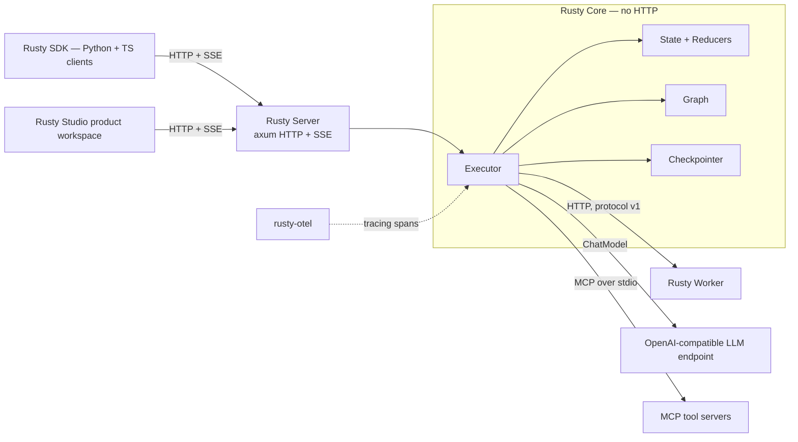
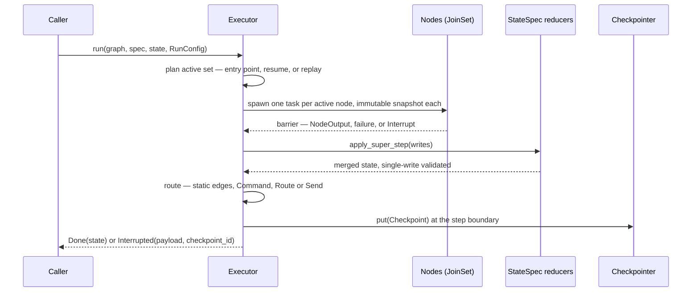

<p class="chapter-eyebrow">Part I · Orientation · Chapter 02</p>

# The Rusty mental model

Chapter 01 argued that an agent runtime answers five questions. This chapter shows you the shape of Rusty's answer — the crates, the five concepts, and one run walked end to end. If you keep this chapter in your head, every API in the repository falls into place; when a later chapter cites `rusty-core/src/executor.rs`, you'll know why that file exists and what else lives near it.

## The crate map

Everything in the repo hangs off one crate. Rusty Core — published as `rusty-agent-runtime`, living in `rusty-core/` — has no HTTP and no server dependencies. Every other crate is a shell around it or a client of those shells.



| Crate | Path | Version | What it is |
|---|---|---|---|
| `rusty-agent-runtime` | `rusty-core/` | 0.12.0 | The engine: state channels + reducers, graph builder, the super-step executor, checkpoints (memory / JSON file / Postgres), interrupts, `Send` fan-out, the prebuilt ReAct agent, MCP client, remote nodes, sandboxed WASM nodes (feature `wasm`), the Flight Recorder. |
| `rusty-agent-server` | `rusty-server/` | 0.12.0 | The network face: an axum library implementing an Agent-Protocol subset — threads, background / blocking / streaming runs, checkpoint history, fork + replay, assistants, crons, KV store, multi-tenant API-key auth. You call `serve(registry, config)` from your own `main.rs`. |
| `rusty-worker` | `rusty-worker/` | 0.3.6 | The worker SDK: serves your node handlers over HTTP so `RemoteNode` can execute graph nodes on remote services. Interrupts cross the wire. |
| `rusty-otel` | `rusty-otel/` | 0.1.7 | One-call `tracing` subscriber setup with optional OTLP span export. |
| `rusty-eval` | `rusty-eval/` | 0.1.5 | Agent TestOps: versioned eval datasets, experiment reports, baseline-vs-candidate compare, statistical regression detection, a model judge, release gates, human-feedback operations. |

Two support crates are not published: `rusty-api/` — the dependency-light trait ABI that extension crates compile against — and `rusty-store/`, the store abstraction behind the server backends, with `rusty-store-conformance/` as their shared test harness. Around the crates sit the SDKs (`sdks/python/`, published to PyPI and imported as `rusty_client`; `sdks/typescript/`, on npm as `@rusty-runtime/client` — both zero-dependency, both verified by an e2e suite that boots the real server binary) and `studio/`, the product workspace.

Notice what's *not* here: native Python or Node bindings. PyO3, napi-rs, and a C ABI were considered and rejected. The server is the polyglot interop layer — one protocol, tested once, spoken by everything.

## Five concepts

Strip the platform down and five concepts remain. Each exists to kill a specific failure class, and each maps to code you can open.

**Graphs are your agents' programs.** A graph is a compiled, validated program over a `StateSpec`: named nodes, static edges, at most one conditional edge per source, one entry point. Validation happens when you call `GraphBuilder::compile()` — dangling edges, reserved names, ambiguous mixed routing all fail there, before any node or paid model call runs (`rusty-core/src/graph.rs`). The ReAct loop is not call-stack recursion; it's nodes being re-scheduled across super-steps, which is why the runaway-loop guard is a step budget (`max_steps`, default 1000) and not a stack limit.

**Threads are conversations.** A thread binds a graph to a durable checkpoint sequence. State is never global; it lives on the thread. Two threads on the same graph are two independent runs with independent history — which is what makes multi-tenant serving, replay, and time-travel fork cheap: they are operations over checkpoint sequences, not over live processes.

**Super-steps and checkpoints are one durability primitive.** Execution proceeds in bulk-synchronous super-steps: *plan → run the active set in parallel → barrier → merge → route → checkpoint* (`rusty-core/src/executor.rs`). There is exactly one thing that persists — the checkpoint written at each barrier (`rusty-core/src/checkpoint.rs`). Resuming is starting from the latest checkpoint. Replaying is walking the sequence. Forking is branching it. There is no separate "save state" call to forget, and no in-memory shadow state that can silently disagree with disk.

**Interrupts are a state, not an exception.** A node suspends the run by returning `Err(ctx.interrupt(payload))` (`rusty-core/src/node.rs`). The run parks with a checkpoint that re-schedules the step's *entire* active set; the process can exit; a human or a policy later posts a resume command on the same thread, and execution continues exactly as if nothing happened. Human approval gates, budget pauses, and missing-input suspensions are all this one mechanism.

**Tools, skills, and connectors are packaging layers over nodes.** A tool is a typed function the model can call (`rusty-core/src/tool.rs`). A skill is a reusable capability — a procedure bundled with the tools it needs — that agents compose. A connector is a packaged integration with managed credentials. All three compile down to the same primitives; the layers exist so Studio and the server can discover, version, and govern them. Part II gives each its own chapter.

## One run, end to end

Here is the smallest real Rusty program — a ReAct agent over a scripted model, no network, deterministic output:

```rust
use rusty_agent_runtime::prelude::*;
use serde_json::json;
use std::sync::Arc;

struct Echo; // scripted ChatModel: one canned reply
#[async_trait::async_trait]
impl ChatModel for Echo {
    async fn chat(&self, _: &[ChatMessage], _: &[serde_json::Value]) -> Result<ChatResponse> {
        Ok(ChatResponse { message: ChatMessage::assistant("42"), model: None, usage: None })
    }
}

#[tokio::main]
async fn main() -> Result<()> {
    let graph = create_react_agent(Arc::new(Echo), ToolRegistry::new())?;
    let spec = StateSpec::new().channel("messages", Reducer::AddMessages);
    let mut input = State::new();
    input.insert("messages", json!([ChatMessage::user("What is 17 + 25?")]));
    let outcome = Executor::new().run(&graph, &spec, input, RunConfig::new("demo")).await?;
    assert!(matches!(outcome, ExecutionOutcome::Done(_)));
    Ok(())
}
```

When `Executor::run` executes this, the same six-beat rhythm drives every run on the platform, from this toy to a week-long research agent:



Three properties of that loop carry most of Part II, so it's worth seeing them now.

**The barrier makes the step transactional.** Writes are validated — every channel declared, correctly typed for its reducer, within the single-write budget — *before* any mutation is applied (`rusty-core/src/state.rs`). If any node fails or interrupts, the step's writes are discarded wholesale. Two nodes silently clobbering the same key, the bug that haunts parallel agent frameworks, is here an `InvalidUpdate` error at the barrier naming both writers.

**Snapshot isolation is structural, not conventional.** Each node receives its own clone of the start-of-step state. Two nodes in the same super-step physically cannot observe each other's writes — not "conventionally shouldn't", cannot.

**The checkpoint is the only persistence.** One `Checkpoint` per boundary: step index, full channel state, the next-node set. `kill -9` mid-run costs nothing that was already checkpointed — the repository demonstrates this with a real SIGKILL against the demo server, and `rusty-server/tests/crash_recovery.rs` asserts the kill-and-restart path in CI. The price is stated plainly: checkpoints happen at boundaries, never mid-node, so resume re-executes a node from its start and node logic must be idempotent. That contract is the cost of durability, and the engine names it rather than hiding it.

## What this buys, previewed

Once execution is checkpointed super-steps over journaled state, the rest of the platform is less a pile of features than a set of readings of the same record. The Flight Recorder reads the journal to replay a run with zero outbound calls. The learning loop reads it as evidence to evaluate candidates. Studio reads it to show you the causal path of a run. The policy plane reads it to know which policy version made which decision. Part II takes each of those readings in turn.

::: tip Key takeaways
- Rusty Core has no HTTP; the server, worker, OTel, and eval crates are shells or clients around it, and the SDKs speak the wire protocol — there are no native bindings.
- Five concepts: graphs are programs, threads are conversations, super-steps + checkpoints are one durability primitive, interrupts are a state, and tools/skills/connectors are packaging over nodes.
- Every run is the same six-beat loop: plan, parallel spawn, barrier, validated merge, route, checkpoint.
- The idempotency contract is the honest price of durability: resume re-executes nodes from their start.
:::

**Further reading**

- [docs/architecture.md](https://github.com/dev-amjad-shaikh/rusty/blob/main/docs/architecture.md) — the stage-by-stage walkthrough with the real code
- [docs/building-agentic-products.md](https://github.com/dev-amjad-shaikh/rusty/blob/main/docs/building-agentic-products.md) — the five-concept model from the product side
- [rusty-core/examples/](https://github.com/dev-amjad-shaikh/rusty/tree/main/rusty-core/examples) — `react_agent`, `parallel_fanout`, `human_in_loop`, `react_record_replay`, `live_agent`
- [docs/roadmap.md](https://github.com/dev-amjad-shaikh/rusty/blob/main/docs/roadmap.md) — what's implemented and what's explicitly rejected (native bindings among them)
