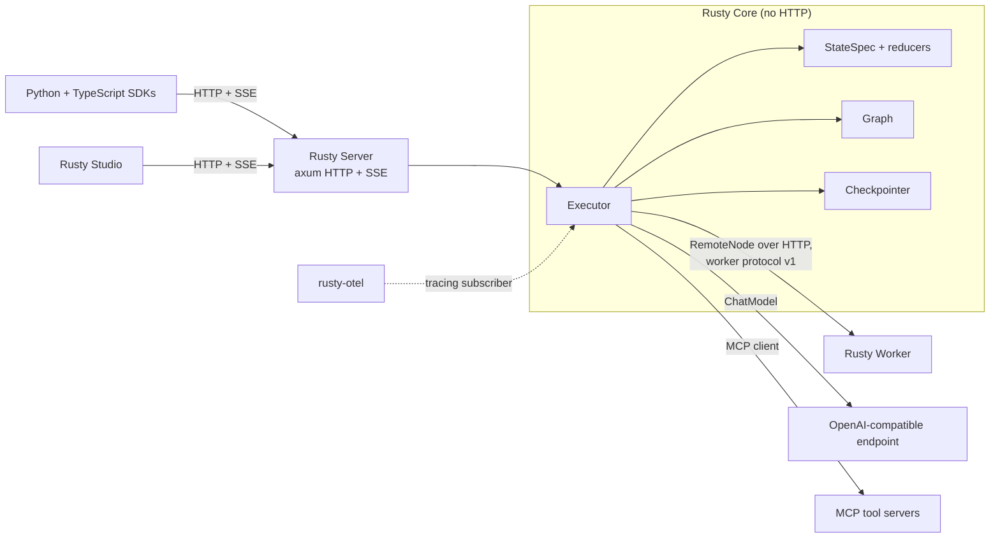
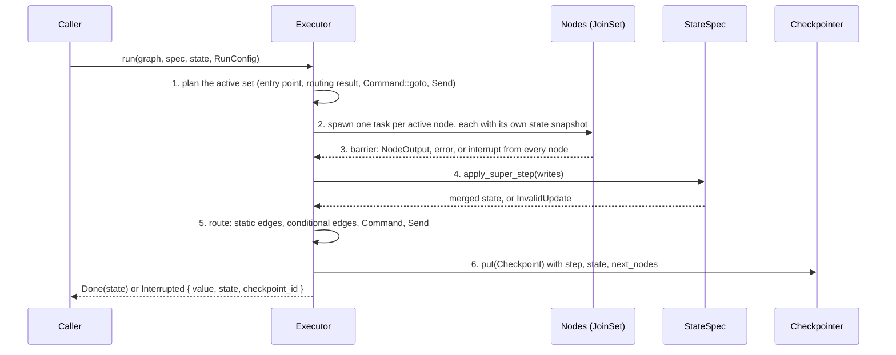

<p class="chapter-eyebrow">Part I · Orientation · Chapter 02</p>

# The Rusty mental model

This chapter shows the crates, the five concepts the platform is built from, and one run walked end to end. Once you have this map, a later reference to `rusty-core/src/executor.rs` will tell you where you are.

## The crate map

Everything depends on one crate. Rusty Core lives in `rusty-core/` and is published as `rusty-agent-runtime`. It has no HTTP and no server dependencies. The other crates wrap it or call it.



| Crate | Path | Version | What it is |
|---|---|---|---|
| `rusty-agent-runtime` | `rusty-core/` | 0.12.0 | The engine: state channels and reducers, the graph builder, the super-step executor, checkpointers (in-memory, JSON file, Postgres behind the `postgres` feature), interrupts, `Send` fan-out, the prebuilt ReAct agent, the MCP client, remote nodes, sandboxed WASM nodes (feature `wasm`), and the Flight Recorder. |
| `rusty-agent-server` | `rusty-server/` | 0.12.0 | The axum HTTP/SSE server: threads, background, blocking, and streaming runs, checkpoint history, fork and replay, assistants, crons, a KV store, and multi-tenant API-key auth. You call `rusty_agent_server::serve(registry, config)` from your own `main.rs`. |
| `rusty-worker` | `rusty-worker/` | 0.3.6 | Serves your node handlers over HTTP so a `RemoteNode` can execute them on another service. Interrupts cross the wire. |
| `rusty-otel` | `rusty-otel/` | 0.1.7 | One-call `tracing` subscriber setup with optional OTLP span export. |
| `rusty-eval` | `rusty-eval/` | 0.1.5 | Versioned eval datasets, experiment reports, baseline-versus-candidate comparison, statistical regression detection, a model judge, failure clustering, release gates, and human-feedback records. |

Three workspace crates are not published: `rusty-api/`, the dependency-light trait crate that extension crates compile against (the `Effect` enum lives there); `rusty-store/`, the store abstraction behind the server's backends; and `rusty-store-conformance/`, their shared test harness. Beside the crates sit the SDKs (`sdks/python/`, on PyPI as `rusty-agent-runtime` and imported as `rusty_client`; `sdks/typescript/`, on npm as `@rusty-runtime/client`) and `studio/`. Both SDKs are zero-dependency, and each has an end-to-end suite that launches the real `server_demo` binary.

There are no native Python or Node bindings. The server's HTTP/SSE protocol is the interface every language uses.

## Five concepts

[docs/building-agentic-products.md](https://github.com/dev-amjad-shaikh/rusty/blob/main/docs/building-agentic-products.md) reduces the platform to five concepts. Each one exists to rule out a class of failure.

**A graph is your agent's program.** A graph is a compiled, validated program over a `StateSpec`: named nodes, static edges, conditional edges, and one entry point. `GraphBuilder::compile()` in `rusty-core/src/graph.rs` rejects dangling edges, nodes named `__end__` or anything starting with `__`, a node with more than one conditional edge, and a node that mixes static and conditional edges. All of that fails before any node or paid model call runs. A loop such as ReAct's `agent → tools → agent` is nodes being re-scheduled across super-steps, so the guard against a runaway loop is a step budget: `RunConfig::max_steps`, default `DEFAULT_MAX_STEPS = 1000` in `rusty-core/src/executor.rs`.

**A thread is a conversation.** A thread binds a graph to a sequence of checkpoints. State lives on the thread, never globally. Two threads on the same graph are two independent runs with independent histories. That is why multi-tenant serving, replay, and forking are cheap: they operate on stored checkpoint sequences, not on live processes.

**Super-steps and checkpoints are one durability mechanism.** The executor runs in bulk-synchronous super-steps: plan, run the active set in parallel, barrier, merge, route, checkpoint. The one thing that persists is the `Checkpoint` written at each boundary (`rusty-core/src/checkpoint.rs`). Resume starts from the latest checkpoint. Replay walks the sequence. A fork branches it. There is no separate save call to forget.

**An interrupt is a state.** A node suspends the run with `return Err(ctx.interrupt(payload))`; `NodeContext::interrupt` in `rusty-core/src/node.rs` returns a `RustyError` for that purpose. The run parks with a checkpoint and the process may exit. Later, a caller runs the same thread again with `RunConfig::with_resume(value)` and execution continues. Approval gates, budget pauses, and missing-input pauses all use this mechanism.

**Tools, skills, and connectors package what an agent can do and know.** A tool is a typed async function the model can call (`Tool` in `rusty-core/src/tool.rs`); the prebuilt ReAct graph dispatches tool calls from its `tools` node. A skill is a versioned `SKILL.md` procedure that is loaded into the model's context and can narrow which tools a run may call ([Chapter 06](./06-skills.md)). A connector is a declared manifest for an external API whose operations become tools and whose credentials are sealed by the server ([Chapter 09](./09-tools-connectors.md)). Tools act. Skills supply context. Connectors produce tools.

## One run, end to end

This is the example from the README: a ReAct agent over a scripted model, with no network and deterministic output.

```rust
use rusty_agent_runtime::prelude::*;
use serde_json::json;
use std::sync::Arc;

struct Echo; // scripted ChatModel: one canned reply
#[async_trait::async_trait]
impl ChatModel for Echo {
    async fn chat(&self, _: &[ChatMessage], _: &[serde_json::Value]) -> Result<ChatResponse> {
        Ok(ChatResponse { message: ChatMessage::assistant("42"), model: None, usage: None })
    }
}

#[tokio::main]
async fn main() -> Result<()> {
    let graph = create_react_agent(Arc::new(Echo), ToolRegistry::new())?;
    let spec = StateSpec::new().channel("messages", Reducer::AddMessages);
    let mut input = State::new();
    input.insert("messages", json!([ChatMessage::user("What is 17 + 25?")]));
    let outcome = Executor::new().run(&graph, &spec, input, RunConfig::new("demo")).await?;
    assert!(matches!(outcome, ExecutionOutcome::Done(_)));
    Ok(())
}
```

`Executor::run` drives every run through the same six phases. The module docs at the top of `rusty-core/src/executor.rs` list them in this order:



Three properties of this loop come up throughout Part II.

**The barrier makes each step transactional.** `StateSpec::apply_super_step` in `rusty-core/src/state.rs` validates every write before applying any. A write to an undeclared channel fails. A second write in one step to a channel with the `Overwrite` reducer fails with `RustyError::InvalidUpdate`, and the message names both nodes: "already written by node `a`, second write from node `b`". If any node fails, the step's writes are discarded. So two parallel nodes cannot silently overwrite each other; you get an error that tells you to pick a multi-write reducer (`Append`, `DeepMerge`, or `AddMessages`).

**Each node sees a snapshot.** Every node in a step receives the state as of the start of the step. No node can observe another node's writes from the same step.

**The checkpoint is the only persistence, and resume re-runs whole nodes.** A `Checkpoint` records the thread, step index, full state, and `next_nodes`. When a node interrupts, the step's writes are discarded, still-running siblings are aborted, and the suspension checkpoint re-schedules every node of that step. On resume they all run again from their start. Checkpoints never happen mid-node, so node logic must be idempotent. The README lists this as a known limitation.

Two tests show this path working. `kill_and_resume_via_json_file_checkpointer` in `rusty-core/tests/interrupt_resume.rs` runs a graph to an interrupt with a `JsonFileCheckpointer`, drops the executor and checkpointer (a simulated kill), opens a new checkpointer on the same directory, asserts the checkpoint's `next_nodes` and state survived, and resumes the run to `Done`. That test does not kill a process. The real-process test is `rusty-server/tests/crash_recovery.rs`, and it proves something narrower than whole-run resume: it SIGKILLs a worker and then the server while a durable task's idempotent effect is in flight, restarts both on the same store, and asserts that the task record survived, completed on attempt 2, and that the provider ledger holds exactly one invocation. That is the durable task queue's crash guarantee ([Chapter 10](./10-durability.md)). The GIF in the README shows the demo server resuming a parked run after `kill -9`; the test automates the task-queue half of that story.

## What this buys

Once runs are checkpointed super-steps with a journal beside them, the rest of the platform reads the same record in different ways. The Flight Recorder replays a run from its journal with zero outbound calls ([Chapter 03](./03-journals.md)). The learning loop evaluates candidates against recorded runs ([Chapter 05](./05-learning-loop.md)). Studio shows a run's causal path from the journal. Checkpoint headers pin the policy version each run used, so you can tell which policy made which decision.

::: tip Key takeaways
- Rusty Core has no HTTP. The server, worker, OTel, and eval crates wrap or call it, and the SDKs speak the server's HTTP/SSE protocol. There are no native bindings.
- Five concepts: a graph is the program, a thread is a conversation, super-steps plus checkpoints are the durability mechanism, an interrupt is a state, and tools, skills, and connectors package what an agent can do and know.
- Every run follows plan, parallel run, barrier, validated merge, route, checkpoint.
- Resume re-executes interrupted or crashed nodes from their start, so node logic must be idempotent.
- `interrupt_resume.rs` tests checkpoint resume across a simulated restart; `crash_recovery.rs` SIGKILLs real processes and tests the durable task queue.
:::

**Further reading**

- [docs/architecture.md](https://github.com/dev-amjad-shaikh/rusty/blob/main/docs/architecture.md): the stage-by-stage walkthrough
- [rusty-core/src/executor.rs](https://github.com/dev-amjad-shaikh/rusty/blob/main/rusty-core/src/executor.rs): the six-phase loop in its module docs
- [rusty-core/examples/](https://github.com/dev-amjad-shaikh/rusty/tree/main/rusty-core/examples): `react_agent`, `parallel_fanout`, `human_in_loop`, `react_record_replay`, `live_agent`
- [rusty-core/tests/interrupt_resume.rs](https://github.com/dev-amjad-shaikh/rusty/blob/main/rusty-core/tests/interrupt_resume.rs) and [rusty-server/tests/crash_recovery.rs](https://github.com/dev-amjad-shaikh/rusty/blob/main/rusty-server/tests/crash_recovery.rs)
