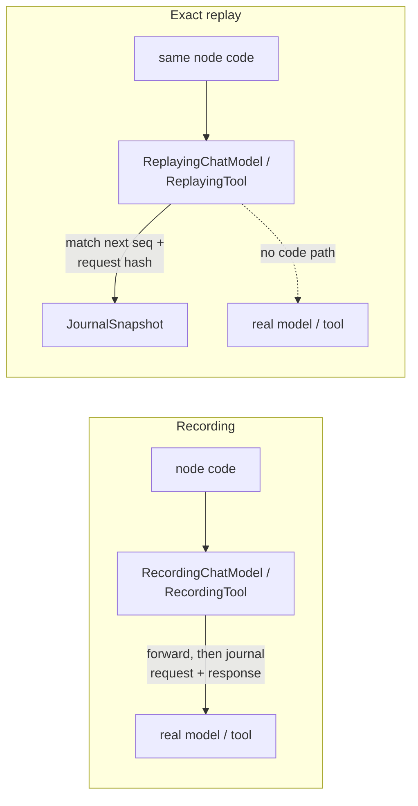

Part II · Concepts and internals · Chapter 03

# Journals & evidence

Any system that executes work keeps a record of what it did. What the record is for decides what it has to contain. This chapter covers Rusty's record, the Flight Recorder, starting with the general idea.

## The concept: four kinds of "what happened"

Systems record execution for four different reasons.

- **Observability** records so people can look. Logs, traces, and metrics, with OpenTelemetry as the common shape. Approximation and sampling are acceptable.
- **Event sourcing** records so state can be rebuilt. The event log is the source of truth, and current state is a fold over it.
- **Workflow history** records so execution can resume. Temporal persists each decision, replays the history on recovery, and deduplicates side effects on re-execution.
- **Evidence** records so the system can be held to account and can learn later. It has to capture what was decided, among which alternatives, under which policy version, and with what outcome.

The fourth reason has a specific requirement from off-policy evaluation, the statistics of judging a new policy against logged data. A log you intend to learn from must record the set of legal actions and the probability (propensity) of the action taken, at the moment of the decision. A propensity reconstructed afterward cannot be trusted.

## Rusty: the Flight Recorder

Rusty's journal is built as evidence in that fourth sense. The design is in [docs/flight-recorder-design.md](https://github.com/dev-amjad-shaikh/rusty/blob/main/docs/flight-recorder-design.md) and shipped in R0.5 (platform v0.6). The contracts live in `rusty-core/src/record.rs`, the journal in `rusty-core/src/journal.rs`, and replay in `rusty-core/src/replay.rs`. Three decisions shape it.

**The contracts were frozen first.** Replay, the server endpoints, Studio, and the learning loop all read the same shapes, so those shapes are pinned by golden-file tests under `rusty-core/tests/golden/`. An accidental change to a serialized contract fails CI. `DecisionEvent`, the learning contract with its legal-action set and propensity, was frozen in R0.5 while the executor emitted no decision events at all. The first producer arrived with R0.8's retry policy (`retry_decision_event` in `rusty-core/src/durable.rs`), and journals written in between already had a compatible shape. The design names the ordering rule: replay before learning. No learning mechanism ships before the evidence it learns from can be recorded and replayed.

**Determinism is injected.** Exact replay is impossible if the executor reads wall time and OS randomness deep inside its loop. The executor gets every timestamp from a `Clock` and every random id from an `RngSource` (`rusty-core/src/journal.rs`). The defaults are the system clock and OS randomness. For reproducible runs you set `Clock::logical(start_ms, tick_ms)` and `RngSource::seeded(seed)` through `RunConfig::with_journal` and `with_rng`. The test `seeded_clock_and_rng_make_journal_snapshots_identical` in `rusty-core/tests/flight_recorder.rs` runs the same model-and-tool graph twice with a logical clock and seed 7 and asserts the two serialized journal snapshots are equal.

**Effects are classified when they are declared.** Whether a call was safe to retry cannot be recovered from a log line afterward. Every journaled event carries the `Effect` class of whatever produced it. The enum lives in `rusty-api/src/lib.rs` and is ordered as a severity ladder:

| Class | Re-execution | Retry and replay |
|---|---|---|
| `Pure` | safe and equivalent | unconstrained; replay may re-run or reuse the output |
| `ReadOnly` | safe, not equivalent | exact replay serves the journaled output |
| `Idempotent` | safe under a stable key | retry with the same idempotency key |
| `Compensatable` | duplicates the effect | pair the effect with its declared compensation |
| `NonIdempotent` | duplicates, no undo | never retried silently; re-execution is an explicit decision |

The defaults are conservative. Plain nodes default to `Pure` (`rusty-core/src/node.rs`). Model calls, tool calls, remote nodes, and WASM nodes default to `NonIdempotent`, and each trait has an `effect()` method you override when you can prove a narrower class. Retry policy, replay serving, and capsule grants all read this class.

## One recorded fact

The unit of the journal is `RunEvent` (`rusty-core/src/record.rs`). Its fields:

- `id`, deterministic: `{run_id}:{seq}`
- `run_id`, `thread_id`, and an optional `node_id`
- `seq`, the total order within the journal
- `kind`, a `RunEventKind`
- `effect`, the class above
- `input` and `output` as `PayloadRef`: inline up to `INLINE_PAYLOAD_MAX_BYTES` (4096 bytes), otherwise a SHA-256 content-addressed artifact held in the journal
- `latency_ms`, `tokens`, `cost_usd`, `status`
- `parent`, the causal parent's event id
- `recorded_at`

R0.5 shipped twelve execution kinds: super-step start and end, node input and output, model call, tool call, remote call, WASM call, interrupt, resume, routing decision, and checkpoint written. Later releases added kinds without changing old ones: effect receipts, agent and mailbox events, memory reads and writes, candidate lifecycle events, policy decisions, capsule calls and denials, connection and credential events, artifacts, and deployments. Old journals keep deserializing.

Two fields turn the log into evidence. `seq` is the order; wall time is an attribute, so clock skew cannot reorder the account. `parent` forms a causal chain: a model call's parent is the node invocation that made it. Walk parents backward and you get why an event happened, not only that it did.

The journal is append-only and hash-chained. Each appended event extends a SHA-256 head hash over the previous head and the event's bytes. A `JournalSnapshot` exports the events, artifacts, and head hash, and `Journal::from_snapshot` recomputes the chain and rejects a snapshot whose head does not match. An edited fixture fails when it is loaded, not halfway through a replay. Each checkpoint carries a `journal_ref` (`JournalRef { events, sha256 }`), so a checkpoint pins both how many events existed at that boundary and which ones.

## Replay: the point of the exercise

A journal you can only read is an audit log. Exact replay re-drives a recorded run from its journal and serves every outbound effect from the record instead of executing it (`rusty-core/src/replay.rs`). The mechanism is a pair of wrappers per effect kind, so the same graph code runs in both modes:

The servable kinds are listed in `SERVABLE_KINDS`: `ModelCall`, `ToolCall`, `RemoteCall`, and `WasmCall`. Everything else (super-step boundaries, node inputs and outputs, routing, interrupts, checkpoint writes) is re-derived by the executor during replay and compared against the record.

The replaying wrappers hold the real implementation but have no code path that calls it. `rusty-core/tests/replay.rs` replays with sentinel inner implementations, and the test `exact_replay_reproduces_journal_and_state_byte_identically` asserts that the sentinels were called zero times and that the replayed journal serializes to the same bytes as the recorded one. So replay makes zero outbound calls and works without credentials. Each served call is matched by sequence and canonical request hash. A request that differs, an effect out of order, a request past the end of the journal, or a replay that finishes with recorded effects unserved all fail with `RustyError::Replay` and say which. `ExactReplay::run_and_verify` goes further and requires the replayed journal to equal the recorded one. Interrupts need no special handling: with every effect answered identically, the node re-derives the same interrupt (`interrupted_run_replays_to_the_same_suspension`).

One limit is stated in the module docs. Byte-identical replay is guaranteed for runs whose super-steps run one node at a time. With several parallel nodes in a step, clock reads interleave by schedule.

Two companions ship with exact replay:

- `BranchDiff::between(base, branch)` compares two journal snapshots: the first divergent `seq`, per-step channel differences, and per-branch token and cost totals. Use it to compare two continuations of a forked history.
- `ReplayFixture` bundles a run (topology hash, journal snapshot, final checkpoint, clock and RNG parameters) into one JSON file. `ReplayFixture::replay_in_ci` goes from a checked-in file to a verified replay in one call. The repository checks one in at `rusty-core/tests/fixtures/exact_replay_agent_tools.json`, replayed by `checked_in_fixture_replays_in_ci`. An agent regression test that makes no network calls is a fixture replay.

The design defined two more modes. **Hybrid replay** (serve recorded effects up to a fork point, then act differently) shipped in R0.10 as part of the runtime digital twin: `CounterfactualFork::then_act_with` in `rusty-core/src/twin.rs`. The twin can only evaluate decisions that change when or whether an effect runs, not what an effect is asked, because the journal has no answer for a request it never saw. **Live replay** (re-executing the effects whose class allows it, to see what a run does against today's world) is designed and not built.

::: tip Key takeaways
- The journal is evidence: append-only, hash-chained, causally parented, ordered by `seq`.
- Every event carries an `Effect` class from `Pure` to `NonIdempotent`, declared by its producer, and retry, replay, and capsules read it.
- `Clock` and `RngSource` are injected, which is what makes byte-identical journals testable.
- Exact replay serves model, tool, remote, and WASM calls from the journal and never calls the real implementation. Branch diff and CI fixtures ship with it.
- Hybrid replay shipped in R0.10 through the digital twin. Live replay is designed, not built.
:::

**Further reading**

- [docs/flight-recorder-design.md](https://github.com/dev-amjad-shaikh/rusty/blob/main/docs/flight-recorder-design.md): the R0.5 design
- [rusty-core/src/record.rs](https://github.com/dev-amjad-shaikh/rusty/blob/main/rusty-core/src/record.rs): `RunEvent`, `RunEventKind`, `DecisionEvent`, `CheckpointHeader`
- [rusty-core/src/replay.rs](https://github.com/dev-amjad-shaikh/rusty/blob/main/rusty-core/src/replay.rs): `ExactReplay`, `BranchDiff`, `ReplayFixture`
- [rusty-core/tests/replay.rs](https://github.com/dev-amjad-shaikh/rusty/blob/main/rusty-core/tests/replay.rs): the panic-sentinel replay tests
- [rusty-core/examples/react_record_replay.rs](https://github.com/dev-amjad-shaikh/rusty/blob/main/rusty-core/examples/react_record_replay.rs): record a run, then replay it with zero outbound calls
