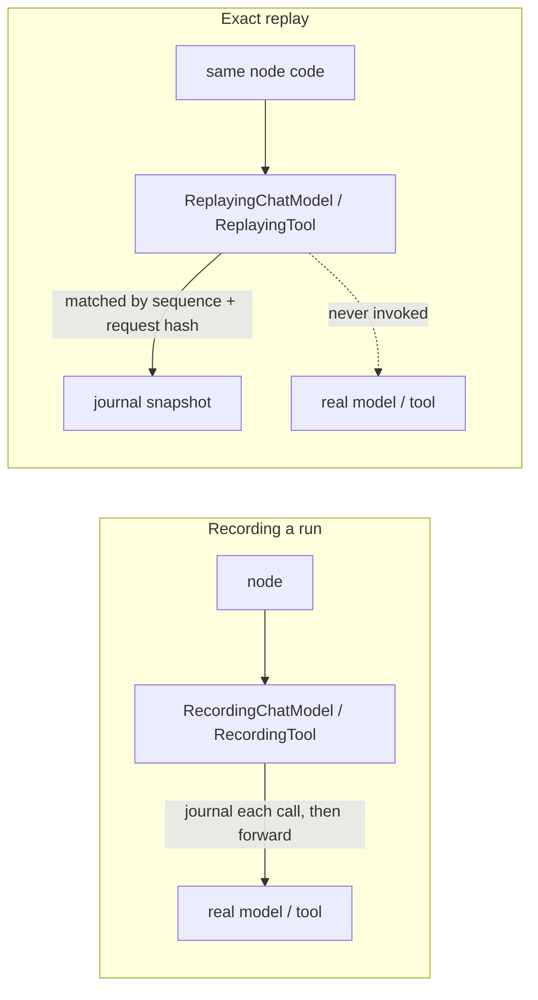

Part II · Concepts and internals · Chapter 03

# Journals & evidence

Every serious system that executes work keeps some record of what it did. The interesting question is what the record is *for*, because the answer decides what the record contains. This chapter is about Rusty's answer — the Flight Recorder — and it starts, as every Part II chapter will, with the general idea.

## The concept: four kinds of "what happened"

Systems record execution for four different reasons, and they are easy to confuse:

- **Observability** records so humans can look. Logs, traces, metrics — OpenTelemetry is the canonical shape. The reader is a person with a dashboard; approximation is fine; sampling is normal.
- **Event sourcing** records so state can be rebuilt. The journal *is* the truth; current state is a fold over it.
- **Workflow histories** record so execution can resume. Temporal's event history is the famous one: persist each decision, replay the history on recovery, deduplicate side effects on re-execution.
- **Evidence** records so the system can be held to account later — and so it can *learn*. Evidence has to answer not just "what happened" but "what was decided, against which alternatives, under which policy version, with what outcome."

The fourth reason is the rare one, and it has teeth. The off-policy evaluation literature — the statistics of comparing a new policy against logged data — has known for decades that a log you intend to learn from must record the *legal action set* and the *propensity* of the action taken, at decision time. A propensity reconstructed afterward is fiction; the counterfactual is only as good as what you froze in the moment.

## Rusty: the Flight Recorder

Rusty's journal is evidence in that fourth sense, and the design says so in its first paragraph: not observability spans for humans to eyeball, but a causally linked, tamper-evident journal of effects that later waves replay against, evaluate policies on, and roll back from (`rusty-core/src/record.rs`, `rusty-core/src/journal.rs`; design: `docs/flight-recorder-design.md`). Three commitments shape it.

**Contracts freeze first.** Replay engines, server endpoints, Studio views, and the learning loop all consume the same shapes, so the schemas were frozen with golden-file tests under `rusty-core/tests/golden/` — accidental drift is a CI failure — even before several of them had a producer. `DecisionEvent` was frozen in R0.5 with nothing emitting it, precisely so that every journal written since then is already learnable evidence. The sequencing rule is *replay before learning*: no learning mechanism ships before the evidence it learns from can be faithfully recorded and replayed.

**Determinism is a seam, not a property.** You cannot bolt exact replay onto an executor that reads wall time and OS entropy from deep inside its loop. The executor sources every timestamp through a `Clock` and every random id through an `RngSource` (`rusty-core/src/journal.rs`): `System` by default, `Clock::logical` and `RngSource::seeded` when you need two drives of the same graph to produce byte-identical journals. That property is proven by test, and it's what makes replay fixtures in CI possible.

**Effects are classified at declaration time.** "Was that call safe to retry?" is not answerable from a log line after the fact. Every journaled event declares the effect class of whatever produced it:

| Class | Re-execution | Retry / replay guarantee |
|---|---|---|
| `Pure` | safe and equivalent | unconstrained; output may be re-derived or reused |
| `ReadOnly` | safe, not equivalent | exact replay serves the journaled output |
| `Idempotent` | safe under a stable key | retry with the same idempotency key |
| `Compensatable` | duplicates the effect | rollback pairs effect with compensation |
| `NonIdempotent` | duplicates, no compensation | never silently retried; re-execution is explicit |

The defaults are honest and conservative: plain nodes are `Pure`; models, tools, remote nodes, and WASM nodes are `NonIdempotent`, each trait carrying a documented override point. The class is the bridge between "what happened" and "what may safely happen again" — retry policy, replay serving, and capsule grants all consume it downstream.

## One recorded fact

The atomic unit is `RunEvent`: a deterministic id (`{run_id}:{seq}`), a closed `kind` enum (super-step start/end, node input/output, model call, tool call, remote call, WASM call, interrupt, resume, routing decision, checkpoint written), the effect class, input and output as `PayloadRef` — inline up to 4 KiB, content-addressed SHA-256 artifact above — plus latency, tokens, cost, status, and a causal `parent`.

Two properties turn this from a log into evidence. `seq` is the total order — wall time is just an attribute, so clock skew can't scramble the account. And `parent` forms the causal chain: a model call's parent is the node invocation that made it; a checkpoint write's parent is the routing decision that ended the step. Walk parents backward and you reconstruct why, not just what.

The journal itself is append-only, hash-chained over every event, and cheap to clone. A `JournalSnapshot` is the complete export — events, artifacts, head hash — and `Journal::from_snapshot` re-verifies the head hash on load, so an edited fixture fails at the boundary instead of deep inside a replay. Every checkpoint carries a `journal_ref`: the journal's event count and chained head hash at that boundary. State pins not just *how much* evidence existed, but *which* evidence.

## Replay: the point of the exercise

A journal you can only read is an audit log. Rusty's journal is executable evidence, because exact replay re-drives a recorded run from its snapshot with **every outbound effect served from the journal instead of executed** (`rusty-core/src/replay.rs`). The trick is a pair of wrapper types per effect kind, so the same graph code runs in both modes:

There is no code path from a replaying wrapper to the wrapped implementation — tests replay against panic-on-call sentinels and prove the sentinels never fire, which means replay is safe against credential-less clients and costs zero outbound calls. Each call is matched against the journal by sequence and request hash through a shared cursor; divergence, out-of-order effects, exhaustion, and shortfall all fail loudly as `RustyError::Replay` with the reason named. `ExactReplay::run_and_verify` goes further: it requires the replayed journal to equal the recorded one event for event. Interrupts need no special serving — with every effect answered deterministically, node logic re-derives the same interrupt, checkpoint id included.

Two companions ship with it. `BranchDiff::between(base, branch)` compares two journal snapshots logically — first divergent `seq`, per-super-step channel diffs, per-branch token and cost totals — which is how you look at two continuations of a forked history. And `ReplayFixture` bundles a recorded run (topology hash, journal snapshot, final checkpoint, clock and RNG parameters) into a JSON file for CI; a checked-in example lives at `rusty-core/tests/fixtures/exact_replay_agent_tools.json`. An agent regression test that makes zero network calls is a fixture replay.

What is designed but not yet shipped, stated plainly: **live replay** (re-executing the effect classes that permit it, answering "what does this run do against *today's* world") and **hybrid replay** (serve to a fork point, run live afterward — the counterfactual probe) are both defined in the design and deferred; exact replay is the fidelity floor they will build on.

::: tip Key takeaways
- Rusty's journal is evidence, not logs: append-only, hash-chained, causally parented, with `seq` as the total order.
- Effects are classified at declaration time (`Pure` through `NonIdempotent`), and that classification drives retry, replay, and capability policy downstream.
- Determinism is an injected seam (`Clock`, `RngSource`), which is what makes byte-identical replay provable.
- Exact replay, branch diff, and portable CI fixtures are shipped; live and hybrid replay are designed, not yet shipped.
- Contracts were frozen — and golden-pinned — before their consumers existed, so every journal since R0.5 is already learnable evidence.
:::

**Further reading**

- [docs/flight-recorder-design.md](https://github.com/dev-amjad-shaikh/rusty/blob/main/docs/flight-recorder-design.md) — the R0.5 design: contracts, determinism seams, replay modes
- [rusty-core/src/record.rs](https://github.com/dev-amjad-shaikh/rusty/blob/main/rusty-core/src/record.rs) — `Effect`, `RunEvent`, `DecisionEvent`, `CheckpointHeader`
- [rusty-core/src/replay.rs](https://github.com/dev-amjad-shaikh/rusty/blob/main/rusty-core/src/replay.rs) — `ExactReplay`, `BranchDiff`, `ReplayFixture`
- [rusty-core/examples/react_record_replay.rs](https://github.com/dev-amjad-shaikh/rusty/blob/main/rusty-core/examples/react_record_replay.rs) — journal a run, re-drive it with zero outbound calls
