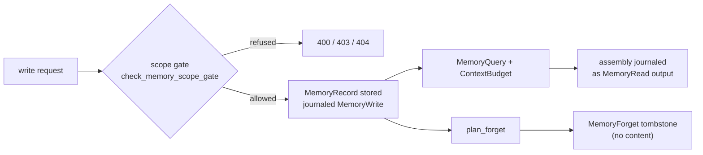

Part II · Concepts and internals · Chapter 04

# Memory

An agent that remembers nothing starts every conversation from zero. An agent that remembers badly is worse: it acts on stale facts, leaks one user's context into another's, and nobody can say where a belief came from. This chapter covers how Rusty stores what agents remember across runs. Memory in Rusty is a governed record store with scopes, provenance, and journaled reads and writes. An agent does not edit it freely through a tool.

## The concept: what the field settled on, and what it lost

[docs/learn-design.md](https://github.com/dev-amjad-shaikh/rusty/blob/main/docs/learn-design.md) names the systems Rusty borrows from and where it departs.

**MemGPT (now Letta)** introduced the operating-system analogy: a small core tier always in context, an archival tier outside it, and the agent paging between them through explicit tool calls. Rusty keeps the explicit operations. It rejects self-editing, where an agent rewrites its own core memory with a tool call and changes production behavior with no candidate, no evaluation, and no way back.

**Zep and Graphiti** made memory temporal. Facts carry validity windows, and the system tracks when a fact was true separately from when it learned the fact, so contradictions are handled by time instead of deletion.

**Mem0** built extraction pipelines that pull facts out of conversations, detect conflicts, and organize memory by user, session, and agent.

The design names three things you lose when memory is a framework-level add-on. **Scope** becomes a convention: nothing stops one agent's write from landing in a pool every agent reads. **Provenance** is missing: a record cannot say who wrote it, from which run, or what it replaced. **Mutation is silent**: the self-editing pattern again.

## Rusty: governed memory

Governed memory shipped in R0.8. Every memory is one `MemoryRecord` (`rusty-core/src/memory.rs`), a serde-versioned struct that only grows by adding optional fields and is pinned by golden files. Each field exists because some operation needs it:

- **`memory_id`**: SHA-256 over the canonical serialization of content plus provenance. A changed record is a new id, and a tampered record no longer matches its own address.
- **`kind`**: `fact`, `preference`, `example`, or `summary`. An `example` is the corrected input/output pair the correction loop produces. A `summary` names its source records, which is what lets forgetting find the summaries that depend on a record.
- **`scope`**: one of `run`, `agent`, `team`, `user`, `tenant`, plus a concrete scope id. The first four map onto the Agent Fabric's `StateScope`s ([Chapter 08](./08-blueprints-agents.md#state-scopes-and-supervision)), with `agent` corresponding to `StateScope::Private`. `run` is new here: memory bound to one run's thread.
- **`key`, `tags`, `priority`**: the writer's lookup key, equality-matched tags, and an explicit rank used during assembly.
- **`provenance`**: who wrote it (`agent:{id}`, `human:{id}`, `distiller:{name}`, or `system`), from what evidence (run id and journal event ids, a correction id, a candidate id, source record ids), and when. It is mandatory.
- **`confidence`**: an `f64` in `(0, 1]` declared by the writer. A human correction sets 1.0. The runtime validates the range and filters on it. It never computes it.
- **`validity`**: the interval the record claims to be true, kept separate from **`created_at`**, when the system learned it.
- **`expires_at`**: an optional expiry that retrieval filters on.
- **`supersedes`**: the record this one replaces. The replaced record is kept as evidence and filtered out of default retrieval. Nothing in the model is updated in place.
- **`content`**: a `PayloadRef`, inline up to 4 KiB and content-addressed above, the same rule the journal uses.
- **`embedding`**: reserved and always `None` for now, so vector retrieval can be added without changing the wire format.

## The write path: governed three ways

Every write passes three checks.

1. **Scope authorization.** On the server, `POST /memory` and the correction and consolidation endpoints share one gate, `check_memory_scope_gate` in `rusty-server/src/routes.rs`. `run` scope is refused with 400 on the public API; the runtime writes it on a run's behalf, and a run-scope correction is the one governed exception. `agent` scope requires the agent to exist in your tenant (404 otherwise) and its manifest to declare `StateScope::Private` (403 otherwise). `tenant` scope must name your own tenant (403). `user` scope must name yourself unless you are an administrator or a service key. `team` scope rides tenant namespacing.
2. **Effect classification.** A write is `Effect::Idempotent` under the key `memory:{scope}:{memory_id}`, so a retried write converges, and it is journaled as `MemoryWrite` with its provenance. A read is `Effect::ReadOnly`, journaled as `MemoryRead`. During exact replay, `MemoryReplaySource` serves the journaled read instead of querying the store, the same rule the Flight Recorder applies to model and tool calls. A replayed run that tries to write has diverged from its evidence.
3. **No silent behavior change.** A memory write changes what later retrievals return and nothing else. A change meant to alter a prompt, a policy, or a tool permission goes through the candidate pipeline in [Chapter 05](./05-learning-loop.md).

## Retrieval: structural, budgeted, journaled

`MemoryQuery` filters by structure: scope, kind, key and tag equality, validity at a point in time, minimum confidence, excluding expired, excluding superseded, and author. There is no similarity search. The design states the cost: structured filters can answer what is current, scoped, attributed, and tagged, but not what is semantically similar to the current situation. Writers need to key and tag deliberately, and a miss means the key is absent, not that the fact is.

Assembly into a prompt is bounded by a `ContextBudget`. Filtered records are ranked by explicit priority, then confidence, then recency, with the content address as a final tie-break, and packed until the budget runs out. Tokens are estimated as serialized content bytes divided by 4, plus a declared safety margin (`ContextBudget::margin_percent`). The assembly (the record ids, their order, and the token accounting) is the `MemoryRead` event's output payload. Equal store state and an equal budget produce a byte-equal assembly, and the prompt the model saw can be rebuilt from the journal without re-querying a store that has since changed.

On `main`, `rusty-core/src/memory_tiers.rs` adds a tier overlay on top of scopes: working (run scope), episodic (summaries at agent or team scope), and semantic (facts, preferences, and examples at agent scope and wider). `MemoryTier::classify` derives the tier from scope and kind. Tiers shape assembly, not storage; there are still no separate stores. The same module adds a key grammar (`domain.name`) enforced by a `WriteGate` that also collapses duplicate writes of the same content under the same key onto one record.

## The maintenance operations

Consolidation, conflict detection, and forgetting are journaled operations over the store. None runs as a background job with invisible effects.

**Consolidation** turns several records into one `summary` that names its sources in provenance and supersedes them. The core builds that record with `consolidation_summary`. The server's first pass, in `rusty-server/src/memory_consolidation.rs`, is mechanical: it folds near-duplicate notes under one key into a summary with no model calls, never touches a person's own notes or corrections, and runs after 10 new notes have landed since the last pass.

**Conflict detection** (`detect_conflicts`) flags live records that share a key, overlap in validity, and disagree. It flags and never resolves. The design contrasts this with pipelines that resolve contradictions inside ingestion using a model, which is a silent mutation. Detection produces a review item; a person or a governed candidate resolves it.

**Forgetting** deletes and leaves a receipt. `plan_forget` computes the erasure before anything is removed: the target records plus every summary that named them as a source, transitively. The server exposes `POST /memory/forget` and `POST /memory/forget_scope`. The receipt is a journaled `MemoryForget` tombstone carrying the id, scope, reason (`expired`, `retracted`, or `erasure_request`), and the dependent invalidations. The tombstone type has no content field, so the forgotten bytes cannot leak through it. The boundary is explicit: memory records are derived state and can be erased; run journals are hash-chained evidence and cannot.

::: tip Key takeaways
- Memory is a governed record store: the server's scope gate, mandatory provenance, and no in-place updates.
- `MemoryRecord` is content-addressed; a change is a new record that supersedes the old one.
- Scopes (`run`, `agent`, `team`, `user`, `tenant`) and kinds (`fact`, `preference`, `example`, `summary`) organize memory. The tier overlay on `main` derives working, episodic, and semantic tiers from them.
- Retrieval is structural and token-budgeted, and the assembly is journaled. There is no vector search yet.
- Forgetting removes dependent summaries too and journals a content-free tombstone.
:::

**Further reading**

- [docs/learn-design.md](https://github.com/dev-amjad-shaikh/rusty/blob/main/docs/learn-design.md): the R0.8 design, including the research lineage
- [rusty-core/src/memory.rs](https://github.com/dev-amjad-shaikh/rusty/blob/main/rusty-core/src/memory.rs): `MemoryRecord`, `MemoryQuery`, `ContextBudget`, `Correction`, `plan_forget`
- [rusty-core/src/memory_tiers.rs](https://github.com/dev-amjad-shaikh/rusty/blob/main/rusty-core/src/memory_tiers.rs): the tier overlay and key grammar on `main`
- [docs/agent-fabric-design.md](https://github.com/dev-amjad-shaikh/rusty/blob/main/docs/agent-fabric-design.md): the `StateScope` taxonomy memory scopes map onto
