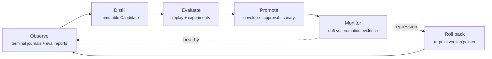

Part II · Concepts and internals · Chapter 05

# The learning loop

Chapter 04 ended with a rule: a memory write changes what retrievals return, and nothing else. This chapter is about everything else — prompts, policies, tool permissions — and the pipeline a change must travel before it touches production behavior. The rule, stated precisely: **no learning process may silently rewrite a production prompt, graph, policy, memory, or tool permission. Learning produces an immutable candidate; the candidate is evaluated against recorded evidence; promotion is a journaled transition bounded by a declared envelope; rollback re-points an immutable version pointer.**

## The concept: improvement without governance is drift

Every deployed agent system improves, or it decays. The question is what "improves" looks like operationally.

The research lineage gives agents that learn from verbal feedback — Reflexion and CLIN persist reflections as memory and do better on the next attempt. The production lineage gives release engineering: a candidate build serves a bounded fraction of traffic against a live baseline before full rollout — canary and shadow deployment, the SRE workbook's shape. The governance lineage gives attribution and reversibility: every change has an author, an evaluation, an approver, and a way back.

What a framework does with a config-file edit and a restart, a runtime can do as an evidence-carrying state transition. The difference only matters the first time someone asks "why did the agent's behavior change last Tuesday?" — and then it's the only thing that matters.

There's a subtler reason this belongs in the runtime, and it's the Flight Recorder's raison d'être from Chapter 03. The learning contract was frozen before any learning shipped, so every journal since R0.5 is already learnable evidence: effect classes, causal parentage, cost and latency, policy version pins in every checkpoint header, decision events with propensity. Learning doesn't introduce a parallel telemetry system. It consumes the journal the same way replay does.

## The correction loop: the highest-trust input

Before the loop proper, one input deserves its own treatment, because it's where most real improvement starts: a human tells the agent it got something wrong.

A correction becomes an attributed candidate memory or example — **never an in-place rewrite of what it corrects** (`Correction` in `rusty-core/src/memory.rs`, golden-pinned). Three rules:

1. **Attribution travels with the derived record.** A correction must name its corrector — a correction that can't name its author is indistinguishable from a prompt edit. The candidate record carries `provenance: human:{author} via correction:{id}` and defaults to confidence 1.0.
2. **Scope decides the path.** A run-scope correction is adopted directly — it affects only the run that produced it. Anything wider becomes a candidate evaluated before promotion, because a wrong human correction at tenant scope is a production incident with a name attached.
3. **Corrections enter evaluation as examples.** A correction targeting a run event also yields an `example`-kind record, folded into a *new version* of a `rusty-eval` dataset — never an edit in place; datasets are canonical JSONL precisely so the diff is visible in version control. The candidate is then evaluated against a dataset that contains the failing case. The correction is both the fix and the regression test.

One boundary is drawn explicitly: `rusty-eval` owns capture and normalization of human feedback (ratings, edits, thumbs — `rusty-eval/src/feedback.rs`); it does not write memory and does not promote anything. The correction loop consumes feedback records and owns everything downstream.

## The six stages

The loop never runs inside a production run. It runs between runs, over recorded evidence, and every stage transition is a durable, journaled event.

**Observe.** Completed runs' journals and experiment reports are the input. "Completed" is load-bearing — learning reads terminal evidence, never in-flight state.

**Distill.** A distiller — application code, not runtime code — reads observations and produces a `Candidate` (`rusty-core/src/learn.rs`): an immutable, versioned, content-addressed declaration of a proposed change. Four kinds, a closed enum:

| Kind | What it carries | Production surface it would change |
|---|---|---|
| `prompt` | New prompt text, content-hashed | A prompt pin in the run manifest |
| `policy` | Executor policy parameters for one decision family | A `PolicyVersion` in the policy plane |
| `memory_set` | A set of memory records (adds and supersessions) | Scoped memory content |
| `tool_permission` | A narrowed or widened tool grant | The tool surface a run may call |

Content addressing does double duty: two distillations of the same change converge on one id, and a tampered candidate fails its own address. Creation is journaled (`CandidateCreated`) with the distiller's identity and the evidence span it read.

**Evaluate.** Composition, not duplication: the candidate is evaluated with machinery that already exists. Exact replay re-drives recorded runs with the candidate applied — replay serves journaled effects, so the candidate's behavior is measured against identical evidence with zero outbound calls. `rusty-eval`'s experiment runner drives the candidate over the versioned dataset — which now contains the correction examples — through the real executor, and `compare()` diffs the candidate report against the baseline. The verdict, the report pair, the dataset version, and the replay fixture ids are journaled (`CandidateEvaluated`). The evaluation is evidence, not a log line.

**Promote.** Promotion is gated by a **promotion envelope**: a declared, per-deployment `PromotionEnvelope` naming, per candidate kind, what may promote automatically — the evidence thresholds: no regression *and* improvement on the target metric over the named dataset version — and what requires review or a canary. Inside the envelope, the envelope itself is the standing approval: versioned, declared, not a silent default. Outside it, promotion requires a human `ApprovalToken` scoped to an effect id derived over the candidate's content hash and target scope — so an approval for one candidate is non-transferable to another, and `approved_by` gives attribution. The mechanism composes the effect kernel rather than inventing an approval parallel to it: promotion executes as an idempotent effect under the key `promotion:{candidate_id}`, so a retried promotion converges. A canary promotion binds the candidate to a declared fraction of new runs by seeded draw — a recorded run reproduces its assignment — with the static version serving the rest.

**Monitor drift.** Post-promotion, the promoted version's runs are sampled into scheduled experiments against the promotion-time dataset. Drift is declared thresholds on journaled metrics — pass-rate drop, p95 latency growth — and the design is honest that this is not statistical process control: the monitor answers "is the promoted version regressing against the evidence that promoted it," nothing deeper.

**Roll back.** Every promotion is a pointer move. The active version per surface is an immutable pointer to a candidate id; rollback re-points it and journals `CandidateRolledBack` with the drift evidence that caused it. Because candidates are content-addressed and immutable, rollback is *exact* — the restored version is byte-identical to the one that previously served, not a reconstruction. New runs bind the re-pointed version at admission; in-flight runs keep the version their checkpoint header pins.

## The policy plane, and an honest caveat

The executor's own mechanical decisions — retry, timeout, placement — learn through the same machinery. Policy versions are epoch-bounded and immutable: active from promotion until the next promotion, pinned in every checkpoint header, so replay of any run in an epoch reproduces that epoch's decisions. The static floor `static-v0` — deterministic, no learning — remains the default forever; every candidate policy is evaluated against it, and revert-to-floor is always a legal rollback. Closed action sets stay closed: a learned policy chooses among enum members, never free-form output. That is what keeps this plane mechanical — dense signals, closed spaces.

The propensity caveat, stated plainly because the design states it plainly: off-policy evaluation theory assumes a *stochastic* logging policy. The deterministic floor logs propensity 1.0 for what it did and implicitly zero for everything else, so importance weighting against floor evidence degenerates to "we know what the floor did." R0.8's gate is therefore replay plus experiment comparison, not importance weighting. Propensity earns its keep the moment canary exploration exists — a canary assigning by seeded draw *is* a stochastic policy with known propensities — and the contract was frozen early so this would be true when needed. Nobody pretends it's needed yet.

::: tip Key takeaways
- The learning rule: no silent rewrites. Candidates are immutable and content-addressed; promotion is journaled and enveloped; rollback is a pointer move.
- Corrections are the highest-trust input and arrive attributed; past run scope they are candidates, and they carry their own regression test.
- Evaluation composes existing machinery — exact replay and `rusty-eval` — instead of building a parallel harness.
- The executor's mechanical policies learn through the same plane, with `static-v0` as the permanent, revertible floor.
- The propensity caveat is admitted, not hidden: the gate is replay + comparison until canary traffic makes off-policy weighting well-posed.
:::

**Further reading**

- [docs/learn-design.md](https://github.com/dev-amjad-shaikh/rusty/blob/main/docs/learn-design.md) — the full R0.8 design, including the executor policy plane
- [rusty-core/src/learn.rs](https://github.com/dev-amjad-shaikh/rusty/blob/main/rusty-core/src/learn.rs) — `Candidate`, `CandidateKind`, `PromotionEnvelope`
- [rusty-core/src/effects.rs](https://github.com/dev-amjad-shaikh/rusty/blob/main/rusty-core/src/effects.rs) — the effect kernel and `ApprovalToken`
- [docs/flight-recorder-design.md](https://github.com/dev-amjad-shaikh/rusty/blob/main/docs/flight-recorder-design.md) — the evidence the loop consumes
