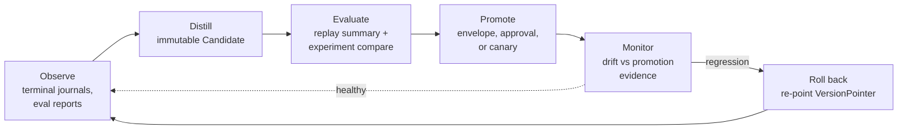

Part II · Concepts and internals · Chapter 05

# The learning loop

Chapter 04 ended with a rule: a memory write changes what retrievals return and nothing else. This chapter covers everything else that shapes behavior (prompts, policies, tool permissions, model settings, skills) and the path a change must take before it reaches production. The rule, from the module docs of `rusty-core/src/learn.rs`:

> No learning process may silently rewrite a production prompt, graph, policy, memory, or tool permission.

Learning produces an immutable candidate. The candidate is evaluated against recorded evidence. Promotion is a journaled transition bounded by a declared envelope. Rollback moves an immutable version pointer back.

## The concept: improvement without governance is drift

A deployed agent changes over time whether you plan for it or not. The question is what a change looks like operationally.

Three lines of work inform the design in [docs/learn-design.md](https://github.com/dev-amjad-shaikh/rusty/blob/main/docs/learn-design.md). Research agents such as Reflexion and CLIN learn from verbal feedback by storing reflections as memory. Release engineering gives canary and shadow deployment: a candidate serves a bounded share of traffic beside a live baseline before full rollout. Governance requires that every change has an author, an evaluation, an approver, and a way back.

A framework handles a change with a config edit and a restart. A runtime can handle it as a journaled state transition with evidence attached. That matters when someone asks why the agent's behavior changed last Tuesday.

The learning loop reads the same journal replay reads ([Chapter 03](./03-journals.md)). Checkpoint headers pin the policy version and run manifest digests, events carry effect classes and causal parents, and `DecisionEvent`s carry propensities. There is no second telemetry system to keep in sync.

## The correction loop: the highest-trust input

Much real improvement starts with a person saying the agent got something wrong. A `Correction` (`rusty-core/src/memory.rs`, golden-pinned) becomes an attributed memory record or example. It never rewrites what it corrects in place. Three rules apply.

1. **Attribution travels with the result.** `author` is mandatory and validated at deserialization. The derived record carries `human:{author}` provenance with the correction id in its evidence, and confidence 1.0.
2. **Scope decides the path.** A run-scope correction is adopted directly, because it affects only the run that produced it. At agent scope or wider, the derived record carries a `Candidacy` mark and waits for evaluation. A wrong correction at tenant scope would be a production incident. A correction to a keyed record inherits the key, so it supersedes the old record automatically.
3. **A correction becomes a test case.** A correction that targets a run event also yields an `example` record: the input the run saw and the corrected output. A distiller folds examples into a new version of a `rusty-eval` dataset. Datasets are JSONL files (`rusty-eval/src/dataset.rs`), versioned and never edited in place. The next candidate is evaluated against a dataset that contains the failing case.

The server surface is `POST /memory/corrections`. `rusty-eval` owns capturing human feedback (ratings, edits, thumbs) in `rusty-eval/src/feedback.rs`. It does not write memory and does not promote anything.

## The six stages

The loop never runs inside a production run. It runs between runs, over recorded evidence, and each transition is journaled.

**Observe.** Input is completed runs' journals and experiment reports. Learning reads terminal evidence only, never a run in flight.

**Distill.** A distiller reads observations and produces a `Candidate` (`rusty-core/src/learn.rs`): an immutable, content-addressed declaration of a proposed change. Distillers are application code. The runtime ships one reference distiller for skills (`rusty-core/src/skill_distill.rs`, on `main`). `CandidateKind` is a closed enum that has grown additively:

| Kind | Added in | Changes |
|---|---|---|
| `prompt` | R0.8 | one named prompt's text |
| `policy` | R0.8 | executor policy parameters for one decision family |
| `memory_set` | R0.8 | a set of memory records (adds and supersessions) |
| `tool_permission` | R0.8 | a narrowed or widened tool grant |
| `tool_contract` | R0.11 | the JSON schema a tool's manifest pin digests |
| `model_settings` | R0.11 | a model id plus parameters |
| `memory_configuration` | R0.11 | retrieval and assembly settings |
| `middleware_composition` | R0.11 | an ordered middleware list with per-layer config |
| `context_policy` | `main` | section layouts, budget splits, tokenizer pin, compaction trigger |
| `skill` | `main` | a skill package by content hash, plus its binding |

The candidate id is SHA-256 over its canonical content (`derive_candidate_id`). Two distillations of the same change get the same id, and a tampered candidate fails `Candidate::verify_address`. Creation is journaled as `CandidateCreated`.

**Evaluate.** Evaluation reuses existing machinery. The runtime defines the journaled shape, `CandidateEvaluation`, and a `CandidateEvaluator` seam. The work happens in `rusty-eval`, because `rusty-eval` depends on the runtime and not the reverse. An evaluation carries a replay summary (divergence against recorded runs plus fixture ids), a baseline and a candidate report from `rusty-eval`'s `ExperimentRunner` over a named dataset version, the `compare()` verdict, and the thresholds it used. The server's evaluator composes `ExperimentRunner` behind `POST /learn/candidates/{id}/evaluate`. The result is journaled as `CandidateEvaluated`.

**Promote.** A `PromotionEnvelope` declares, per candidate kind, one of three rules (`EnvelopeRule`):

- `Auto`: promote when the verdict clears the declared thresholds (`min_improvement`, default 0.0, which means any improvement and not parity; optionally a pinned dataset version; for `memory_set`, the allowed scopes).
- `Approval`: always require a human `ApprovalToken`.
- `Canary { fraction, auto }`: after clearing the thresholds, bind the candidate to a fraction of new runs.

The shipped default, `PromotionEnvelope::r08_default()`, auto-promotes only `memory_set` candidates at `run` or `agent` scope and requires approval for every other kind. An `ApprovalToken` is scoped to `promotion_effect_id`, derived from the candidate's content hash and target scope, so an approval for one candidate cannot be reused for another, and its `approved_by` is the attribution. Promotion runs as an idempotent effect under the key `promotion:{candidate_id}`, so a retried promotion converges. Canary assignment uses a seeded draw (`canary_admits`), so a recorded run reproduces its assignment. The gate itself, `admit_promotion`, is a pure function that returns a typed `PromotionRefusal` when it says no.

**Monitor drift.** For executor policies, `GET /policy/drift` runs `detect_policy_drift`: it compares the acting version's journaled outcomes against the baseline recorded at promotion, using declared `DriftThresholds` (completion-rate drop, dead-letter growth, p95 latency ratio, and a minimum number of decisions before any verdict). The design says plainly that this is a regression check against the evidence that promoted the version, not statistical process control. For other candidate kinds, the design calls for scheduled experiments against the promotion-time dataset; the rollback endpoint takes the reason as input.

**Roll back.** The active version of each surface is a `VersionPointer` to a candidate id. Promotion moves the pointer. `POST /learn/candidates/{id}/rollback` moves it back and journals `CandidateRolledBack`. Candidates are immutable, so the restored version is byte-identical to what served before. New runs bind the re-pointed version at admission. Runs already in flight keep the version their checkpoint header pins.

## The policy plane, and an honest caveat

The executor's own mechanical decisions learn through the same pipeline. R0.10 (Adaptation) shipped learned retry and timeout policies. A policy version is immutable, active from its promotion until the next one, and pinned in every checkpoint header, so replaying a run reproduces the decisions of its policy version. The static floor `static-v0` is deterministic, never learns, and stays available: every candidate policy is evaluated against it, and reverting to it is always a legal rollback. A learned policy picks from a closed set of actions (`DecisionAction`) and never produces free-form output.

R0.10 also added the runtime digital twin (`rusty-core/src/twin.rs`), which re-executes recorded runs under seeded fault schedules and compares the floor with a candidate on identical inputs. `TwinCandidateEvaluator` gates policy promotion on that comparison. The release test, `rusty-server/tests/adaptation_release.rs`, promotes a retry policy distilled from twin evidence and then asserts that reactivating `static-v0` restores the floor's behavior exactly.

The caveat is about propensity. Off-policy evaluation assumes the logging policy was stochastic. The floor is deterministic: it logs propensity 1.0 for what it did and zero for everything else, so importance weighting against floor evidence tells you only what the floor did. That is why R0.8's gate is replay plus experiment comparison, not importance weighting. Propensity becomes useful once there is exploration. The twin's shadow policies decide beside the acting floor, journal as `PolicyDecision` events with their true propensities, and explore by seeded draw, which makes them stochastic policies with known propensities. Freezing `DecisionEvent` in R0.5 is what made that evidence usable when it arrived.

::: tip Key takeaways
- No silent rewrites: candidates are immutable and content-addressed, promotion is journaled and bounded by an envelope, rollback moves a pointer.
- A correction is attributed, adopted directly only at run scope, and becomes a regression test case.
- The default envelope auto-promotes only run- and agent-scope memory sets; every other kind needs a scoped `ApprovalToken`.
- Evaluation reuses replay and `rusty-eval`; for executor policies, the R0.10 digital twin compares candidates with the `static-v0` floor.
- Importance weighting needs a stochastic logging policy; shadow policies with seeded exploration supply one.
:::

**Further reading**

- [docs/learn-design.md](https://github.com/dev-amjad-shaikh/rusty/blob/main/docs/learn-design.md): the R0.8 design
- [docs/adaptation-design.md](https://github.com/dev-amjad-shaikh/rusty/blob/main/docs/adaptation-design.md): the R0.10 design for learned executor policies and the twin
- [rusty-core/src/learn.rs](https://github.com/dev-amjad-shaikh/rusty/blob/main/rusty-core/src/learn.rs): `Candidate`, `CandidateKind`, `PromotionEnvelope`, `VersionPointer`, `detect_policy_drift`
- [rusty-core/src/effects.rs](https://github.com/dev-amjad-shaikh/rusty/blob/main/rusty-core/src/effects.rs): the effect kernel and `ApprovalToken`
