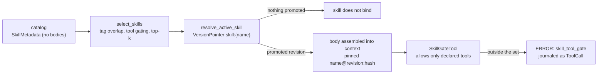

Part II · Concepts and internals · Chapter 06

# Skills

A tool lets an agent act. A skill tells it how your team does a task: the procedure, the pitfalls, the order of operations, written once and reused by every agent that needs it. The module docs of `rusty-core/src/skill.rs` put it in the capability-harness vocabulary: tools provide action, skills and knowledge provide context. A skill carries no executable authority and no credentials. It is versioned procedural knowledge, and the rest of this chapter follows from that.

Status: the skill plane is on `main` and not yet in a versioned release. The CHANGELOG lists it under "Unreleased — the product cycle after R0.12", and the crates stay at 0.12.x until the next release.

## The concept: procedural knowledge as a package

The package format follows the Agent Skills convention: one `SKILL.md` file with YAML frontmatter (`name` and `description` required) and a markdown body, plus optional `references/` and `assets/` directories. The format is simple. The loading discipline is what matters, and it is called **progressive disclosure**. An agent with hundreds of skills available cannot hold hundreds of procedures in context. So the catalog is tiered: the agent sees names and descriptions first, loads a body only when a skill looks relevant, and pulls reference files one at a time. Context is limited, and this spends it on a procedure only when the task needs one.

A folder of markdown files leaves the governance questions open. Who published this skill? Which version is live? Did anyone review it? Does it contain a script tag or a URL with embedded credentials? When a run used it, can you prove which bytes the model saw? The runtime answers those.

## Rusty: the package registry

`rusty-core/src/skill.rs` handles parsing, disclosure tiers, provenance, scanning, and versioning. Its rules hold at construction, so nothing downstream re-checks them.

- **Parsing fails closed.** `SkillPackage` validates when it is built: frontmatter present and in the supported subset, a kebab-case name up to 64 bytes, a description up to 1 KiB, a body up to 256 KiB, each reference or asset up to 512 KiB, the whole package up to 2 MiB, and member paths that are relative, with no `..` and no symlinks. An invalid package cannot exist as a value.
- **Provenance is mandatory.** Every registered version records its `SkillSource` (a local path, a named registry, or a catalog package with its publisher and version), an author string, and the content hash.
- **The scan is local and deterministic.** `scan_package` treats embedded HTML script tags and URLs with credentials in the userinfo part as denials, and large base64 blobs as warnings. Registration fails on any denial. Warnings are stored with the version in its `ScanReport`.
- **Versions are immutable and content-addressed.** A version's identity is the SHA-256 of the package's canonical serialization (`SkillPackage::content_hash`). Registering identical content again is a no-op. Changed content under the same name appends a new revision and moves the latest pointer forward, never backward and never in place.

Progressive disclosure is enforced by types. `SkillMetadata`, the type `SkillRegistry::list` returns, has no body field, so a listing cannot pull bodies in by accident. The body comes from `SkillVersion::body` once you resolve a version. References and assets are listed on demand (`reference_paths`, `asset_paths`) and loaded one member at a time.

On the server, skills live under `/skills`: `POST /skills/import` imports packages, `GET /skills/{name}/body` returns a body, and `POST /skills/{name}/promote` promotes a revision.

## Rusty: selection and activation

`rusty-core/src/skills.rs` decides which skills a run gets. It has four parts.

**Bindings.** A `SkillBinding` is the run-facing half of a skill: trigger tags matched against the task, a note on the task shape, a cost class, and an enforceable tool set. The frontmatter's `allowed-tools` field is advisory; the binding turns it into a declared set (up to 32 tools) that limits what calls the run may make while the skill is active.

**Shortlisting without embeddings.** `select_skills` scores catalog entries by how many trigger tags overlap with the task, drops skills whose declared tools are not available to the run, and returns a deterministic top-k with the full ranking and the exclusions. Ranking engages once the catalog exceeds 20 skills (`DEFAULT_SKILL_SHORTLIST_CUTOFF`), and the default shortlist is 5. There is no vector search, consistent with the memory plane, so every selection can be explained and replayed.

**Promotion decides which revision binds.** `resolve_active_skill` reads the learn plane's `VersionPointer` for the surface `skill:{name}`. The registry's latest pointer records authorship history and is never used for activation. A skill with no promoted revision does not bind at all; there is no fallback to the latest upload. In a framework, the newest file in the folder would win. Here, a promoted candidate with evaluation behind it wins ([Chapter 05](./05-learning-loop.md)).

**The gate tool.** While skills are active, `SkillGateTool` wraps tool calls and refuses any call outside the union of the active skills' declared tools. The refusal is the tool's result, a structured `ERROR: {"kind":"skill_tool_gate",…}` payload. Two consequences: a skill can only narrow the run's tools, never add to them; and a refusal is journaled as an ordinary `ToolCall`, so it is attributable and replayable.

## Evidence, and distillation

When a run assembles skills into its context, the section manifest pins each one as `name@revision:hash`, and the bodies are part of the journaled `ModelCall` input. You can rebuild the prompt the model saw, including the exact skill revision, the same way you can for memory ([Chapter 04](./04-memory.md)). A dedicated `SkillLoaded` journal event is proposed in the design and deferred; the existing records already pin the identity.

A skill is content-addressed, so it can be a learning candidate. `CandidateContent::Skill` carries the name, content hash, and binding, and a skill produced from recorded runs goes through the same candidate, evaluate, promote, and rollback path as a prompt change. The reference distiller, `rusty-core/src/skill_distill.rs`, reads completed runs' journals and the corrections recorded against them, and drafts a `SKILL.md` by deterministic templating with no model call. Equal inputs give the same package and the same candidate id. The draft is parsed by `SkillPackage::from_markdown` and scanned by `scan_package` like any other package, and a draft that fails either never becomes a candidate. A distiller that uses an LLM to write the prose is an application-side replacement; it still cannot skip the governance path.

::: tip Key takeaways
- A skill is versioned procedural knowledge. It supplies context and carries no credentials or authority of its own.
- Packages parse fail-closed with byte limits, carry mandatory provenance, pass a deterministic scan, and version immutably by content hash.
- Listings cannot pull bodies by accident, because `SkillMetadata` has no body field.
- A skill binds only through a promoted `VersionPointer`, and active skills can only narrow the tool set.
- Skills are learning candidates. The reference distiller builds them from journals without model calls.
:::

**Further reading**

- [rusty-core/src/skill.rs](https://github.com/dev-amjad-shaikh/rusty/blob/main/rusty-core/src/skill.rs): the package registry and its rules
- [rusty-core/src/skills.rs](https://github.com/dev-amjad-shaikh/rusty/blob/main/rusty-core/src/skills.rs): selection, activation, and the gate tool
- [rusty-core/src/skill_distill.rs](https://github.com/dev-amjad-shaikh/rusty/blob/main/rusty-core/src/skill_distill.rs): the reference trajectory distiller
- [docs/how-to.md](https://github.com/dev-amjad-shaikh/rusty/blob/main/docs/how-to.md#build-a-skill): building a skill in Studio
- [docs/rusty-capability-harness-design.md](https://github.com/dev-amjad-shaikh/rusty/blob/main/docs/rusty-capability-harness-design.md): the tools-act, skills-inform vocabulary
