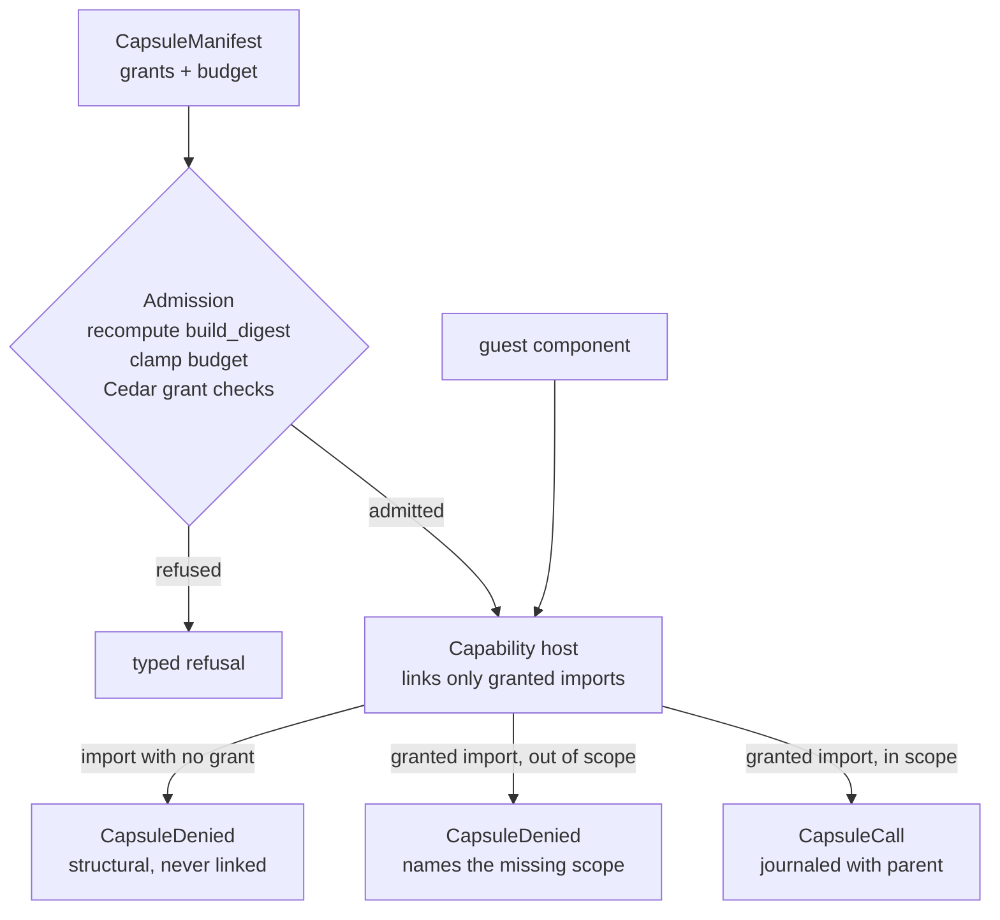

Part II · Concepts and internals · Chapter 07

# Capsules

Eventually your platform has to run code you did not write: a community tool, a tenant's custom node, an MCP server of unknown origin. Running it as a subprocess gives it everything the process can reach. Capsules, shipped in R0.9 (platform v0.10), are Rusty's answer. The rule from [docs/capsules-design.md](https://github.com/dev-amjad-shaikh/rusty/blob/main/docs/capsules-design.md): code the runtime does not trust may reach the filesystem, the network, a secret, the clock, a model, or another tool only if its manifest declared that reach, a policy permitted it, and the grant can be shown afterward. Every capability use and every denied attempt is journaled and attributed to the manifest grant that allowed or refused it.

## The concept: isolation is a spectrum, and the middle was missing

Two isolation approaches are common. **MicroVMs** (Firecracker, E2B) isolate at the machine boundary. They suit hostile multi-tenant processes, but cold starts cost hundreds of milliseconds and the boundary is a whole kernel, while the untrusted unit is often a single node invocation. **In-process sandboxes** are cheap, but the guest traditionally inherits the host's filesystem, network, and environment, and the permission model lives in deployment config the code cannot see.

The design draws on five ideas that fill the middle:

- **Object capabilities** (Mark Miller's E language and its successors): authority is an unforgeable reference. A component that was never handed the secret-store capability cannot reach secrets, because there is nothing to name. Deny-by-default becomes a structural fact.
- **The WASM Component Model and WASI**: a component's WIT world declares the imports it needs, and the host decides what to link. An import that is not linked does not exist.
- **Wasmtime resource controls**: fuel is a deterministic CPU budget, epoch interruption preempts a guest that stops yielding, and `ResourceLimiter` caps memory.
- **Deno's permissions**: grants scoped to host, protocol, and method, declared by whoever runs the code, not by the code.
- **Cedar**: authorization policy as data with formal semantics.

The design lists what framework-level isolation loses. Authority is ambient. Denials are silent, a log line at best. Budgets are advisory, enforced outside the execution record, so a run that used 40 seconds of a 30-second budget leaves evidence of the 40 and none of the bound.

## Rusty: the manifest declares, the host enforces

A capsule is declared before any code runs, as a `CapsuleManifest` (`rusty-core/src/capsule.rs`). The manifest is golden-pinned and evolves only by addition. `CapsuleId` is the SHA-256 of its canonical serialization, so a tampered manifest no longer matches its id. The fields that matter:

- **`build_digest`**: the SHA-256 of the guest `.wasm` bytes. Admission recomputes it, and a manifest that names bytes it was not built from does not load.
- **`interface`**: the WIT world it was built against. R0.9 supports one, `rusty:capsule/world@0.1.0`.
- **`effects`**: the `Effect` classes the capsule may produce. Each grant implies a minimum class (`CapabilityGrant::implied_effect`): a read-only filesystem grant or GET-only network grant implies `ReadOnly`, while read-write filesystem, write methods, tool, and model grants imply `NonIdempotent`. A manifest that declares less than its grants imply is refused.
- **`capabilities`**: a closed set of `CapabilityGrant`s. `Filesystem` (path prefixes, read or read-write), `Network` (hosts, protocols, HTTP methods), `Secret` (handles, never bytes), `Tool` (names in the run's `ToolRegistry`), `Model` (names the deployment serves), and `Clock`. The set is the entire reach. The default is empty, a pure-compute guest.
- **`budget`**: a `ResourceBudget` of fuel, memory, wall time, tokens, cost, and output bytes. `None` on a field means the enclosing scope's bound applies.

The manifest is not signed. Its digest proves integrity against the registry, not who wrote it. The design deferred manifest signing and spent R0.9's signing work on run receipts, which cover the resolved capsule ids.

## The capability host: denial you can show

The host is `rusty-core/src/capsule_host.rs`, behind the `wasm` feature. The older `WasmNode` (`rusty-core/src/wasm_node.rs`) runs pure-compute guests with no imports at all and stays as the fast path. The capability host runs Component Model guests whose imports exist only when granted. Nothing had to migrate.

**Structural denial.** Before instantiation, the host walks the component's import list. An import whose capability has no grant is never linked, and the invocation is refused with a journaled `CapsuleDenied`. A component built without the network import cannot reach the network even in-process: there is no symbol to call. The R0.9 world is narrow and the CHANGELOG says so. It links two imports, `rusty:capsule/net@0.1.0` (`fetch`) and `rusty:capsule/clock@0.1.0` (`now-millis`). Filesystem, tool, and model grants are defined in the manifest contract and have no linked import yet, so a guest that imports them fails closed.

**Scoped denial.** A grant can be narrower than the import. A `Network` grant for one host links `fetch`, and the host's import implementation checks host, protocol, and method against the grant before opening a socket. A mismatch is refused and journaled as `CapsuleDenied` with an `absent_grant` naming the missing scope. The module docs are explicit that this is a runtime check, evaluated when the attempt arrives. Revocation is checked the same way: through the `GrantRecheck` seam, each granted import re-authorizes at its next use.

**Budgets.** Fuel is the CPU budget and is deterministic, so it replays the same way. Epoch interruption enforces wall time: a ticker advances the engine epoch every 5 ms (`EPOCH_TICK_MS`), and a guest that stops yielding is preempted. `ResourceLimiter` carries the memory cap. At admission, the budget is clamped field by field to the minimum of what the manifest declares and what the enclosing run allows (`ResourceBudget::clamp`), and the clamp is journaled. A breach aborts the invocation and records which budget was hit when that can be attributed confidently: fuel and wall time can, memory and other traps are reported unattributed.

**Secrets.** A guest never holds credential bytes. Since R0.11, `BrokeredCapsuleHost` (`rusty-core/src/broker.rs`) turns a manifest's `Secret` grants into broker-issued handle tokens delivered in the guest's input. The credential is resolved on the host side at the moment of use, so a granted call can be authenticated while the guest holds only an opaque token.

The release proof is `rusty-server/tests/capsules_release.rs`. An untrusted capsule arrives through the A2A bridge as a durable node, with a manifest granting exactly one network host and no filesystem. The granted fetch succeeds and is journaled. A fetch to another host is denied, and the filesystem import does not exist. Both denials are journaled into the invoking run, each naming the absent grant. The run's signed receipt verifies and covers both denials, and tampering with a journaled denial fails verification, naming the journal head. The test only compiles with the `capsules` feature.

## Cedar, and signed run receipts

Authorization is Cedar, in `rusty-server/src/capsule_policy.rs` behind the server's `capsules` feature. A server built without the feature refuses the capsule policy surface with a typed error. Cedar decides three questions. May this tenant load this capsule at all, checked at `POST /capsules` and again at `POST /capsules/resolve`? Does policy permit each declared grant (one Cedar request per grant, and any denial refuses admission)? May this author attach this overlay? The narrowing itself is not Cedar's job. The effective grant set is the intersection of manifest and overlay (`intersect_grants` in `rusty-core/src/capsule.rs`), a set operation that cannot add a grant. Policies are operator-authored `.cedar` text, stored as immutable versions with one active pointer per tenant, moved only by `POST /capsule_policies/active`. The active version is pinned into every admission event.

A run receipt (`rusty-core/src/receipt.rs`) is an Ed25519 signature over evidence the Flight Recorder already holds:

- the run id and the journal head (`JournalRef`); signing the head covers every event in the chain
- the run manifest and its digest, plus the resolved capsule ids
- the effect ledger: one digest per journaled `EffectReceipt`
- the executor policy version and the Cedar policy versions capsules were admitted under
- the denials ledger: the ids of every `CapsuleDenied` event, so a receipt for a run that attempted forbidden access says so

The server exposes `GET /runs/{id}/receipt` and `POST /receipts/verify`. `verify_receipt` recomputes the journal head with the journal's own chain step and returns a typed `ReceiptRejection` naming the component that failed. Keys are scoped plainly: one Ed25519 keypair per deployment, stored as a `0600` file under `{store_path}/keys/`, with only the public half in the store. Key genesis and rotation are journaled (`SigningKeyRotated`), and old receipts verify against the key history. A receipt proves integrity and origin against a key the operator holds. It gives no non-repudiation against that operator and no remote attestation. KMS, transparency-log witnessing, and attestation are planned for R1.0 and later, and `RunReceipt::canonical_bytes` is the exact byte string a log would witness. A receipt also cannot vouch for an external model's answer or a remote agent's claims; it covers only what this runtime received, authorized, and executed.

R0.9 also shipped protocol bridges in four directions. As an MCP server, Rusty exposes a registered assistant as a tool whose calls submit background runs, and a client disconnect cancels the run. As an MCP client, calls are journaled with derived idempotency keys, and replay serves the recorded response without starting the stdio server. As an A2A server, inbound tasks become durable tasks. As an A2A client, remote agents are durable nodes journaled as effects. [Chapter 09](./09-tools-connectors.md) continues with tools and connectors.

::: tip Key takeaways
- A capsule's reach is declared in a content-addressed manifest before it runs, and the manifest's effects must cover what its grants imply.
- An ungranted import is never linked. A granted import out of scope is refused at use. Both journal `CapsuleDenied` naming the absent grant.
- The R0.9 world links only `net.fetch` and `clock.now-millis`; other grant kinds are contract-only so far.
- Budgets are clamped to the enclosing run at admission, and breaches are journaled.
- Cedar decides legality, set intersection does the narrowing, and receipts sign the journal head, manifests, effects, policy versions, and denials with a local key.
:::

**Further reading**

- [docs/capsules-design.md](https://github.com/dev-amjad-shaikh/rusty/blob/main/docs/capsules-design.md): the R0.9 design, lineage, and open questions
- [rusty-core/src/capsule.rs](https://github.com/dev-amjad-shaikh/rusty/blob/main/rusty-core/src/capsule.rs) and [rusty-core/src/capsule_host.rs](https://github.com/dev-amjad-shaikh/rusty/blob/main/rusty-core/src/capsule_host.rs): manifest and host
- [rusty-core/src/receipt.rs](https://github.com/dev-amjad-shaikh/rusty/blob/main/rusty-core/src/receipt.rs): `RunReceipt` and `verify_receipt`
- [rusty-server/tests/capsules_release.rs](https://github.com/dev-amjad-shaikh/rusty/blob/main/rusty-server/tests/capsules_release.rs): the R0.9 release proof
