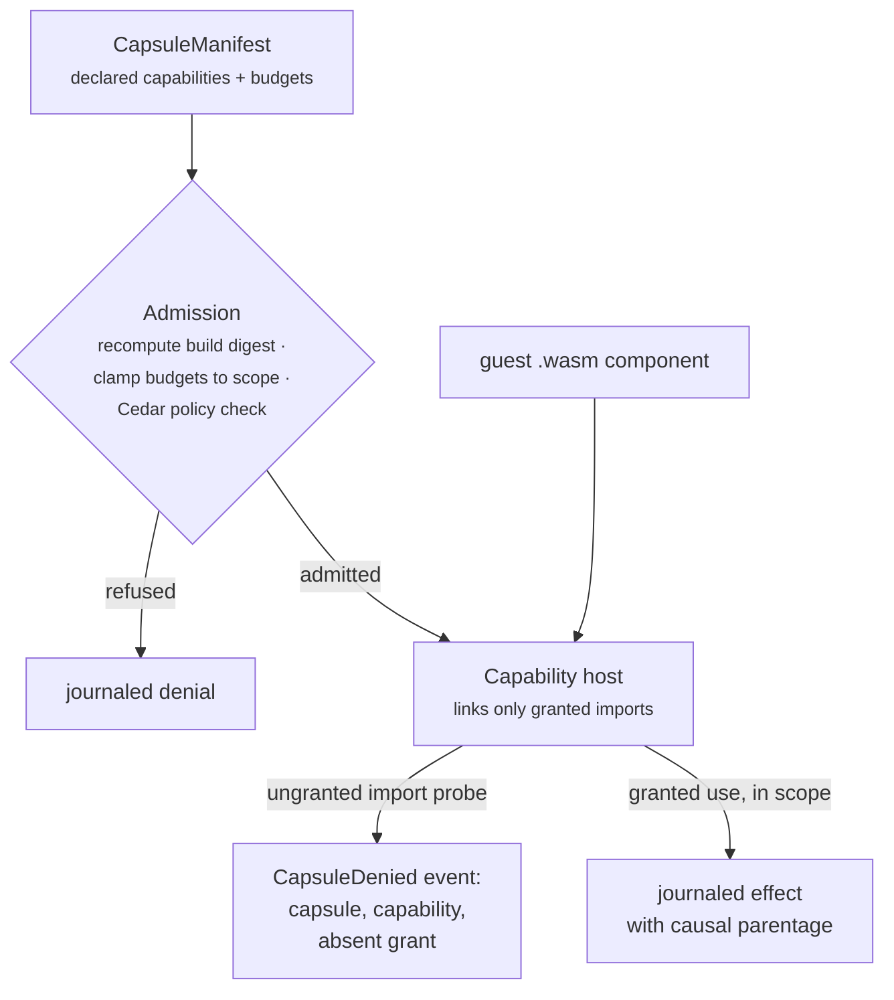

Part II · Concepts and internals · Chapter 07

# Capsules

Sooner or later someone asks your agent platform to run code you didn't write: a community tool, a tenant's custom node, an MCP server of unknown provenance. The framework answer is a subprocess and a prayer. This chapter is about doing it properly — the capsule rule: **no code the runtime does not trust may reach the filesystem, the network, a secret, the clock, a model, or another tool unless its manifest declared that reach, a policy permitted it, and the grant can be shown afterward.** Every capability use, and every denied attempt, is journaled with causal parentage and attributable to the exact manifest grant that allowed or refused it.

## The concept: isolation is a spectrum, and the middle was missing

The field offers two classic answers. **MicroVMs** (Firecracker, E2B) isolate by machine boundary — right for hostile multi-tenant *processes*, but the cold start is hundreds of milliseconds and the boundary crosses an entire kernel when the untrusted unit is usually a single node invocation. **In-process sandboxes** are cheap but historically ambient: the guest shares the host's filesystem, network, and environment, and the permission model lives in deployment config the code can't see.

The interesting lineage is the one that closes the middle:

- **Object capabilities** (Mark Miller's E work and its successors): authority as unforgeable references. A component never handed the secret-store capability cannot reach secrets no matter what it asks, because there is no ambient name to ask for. Deny-by-default stops being a policy stance and becomes a structural fact.
- **The WASM Component Model and WASI**: a component's WIT *world* declares exactly the imports it receives; the host chooses what to link. An import that doesn't exist is not a permission checked and refused — it's a door that was never built.
- **Wasmtime's resource governance**: fuel metering is a deterministic CPU budget, epoch interruption preempts a guest that stops yielding, `ResourceLimiter` caps memory.
- **Deno's permission model**: `--allow-net=api.example.com`-style grants demonstrate that host/protocol/method scoping is the right granularity, and that the grant must be declared by the party running the code, not the code itself.
- **Cedar**: policy-as-data authorization with a formal semantics — so "can this tenant overlay ever widen a grant?" is a verification question, not a code-review question.

Framework-level isolation loses three things, and the capsules design names them: authority is ambient, denial is silent (a refusal is a log line, if anything), and budgets are advisory (enforced outside the execution record, so a run that burned 40 seconds inside a 30-second budget leaves evidence of the 40, not of the bound that should have stopped it).

## Rusty: the manifest declares, the host enforces

A capsule is declared before any code runs, as a content-addressed `CapsuleManifest` (`rusty-core/src/capsule.rs`) — golden-pinned, additive-evolution only, the same contract discipline as memory records and candidates. `CapsuleId` is the SHA-256 of the manifest's canonical serialization: identity is integrity. The load-bearing fields:

- **`build_digest`** — SHA-256 of the guest `.wasm` bytes. Admission recomputes it; a manifest naming bytes it wasn't built from does not load.
- **`interface`** — the WIT world reference the component was built against. World versions are additive; old worlds keep instantiating.
- **`effects`** — the closed `Effect` classes the capsule may produce, reserved as the taxonomy's consumer since R0.5. A capsule whose declared classes top out at `ReadOnly` is refused at admission if its requested grants imply writes; the host enforces the stricter of the two.
- **`capabilities`** — a closed set of grants: `filesystem` (path prefixes, read or read-write), `network` (hostnames, protocols, HTTP methods), `secret` (handles, not bytes), `tool` (names in the run's `ToolRegistry`), `model` (names the deployment serves). The set is the whole reach; the default is empty, which describes a pure-compute guest — exactly what the existing `WasmNode` ABI already runs, so nothing regresses.
- **`budget`** — fuel, memory, wall time, max tokens, max cost, max output bytes. `None` means the enclosing scope's budget applies, never an invented default.

Manifest signing is deliberately deferred — the digest proves integrity against the registry, not provenance against an author. R0.9's signing budget went to run receipts instead, because receipts cover manifest digests transitively. The book flags this as designed-but-later, as the design does.

## The capability host: denial you can show

The host (`rusty-core/src/capsule_host.rs`, feature `wasm`) upgrades the sandbox from "no imports at all" to "imports that exist only when granted" — the strictly harder problem the Component Model exists for. `WasmNode` stays untouched beside it; there's no forced migration.

Three enforcement properties deserve emphasis.

**Structural denial.** A component built without the `secret-store` import cannot reach secrets even in-process: no symbol to call, no handle to forge. Grants narrower than the world — a `network` grant naming one hostname — are enforced inside the host's import implementation, matching host, protocol, and method before any socket opens.

**Denials are evidence.** A denied attempt journals `CapsuleDenied`, naming the capsule id, the requested capability, and *the manifest grant that was absent* — attributable to a declaration, not a stack trace. Every runtime claims deny-by-default; in Rusty the claim is checkable, because the evidence plane predates the isolation plane. The release proof is a denial you can show, not a denial you can assert.

**Budgets compose downward.** Fuel is the CPU budget (deterministic, replay-stable), epoch interruption enforces wall time, the memory cap carries over. A capsule's declared budget is clamped at admission to the *minimum* of what the manifest declares and what the enclosing run, tenant quota, and pool permit — and a breach terminates the invocation and journals which budget bit. A budget that cannot be shown in evidence is advisory; these are not.

Secrets deserve a sentence of their own: a `secret` grant hands the guest an opaque handle — no bytes, redacted in `Debug`, never in guest linear memory. The host resolves handle to secret at the moment of use, inside the host-side connector, so a granted HTTP call can be authenticated without the guest ever holding the credential.

## Cedar, and signed run receipts

Authorization policy is Cedar (`rusty-server/src/capsule_policy.rs`, feature `capsules`): capsule admission, grant checks, and tenant overlays that can only narrow. Cedar's analysis tooling is the credible path to proving an overlay can't widen — stated as intent where the tooling is still moving.

The receipt (`rusty-core/src/receipt.rs`) is the release's signing spend: an Ed25519-signed statement over evidence that already exists — the journal head hash (signing the head signs every event transitively), the run manifest digests, the effect-receipts ledger, the policy versions, and the *denials ledger*, so a receipt over a run that attempted forbidden access says so. v1 key management is honestly scoped: one keypair per server deployment, generated on first boot — local signing with local keys, proving integrity and origin against a key the operator holds, no more. KMS, remote attestation, and transparency-log witnessing are R1.0+; the receipt's canonical form is exactly the byte string a transparency log would witness later. And the design is plain about what a receipt does *not* prove: nothing about whether an external model told the truth or a remote agent kept its word — a signature over Rusty's evidence cannot witness systems whose journals Rusty doesn't hold.

Finally, the bridges: R0.9 also ships MCP server and client bridges and A2A server and client, with streaming and cancellation preserved in all four directions — a graph exposed as an MCP tool runs under its declared manifest and budget, and an outbound MCP call is a journaled, idempotency-keyed effect. The ecosystem's ambient-authority posture isn't Rusty's to fix; Rusty's own exposure, in both directions, is governed. Chapter 09 picks up the connector story from there.

::: tip Key takeaways
- Capsules bound the guest; they are not plugins that extend the host. Declaration precedes execution, and the manifest is content-addressed.
- Denial is structural — unlinked imports, not runtime checks — and journaled: `CapsuleDenied` names the absent grant.
- Budgets clamp to the strictest enclosing scope and breaches are evidence, not log lines.
- Receipts sign the journal head, manifest digests, effect ledger, policy versions, and denials — local keys for now, transparency-log-ready by construction.
- What a receipt can't prove is stated: Rusty's own conduct only, never third-party systems'.
:::

**Further reading**

- [docs/capsules-design.md](https://github.com/dev-amjad-shaikh/rusty/blob/main/docs/capsules-design.md) — the full R0.9 design, lineage and open questions included
- [rusty-core/src/capsule.rs](https://github.com/dev-amjad-shaikh/rusty/blob/main/rusty-core/src/capsule.rs) and [capsule_host.rs](https://github.com/dev-amjad-shaikh/rusty/blob/main/rusty-core/src/capsule_host.rs) — manifest and host
- [rusty-core/src/receipt.rs](https://github.com/dev-amjad-shaikh/rusty/blob/main/rusty-core/src/receipt.rs) — `RunReceipt` and the verification API
- [rusty-core/src/wasm_node.rs](https://github.com/dev-amjad-shaikh/rusty/blob/main/rusty-core/src/wasm_node.rs) — the pure-compute sandbox capsules build beside
