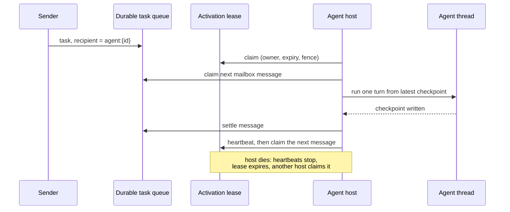

Part II · Concepts and internals · Chapter 08

# Blueprints & agents

The chapters so far describe runs: graphs executing, checkpointing, journaling. A product thinks in agents: the researcher, the triager, the accounts-payable clerk. These are durable identities that survive redeploys, hold state across days, receive work while they are not running, and answer for what they did. This chapter covers how Rusty gives an agent identity and declared capability, and how reusable agent definitions are packaged. Coordination patterns (delegate, fan-out, race, quorum) are in [Chapter 11](./11-sub-agents.md).

## The concept: identity beyond the process

The relevant background is the actor model, specifically Orleans: an actor's identity should be names and records, not a live process, so it survives crashes and redeploys without a directory service. Erlang gives each process an in-memory FIFO mailbox. Orleans adds virtual actors that activate on demand. Most agent frameworks give you neither. An "agent" is a prompt and a loop held in a variable, and if two callers need it at once you design the discipline yourself.

A durable agent needs a stable identity scoped to a tenant, private state that outlives any process, a mailbox that accepts work while the agent is down, declared limits on what it may touch, and supervision when it fails. The Agent Fabric, shipped in R0.7 (platform v0.8), builds these on primitives from earlier releases. The design is [docs/agent-fabric-design.md](https://github.com/dev-amjad-shaikh/rusty/blob/main/docs/agent-fabric-design.md) and the contracts are in `rusty-core/src/agents.rs`.

## Rusty: an agent is a triple

An agent is three things.

1. **A stable `AgentId`**, tenant-namespaced like every other server id. `acme/researcher-7` uses the tenant isolation model from v0.5 unchanged; another tenant's agent resolves to nothing.
2. **A thread** holding its private state. `AgentId::thread_id()` returns `agent:{agent_id}`. There is no new store: the checkpointer, time travel, and fork work on agent state unmodified, because an agent's memory of itself is its checkpoint log.
3. **A versioned `CapabilityManifest`**, which makes everything else enforceable.

The manifest's fields:

- `agent_kind`: the graph and config the agent runs, as the server's assistant registry models it.
- `manifest_version`: an exact version string such as `researcher/1.4.0`. A team started against one manifest version keeps it for its mailbox traffic and delegated work, so a redeploy mid-coordination cannot change semantics under it. Semver ranges are deferred; exact match is the only rule that cannot surprise you.
- `accepts`: the message kinds the mailbox takes, each mapped to an `ArtifactContract` its payload must satisfy. A message whose kind is not in the map fails at submission, classified as invalid input and never retried, instead of dead-lettering after its attempt budget.
- `scopes`: the `StateScope`s the agent may read and write, journaled with the `AgentSpawn` event.
- `budget`: an optional agent-level ceiling (`AgentBudget`). Tenant quotas apply either way.
- `supervision`: an optional `SupervisionPolicy`.

## The mailbox is an addressing discipline

A mailbox is not a new queue. It is a way of addressing work on the durable task queue from R0.6: a task whose `recipient` is `agent:{agent_id}` (`AGENT_RECIPIENT_PREFIX`) is mailbox traffic. The design explains the alternatives it rejected. A worker pool per agent would turn static deployment config into per-agent config. A separate mailbox table would duplicate leases, retries, the dead-letter queue, quotas, deadlines, and the outbox, all of which the queue already has. One queue means one set of guarantees. Server-side, recipient-addressed tasks are excluded from the pool claim path, so a pool worker can never take a mailbox message out from under an agent.

The one new mechanism is the **activation lease**, stored per agent (`server_agent_leases`). It guarantees at most one activation of an agent at a time across all hosts. A host claims the lease, drains the mailbox one message at a time, and settles each message before claiming the next. The lease is renewed by heartbeat and carries a fencing token; when a lease is stolen the fence advances, so a stale owner's writes are refused. If a host dies, its heartbeats stop, the lease expires, and another host re-activates the agent from its thread's latest checkpoint.

Ordering is weaker than Erlang's, on purpose. The runtime promises **turn-sequential processing**, one message at a time per agent, and approximate FIFO when nothing fails. It does not promise total order. A message scheduled for retry becomes visible again behind later messages. If you need strict order, carry a sequence number from the sender. The envelope records `sender` and `parent`, so out-of-order handling is visible in the evidence. This matches Orleans' guarantee, because the mailbox's durability comes from the queue, not from process memory.

## State scopes and supervision

The four `StateScope`s map onto stores that already exist:

- **`Private`**: the agent's own thread. The checkpoint log is the private state.
- **`Team`**: a shared thread (`team:{team_id}`) written only through mailbox-driven turns, so every change has a journaled author. Shared mutable team state outside turns is not offered, because that is the bug class the channel and reducer model exists to prevent.
- **`User`**: the server KV store under a `user:{user_id}` namespace inside the tenant.
- **`Tenant`**: the tenant's KV namespace itself, for configuration and reference data shared by every agent in the tenant.

The manifest's declared scopes are checked on access. Memory scopes ([Chapter 04](./04-memory.md)) extend this list with `run`, and the server's memory gate refuses an agent-scope write unless the agent's manifest declares `Private`.

Supervision (`rusty-server/src/supervision.rs`) uses Erlang/OTP's vocabulary: restart policies `permanent`, `transient`, and `temporary`, with an intensity-per-period budget over a sliding failure window. Three signals feed it, all already durable records: mailbox turn failures (classified by the shared `ErrorClass` taxonomy), the agent-level deadline, and an operator's manual restart. A restart re-drives the agent's thread from its latest checkpoint and leaves the mailbox untouched. When the restart budget is exhausted, the agent escalates by message, not by exit: an `EscalationNotice` goes to the supervisor's mailbox, and a root agent's notice dead-letters with the evidence attached. Every decision is a `SupervisionEvent` in a per-agent supervision journal, readable at `GET /agents/{id}/supervision`. A crash-looping agent's history is therefore durable evidence the learning loop can read ([Chapter 05](./05-learning-loop.md)).

## Blueprints and the catalog: agents as versioned packages

A manifest declares one agent. Packaging reusable definitions is the catalog's job (`rusty-core/src/package.rs`). Every catalog item ships as one package whose manifest is the authoritative contract: what the package registers, what it requires, and what it may reach. A package that tries to register something, or reach an egress destination, missing from its declaration is refused. The manifest's content hash (SHA-256 over canonical JSON of every field except `hash`) is its identity, and files are stored in a content-addressed blob store keyed by their own SHA-256, so every installed version stays retrievable for rollback and audit.

`PackageKind` has four variants: `Connector`, `ToolPack`, `SkillPack`, and `BlueprintTemplate`. The first three have working content: the repository's `catalog/` directory ships a dozen connector manifests (GitHub, Jira, Slack, Stripe, Zendesk, and others) plus skills. `BlueprintTemplate` exists as a package kind, but the core defines no blueprint content schema for it yet.

There is no team blueprint shelf in the current Studio. `docs/studio.md` still describes one from an earlier version of the workspace, but `studio/ui/src` has no such screen, so reusable team structure lives in code and in catalog packages for now.

::: tip Key takeaways
- An agent is a tenant-namespaced `AgentId`, a thread `agent:{id}` holding its state, and a versioned `CapabilityManifest` with an exact version pin.
- A mailbox is the durable task queue addressed to `agent:{id}`. An activation lease with a fencing token ensures one turn at a time.
- Ordering is turn-sequential with approximate FIFO; carry a sequence number if you need strict order.
- State scopes map onto existing stores, and supervision restarts from the checkpoint log and escalates by message.
- Catalog packages are content-addressed and capability-declared. `BlueprintTemplate` is a declared kind without a content schema yet.
:::

**Further reading**

- [docs/agent-fabric-design.md](https://github.com/dev-amjad-shaikh/rusty/blob/main/docs/agent-fabric-design.md): the R0.7 design
- [rusty-core/src/agents.rs](https://github.com/dev-amjad-shaikh/rusty/blob/main/rusty-core/src/agents.rs): `AgentId`, `CapabilityManifest`, `StateScope`, `SupervisionPolicy`
- [rusty-server/src/supervision.rs](https://github.com/dev-amjad-shaikh/rusty/blob/main/rusty-server/src/supervision.rs): restart and escalation
- [rusty-core/src/package.rs](https://github.com/dev-amjad-shaikh/rusty/blob/main/rusty-core/src/package.rs): the catalog package format and `PackageKind`
