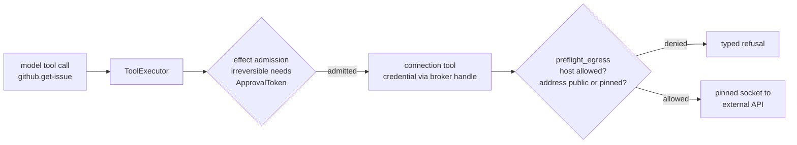

Part II · Concepts and internals · Chapter 09

# Tools & connectors

A tool call is where an agent stops talking and starts acting. The model emits JSON naming `send_email` and its arguments, and your system turns that string into a side effect in a system you may not own, using credentials you would rather keep away from the model. This chapter covers how tools are declared and executed, and how connectors, the packaged integrations with external APIs, keep the risky parts declared, sealed, and recorded.

## The concept: the tool-call gap

Function calling looks simple on the happy path, so the failure cases define the design. A tool that throws should not abort the other calls in its batch. A model that asks for ten calls wants them run in parallel and the results returned in order. A tool that touches the filesystem should not run in the same trust domain as one that reads engine state. A credential configured for an integration must never appear in a prompt, a journal, or a UI.

The existing standards cover pieces. Provider function-calling APIs standardize the schema format and say nothing about execution. MCP, the Model Context Protocol, standardizes discovery: a server lists its tools and a client consumes them. MCP servers typically run as local processes with the user's full authority, or as remote endpoints trusted because of their URL. Connector frameworks tend to grow one code path per integration. The Rusty connector standard records how that went wrong once: a hand-rolled `credentials.oauth` block got past a connector that had been "validated", and the rule that prevents it is now written down.

## Rusty: the tool system

The core is small (`rusty-core/src/tool.rs`). A `Tool` is an async callable with a JSON-Schema parameter surface. A `ToolRegistry` holds the tools an agent can see and emits OpenAI-format schemas for the chat API. `ToolExecutor::execute_batch` runs a batch of tool calls in parallel and returns one `role: "tool"` message per call, in call order. A tool that returns an error, or panics, becomes an `ERROR:` tool message in its own slot. The panic is caught, the other calls complete, and the model can read the error and recover.

Every tool carries two classifications that answer different questions:

- **`Effect`** ([Chapter 03](./03-journals.md)) answers what may safely happen again. The `Tool` trait's default is `NonIdempotent`.
- **`EffectClass`** answers where the tool runs. `Read` tools read engine state and may run in-process. `Execute` tools run model-influenced code or touch the host filesystem. `Egress` tools open network connections. Each tool also declares a `SandboxRequirement`, `None` or `Required`. Registering an `Execute` or `Egress` tool with `SandboxRequirement::None` panics at registration, so an unsafe placement cannot be configured by accident. A sandbox backend reports the enforcement level it actually provides.

Tool calls are journaled like everything else. Wrapped in `RecordingTool`, a call is an event with a causal parent; under exact replay, `ReplayingTool` serves the recorded result without calling the tool. A gate refusal, such as the skill gate from [Chapter 06](./06-skills.md), comes back as the tool's result, so refusals are replayable evidence too.

The registry does not have to be fixed at build time. `ToolRegistry` can take a live `ToolSource` that is consulted on every read: the schema list, dispatch, and the catalog a run checks its allow-list against. Statically registered tools always win a name collision, so a source extends a graph and never shadows it. The server's connections plug in this way.

## MCP: discovery in, governance around

Rusty's MCP client (`rusty-core/src/mcp.rs`) is JSON-RPC 2.0 over any async reader and writer, with `McpStdioClient::spawn` to launch a server as a child process. It supports newline-delimited JSON and LSP-style `Content-Length` framing, puts a timeout on every request (30 seconds by default), and requests protocol revision `2024-11-05`. Inbound frames are capped at 16 MiB (`MAX_FRAME_BYTES`), checked before any length-driven allocation, because a hostile server's declared frame size cannot be trusted. `McpClient::into_tools()` lists a server's tools and returns them as ordinary `Tool`s, so MCP tools go through the same executor, the same ReAct graph, and the same journal without graph changes.

The R0.9 bridges ([Chapter 07](./07-capsules.md#cedar-and-signed-run-receipts)) cover both directions: a registered assistant can be exposed as an MCP tool, and outbound MCP calls are journaled effects with derived idempotency keys. The bridges govern Rusty's own exposure. They cannot change how the rest of the MCP ecosystem grants authority.

## The connector standard: one shape, no exceptions

The rule from [docs/connector-standard.md](https://github.com/dev-amjad-shaikh/rusty/blob/main/docs/connector-standard.md): every connector is one shape, a `ConnectorManifest` (`rusty-core/src/connector/manifest.rs`), and there is no second way to reach an external system. A connector that does not fit is a gap in the standard, and the fix is to close the gap. The connector plane is on `main`, not yet in a versioned release.

A manifest is one JSON document, content-hashed and registered on the server. Its fields:

- `id`, `version`, `display_name`, `description`, and an https `documentation_url`
- `base_url`: the API root, templated over config and required to be https, checked on the template and on the rendered URL
- `connection_specification`: JSON Schema draft-07 describing everything a connection needs
- `operations`: each with a method, path, params schema, declared effect, and an ordered list of auth alternatives
- `check`: the name of a parameterless read-only GET used as the setup gate
- `hash`: SHA-256 of the canonical serialization of the rest, derived and never chosen

Three properties follow. One document serves every surface: Studio's form, server validation, secret extraction, the tools an agent sees, and the egress policy all read it, so nothing drifts. A connection points at a manifest hash, so the manifest cannot change under it. And the check is the gate: `POST /connectors/check` proves a configuration against the real system before it is stored.

The rules behind the manifest each exist because of a failure:

- **The spec must constrain.** `ConnectorManifest::validate` requires `additionalProperties: false` at every object level, including inside `oneOf`, and at least one `required` field when an object declares properties. An undeclared field is refused. This is the rule the stray `credentials.oauth` block broke.
- **Alternatives are declared.** Several auth methods are a `oneOf` over closed objects, each with a `const` discriminator such as `"auth": {"const": "basic"}`. An alternative is selected by shape, without touching the network. Once selected, its failure is final and reports what the other system said. Before this split, a refused OAuth token exchange fell through to the next alternative and was reported as a config error.
- **Secrets are marked, sealed, and never returned.** A property with `rusty_secret: true` renders as a secret in Studio. The server extracts it before anything persists, seals it through the credential broker, and returns `{"rusty_secret": true}` in its place. Neither Studio nor a run's journal can read a saved secret.
- **Every operation declares its effect**: `read_only`, `idempotent`, `compensatable`, or `irreversible`, mapping to the kernel's `Effect` classes. The executor admits writes by that declaration: a `compensatable` call is admitted with its compensation registered, and an `irreversible` one is refused until an `ApprovalToken` names that exact call.
- **The server computes the hash.** A hand-written manifest arrives without one, and registration validates it, orders the operations canonically, and seals it. Requiring clients to compute a canonical hash would make the connector surface usable only from Rust.
- **A tool is named `{connector}.{operation}` everywhere.** The same name appears in the catalog, the agent's registry, and the model's tool call. A second connection to the same connector is `{connector}@{instance}.{operation}`.

Adding a connector is adding a file. Every `catalog/*/manifest.json` is registered at boot; the repository ships a dozen, including GitHub, Jira, Linear, Slack, Stripe, and Zendesk. For an API the library lacks, `POST /connectors/openapi` turns an OpenAPI 3.x document into a draft manifest: operations with an `operationId` become tools, the rest are listed as unmapped, and you pick one of four auth styles (bearer, basic, header, query). Systems that mint credentials only after a person approves use an `authorization` block for the OAuth round trip: `POST /connectors/instances/{id}/authorize` returns the provider's consent URL, and the callback seals the exchanged tokens into the connection.

## Egress

Connector traffic passes an egress policy. The vocabulary and evaluator are in `rusty-core/src/egress.rs`; interception is in `rusty-server/src/connectors.rs`. The policy is an allow-list. A host with no endpoint policy is denied. The allowed set is every configured connection's host (its API root and token endpoint) plus whatever the operator lists in `RUSTY_EGRESS_ALLOW`, recomputed whenever a connection is created, granted, rotated, or revoked.

`preflight_egress` resolves the hostname and checks the resulting addresses. An address that is private, loopback, or link-local is refused unless the endpoint pins it explicitly. The connection is then made to the exact address preflight approved, while the request keeps its hostname for SNI, certificate verification, and the Host header. This defends against DNS rebinding and server-side request forgery: the check applies to the resolved address, not only to the string in the manifest.

::: tip Key takeaways
- `Tool`, `ToolRegistry`, and `ToolExecutor` give parallel dispatch, results in call order, and per-call failure containment (including panics) as `ERROR:` messages.
- Every tool has an `Effect` for retry safety and an `EffectClass` plus `SandboxRequirement` for placement; unsafe placements panic at registration.
- MCP tools become ordinary tools once listed, and inbound frames are capped at 16 MiB before allocation.
- A connector is one content-hashed manifest with a closed spec, declared auth alternatives, sealed secrets, per-operation effects, and a live check before anything is stored.
- Egress is an allow-list checked against resolved addresses, with the socket pinned to what preflight approved.
:::

**Further reading**

- [docs/connector-standard.md](https://github.com/dev-amjad-shaikh/rusty/blob/main/docs/connector-standard.md): the manifest rules and the reasons behind them
- [rusty-core/src/tool.rs](https://github.com/dev-amjad-shaikh/rusty/blob/main/rusty-core/src/tool.rs): the tool trait, registry, and executor
- [rusty-core/src/mcp.rs](https://github.com/dev-amjad-shaikh/rusty/blob/main/rusty-core/src/mcp.rs): the MCP client
- [rusty-core/src/connector/manifest.rs](https://github.com/dev-amjad-shaikh/rusty/blob/main/rusty-core/src/connector/manifest.rs): `ConnectorManifest` and its validation
- [rusty-core/src/egress.rs](https://github.com/dev-amjad-shaikh/rusty/blob/main/rusty-core/src/egress.rs): the egress policy and DNS preflight
