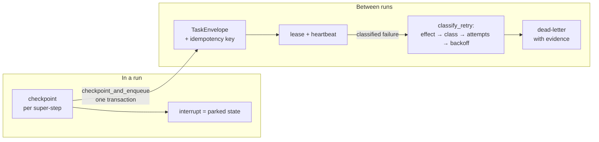

Part II · Concepts and internals · Chapter 10

# Durability

Durability is the property that separates a demo from infrastructure: the work survives the process. Rusty answers it at two levels — the checkpointed run you've already met, and a durable task system for work that outlives any single run — and this chapter treats both, because they share one promise and one honest limit. The promise: **effectively-once execution when applications use idempotency.** The limit, stated as plainly as the durable-work design states it: delivery is at-least-once, and where an effect cannot be made idempotent, the retry machinery refuses to re-drive it silently. There is no universal exactly-once, and Rusty doesn't pretend otherwise.

## The concept: recovery is re-driving, not resurrection

The lineage is old and solid. **Sagas and process managers** (Garcia-Molina & Salem, 1987) decompose long-running work into steps whose state lives outside any single process — you recover by re-driving from durable state, not by keeping a process alive. **Temporal-style activity retries** declare retry policy per unit of work: maximum attempts, backoff, non-retryable error types. **SQS visibility timeouts** make a delivered message invisible rather than deleted; expiry returns it to the queue. The **transactional outbox** commits a state change and a message emission in one transaction, so a crash can never produce "state saved, task lost" or the reverse.

What these systems historically *can't* tell you is whether a retry is safe. "Should we re-run this?" gets answered from error strings, or from a hand-maintained retryable-error list, or not at all. That's the question Rusty's effect taxonomy exists to answer — and it's why the Flight Recorder had to land first.

## Level one: the checkpointed run

Chapter 02 covered the mechanics; the durability view is a summary plus the contract. One checkpoint per super-step boundary; resume is starting from the latest; an interrupt is a parked state, not an exception. The server demonstrates the property rather than asserting it: `rusty-server/tests/crash_recovery.rs` kills a real process with SIGKILL mid-run, boots a fresh one against the same store, and asserts the completed work is intact and the pending human decision resumes. The idempotency contract is the price: checkpoints happen at boundaries, never mid-node, so resume re-executes a node from its start.

Two refinements matter at the server level. Graceful shutdown is cooperative: on SIGINT/SIGTERM the server drains — in-flight runs are cancelled at super-step boundaries through a cancellation hook in `RunConfig`, end terminal-`cancelled`, and remain resumable from their last checkpoint; the whole drain is bounded by `ServerConfig::shutdown_grace`. And queued work is durable too: pending runs persist on enqueue and resume draining after a restart, on both store backends.

## Level two: durable work

Durable Work (R0.6) turns workers from remote-execution helpers into a durable activity system (`docs/durable-work-design.md`; contracts in `rusty-core/src/durable.rs`, golden-pinned because the queue, the workers, and the SDKs must agree byte-for-byte). The unit is the `TaskEnvelope`: task id, causal `parent` into the spawning run's event tree, sender and recipient, input as a `PayloadRef` (the journal's inline-or-content-addressed discipline, so the queue row stays cheap to scan), an output contract, a whole-task deadline across attempts, a budget, an idempotency key, and the declared effect. The idempotency key is load-bearing: the queue refuses duplicate submissions, and the recipient passes the key to the effect it performs.

**Failure is classified, never inferred.** Whoever ran the work — worker, transport, or lease reaper — declares an `ErrorClass`:

| Class | Retry semantics |
|---|---|
| `transient` | Retry with backoff; expected to succeed later |
| `rate_limited` | Retry; the callee's `Retry-After` floors the delay |
| `timeout` | Retry — but the attempt may have partially executed, so the effect gate decides first |
| `invalid_input` | Never retried; the same bytes fail the same way |
| `dependency_failure` | Retry; kept distinct from `transient` so telemetry separates their outage from your wiring |
| `resource_exhausted` | Retry, ideally placed elsewhere |
| `cancelled` | Never retried, never dead-lettered — control flow, not failure |
| `unknown` | Retry to the attempt limit, then dead-letter; the DLQ's primary input |

A failed attempt maps to exactly one decision through four gates, in order, in one function — `classify_retry`, shared verbatim by server and workers. The **effect gate** first: anything not freely repeatable fails rather than silently re-driving. Then the class gate (`invalid_input`, `cancelled` fail immediately), then the attempt gate (exhaustion dead-letters), then retry with backoff. Backoff is exponential with **full jitter** — uniform over the whole range, capped at five minutes — because full jitter is what decorrelates a fleet of tasks that failed together when a shared dependency recovers. The jitter sample comes from the run's seeded `RngSource`, so a recorded run reproduces its retry schedule exactly under replay. That's the Chapter 03 seam paying rent.

Leases are SQS's idea with an owner and a heartbeat: a claimed task is invisible until its lease expires, a dead worker's tasks return to visibility, and settlement — complete or fail — is the acknowledgement. A dead-lettered task is not a log line: it carries its full attempt history as journaled evidence, and tenant quotas count DLQ depth. The transactional outbox (`checkpoint_and_enqueue`) makes a task submission and the checkpoint that spawned it one durable unit on Postgres — the split-brain the pattern exists to kill. And drain is designed, not hoped for: workers stop claiming on a shutdown token while in-flight attempts settle within a grace window, and nothing is ever settled `cancelled` on a worker's behalf, which would kill the task.

Queue-side scaling rounds it out: named pools with per-pool concurrency limits, tenant quotas (`429 quota_exceeded` at submission), and exact-string worker-version pinning — a pinned task is claimable only by a worker advertising that exact version, across retries. Exact match is the only rule that cannot surprise.

## Pause, resume, and the human timescale

Between the run and the task sits the human: approvals that take days, pauses that outlive deploys. The mechanism is Chapter 02's interrupt — a run parks with a checkpoint that re-schedules the step's whole active set, and the resume value arrives whenever the human gets to it. The server layer adds the governance longevity demands: pause envelopes carry expiry, and the pause surface is auditable — obligations and audit records track what's parked, for whom, and until when. Durable execution at human timescale is the same primitive as crash recovery; only the delay differs.

::: tip Key takeaways
- The promise is effectively-once through idempotency; non-idempotent effects are never silently retried — including on timeout, where the work may already have happened.
- Failures are declared as a closed `ErrorClass` and decided by one shared function; the effect gate runs first.
- Backoff is full-jitter, five-minute-capped, and seeded — replays reproduce the retry schedule exactly.
- The outbox makes task submission and its spawning checkpoint one durable unit; dead-letters carry evidence, not log lines.
- Human-timescale pauses are the same checkpoint primitive with expiry and audit governance on top.
:::

**Further reading**

- [docs/durable-work-design.md](https://github.com/dev-amjad-shaikh/rusty/blob/main/docs/durable-work-design.md) — the R0.6 design: envelope, taxonomy, outbox, drain
- [docs/recovery.md](https://github.com/dev-amjad-shaikh/rusty/blob/main/docs/recovery.md) and [docs/backup.md](https://github.com/dev-amjad-shaikh/rusty/blob/main/docs/backup.md) — the operational side
- [rusty-core/src/durable.rs](https://github.com/dev-amjad-shaikh/rusty/blob/main/rusty-core/src/durable.rs) — `TaskEnvelope`, `ErrorClass`, `classify_retry`
- [rusty-server/tests/crash_recovery.rs](https://github.com/dev-amjad-shaikh/rusty/blob/main/rusty-server/tests/crash_recovery.rs) — the SIGKILL-and-restart proof
