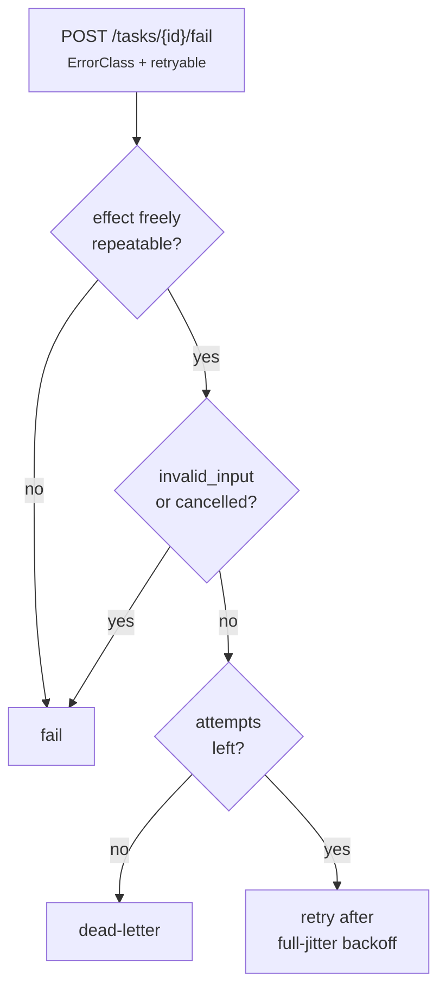

Part II · Concepts and internals · Chapter 10

# Durability

Durable work survives the process that ran it. Rusty provides this at two levels: the checkpointed run you met in Chapter 02, and a durable task queue for work that outlives a single run. Both make the same promise with the same limit. The promise is effectively-once execution when your effects use idempotency keys. The limit is that delivery is at-least-once. Rusty does not claim exactly-once, and where an effect cannot be repeated safely, the retry machinery fails the task instead of re-driving it.

## The concept: recovery is re-driving, not resurrection

The design borrows from well-tested systems:

- **Sagas and process managers** (Garcia-Molina and Salem, 1987) split long-running work into steps whose state lives outside any one process. You recover by re-driving from durable state, not by keeping a process alive.
- **Temporal-style activity retries** declare a retry policy per unit of work: maximum attempts, backoff, and error types that must not be retried.
- **SQS visibility timeouts** hide a delivered message instead of deleting it. If the consumer does not acknowledge in time, the message becomes visible again.
- **The transactional outbox** commits a state change and a message in one transaction, so a crash cannot leave one without the other.

These systems usually cannot tell you whether a retry is safe. That question gets answered from error strings or a hand-kept list of retryable errors. Rusty answers it from two declared facts: the effect class on the work (Chapter 03's `Effect`) and a closed error taxonomy on the failure.

## Level one: the checkpointed run

Chapter 02 covered the mechanics. The contract is short. The executor writes one checkpoint per super-step boundary. Resume starts from the latest checkpoint. An interrupt is a parked state, not an exception. Because checkpoints happen at boundaries and never inside a node, resume re-executes a node from its start. That is the price: node code before an interrupt or an external call must be safe to repeat.

Two server-level behaviors build on this:

- **Graceful shutdown drains cooperatively.** On SIGINT or SIGTERM, `serve` stops accepting work (new run submissions answer `503`), cancels in-flight runs at their next super-step boundary through the `RunConfig` cancellation token, and ends them terminal-`cancelled`. They stay resumable from their last checkpoint. The whole drain is bounded by `ServerConfig::shutdown_grace` (default 25 seconds). Past the bound the server exits anyway, which is the crash case the checkpoints already cover.
- **Queued runs are durable.** A run queued behind a busy thread is persisted when it is enqueued and resumes draining after a restart, on both the JSON-file and Postgres backends.

Two pieces of evidence show this working. The README's recording ([docs/screenshots/crash-resume.gif](https://github.com/dev-amjad-shaikh/rusty/blob/main/docs/screenshots/crash-resume.gif)) runs the demo server: a run finishes two stages and parks on a decision, the server is killed with `kill -9`, a fresh process boots against the same store, and the decision resumes with one command. The CI test [`rusty-server/tests/crash_recovery.rs`](https://github.com/dev-amjad-shaikh/rusty/blob/main/rusty-server/tests/crash_recovery.rs) covers the task queue rather than a checkpointed run. It SIGKILLs the server and a worker in the middle of an idempotent effect, restarts both against the same store, and asserts the task completes on its second attempt with the external effect recorded exactly once.

## Level two: durable work

Durable Work (R0.6) adds a durable task queue to the server (`docs/durable-work-design.md`). You enqueue with `POST /tasks`, workers claim with `POST /tasks/claim`, and they settle with `POST /tasks/{id}/complete` or `POST /tasks/{id}/fail`. The worker side is `ActivityWorker` in the `rusty-worker` crate.

The shared contracts live in `rusty-core/src/durable.rs` and are pinned by golden files. `TaskEnvelope` is the declared wire contract for a unit of work: a task id, a causal `parent`, sender and recipient, input as a `PayloadRef`, an output contract, a deadline, a budget, an idempotency key, and a declared effect (default `NonIdempotent`). The server's queue row today is a narrower `TaskRecord` (`rusty-server/src/tasks.rs`): `kind`, `payload`, `pool`, attempt counters, an optional effect, `worker_version`, and the idempotency key.

The idempotency key does two jobs. The queue deduplicates on it: re-enqueuing a key that names a live task returns `200` with `deduplicated: true` and the existing task. And the worker passes it to the external system, so a repeated attempt does not repeat the effect.

**Failure is classified by whoever saw it.** A worker settles a failed attempt with an `ErrorClass`:

| Class | Retry semantics |
|---|---|
| `transient` | Retry with backoff; expected to succeed later |
| `rate_limited` | Retry with backoff |
| `timeout` | Retry, but the attempt may have partly executed, so the effect gate decides first |
| `invalid_input` | Never retried; the same bytes fail the same way |
| `dependency_failure` | Retry; kept apart from `transient` so telemetry separates their outage from your wiring |
| `resource_exhausted` | Retry, ideally placed elsewhere |
| `cancelled` | Never retried and never dead-lettered; it is control flow, not failure |
| `unknown` | Retry to the attempt limit, then dead-letter |

The server turns a failed attempt into one decision with `classify_retry_with_policy` (`classify_retry` is the floor-policy form). The worker SDK only reports the class and a `retryable` flag; the server decides. The gates run in this order:

1. **Effect gate.** Anything not freely repeatable fails instead of re-driving.
2. **Class gate.** `invalid_input` and `cancelled` fail immediately.
3. **Attempt gate.** An exhausted task is dead-lettered.
4. **Retry** with backoff.

Backoff is exponential with full jitter: a uniform draw over `[0, 1s × 2^(attempt-1)]`, capped at five minutes. Full jitter spreads out a fleet of tasks that failed together when a shared dependency recovers. The queue draws its jitter from OS entropy; only runs use the seeded `RngSource` from Chapter 03. A learned retry policy (R0.10, Chapter 05) can tune the base, cap, and budget, but it can never change which classes or effects are retryable.

**Leases are visibility timeouts with an owner.** A claimed task is invisible while its lease holds; the worker extends it with `POST /tasks/{id}/heartbeat`. Settlement is the acknowledgement. If a worker dies, its lease expires and the task becomes claimable again. Lease expiry does not pass through the retry gates, so it is the path where at-least-once delivery happens and the idempotency key has to protect you. A dead-lettered task keeps its attempt count and last error class, and tenant quotas count dead-letter depth. When a task is linked to a run, each retry decision is journaled into that run.

**The outbox ties state to submission.** On Postgres, `checkpoint_and_enqueue` writes a thread checkpoint and its outbox rows in one transaction, so a crash cannot save the state and lose the task, or the reverse. The relay publishes outbox rows into the queue, deduplicating on the idempotency key. You reach it through `POST /tasks/outbox` and through state updates that carry tasks. On the JSON-file backend the two writes are sequential, not atomic.

**Drain is designed.** A worker stops claiming when its shutdown token fires and lets in-flight attempts settle within a grace window. An attempt that outlives the grace is abandoned unsettled, never reported `cancelled`, because `cancelled` would end the task instead of letting the lease return it.

**Scaling is declared.** Named pools have per-pool in-flight limits (`ServerConfig::with_pool_limit`). Tenant quotas refuse submissions over the limit with `429 quota_exceeded`. A task pinned with `worker_version` is claimable only by a worker advertising that exact version, across retries. `GET /tasks/metrics` reports queue depth, lease saturation, and oldest-task age per pool. These are signals for your autoscaler; Rusty does not scale workers itself.

## Pause, resume, and the human timescale

Between the run and the queue sits the person who has to approve something. Approvals can take days and outlast several deploys. The mechanism is the interrupt from Chapter 02: the run parks at a checkpoint, and the resume value arrives whenever the person answers. A parked run holds no process, so a deploy or a crash while the person decides costs nothing. Durable execution at human timescale is the same primitive as crash recovery with a longer delay.

The core also defines a record for longer pauses: `PauseEnvelope` in `rusty-core/src/record.rs`, whose `RunObligation` entries carry an optional `expires_at`. The server does not act on it yet, so treat expiry of a parked run as your application's job today.

::: tip Key takeaways
- The promise is effectively-once through idempotency keys over at-least-once delivery. Effects that are not freely repeatable are never silently retried.
- A failed attempt is classified with a closed `ErrorClass` and decided by one server-side function, effect gate first.
- Backoff is full-jitter exponential, capped at five minutes on the floor policy.
- Lease expiry re-delivers without the retry gates, which is why the idempotency key matters.
- On Postgres, `checkpoint_and_enqueue` makes a checkpoint and its tasks one transaction.
- Graceful shutdown cancels runs at step boundaries and leaves them resumable; a parked run survives any number of deploys.
:::

**Further reading**

- [docs/durable-work-design.md](https://github.com/dev-amjad-shaikh/rusty/blob/main/docs/durable-work-design.md) — the R0.6 design: envelope, taxonomy, outbox, drain
- [docs/recovery.md](https://github.com/dev-amjad-shaikh/rusty/blob/main/docs/recovery.md) and [docs/backup.md](https://github.com/dev-amjad-shaikh/rusty/blob/main/docs/backup.md) — the operational side
- [rusty-core/src/durable.rs](https://github.com/dev-amjad-shaikh/rusty/blob/main/rusty-core/src/durable.rs) — `TaskEnvelope`, `ErrorClass`, `classify_retry`
- [rusty-server/src/tasks.rs](https://github.com/dev-amjad-shaikh/rusty/blob/main/rusty-server/src/tasks.rs) — the queue: leases, claims, retry decisions
- [rusty-server/tests/crash_recovery.rs](https://github.com/dev-amjad-shaikh/rusty/blob/main/rusty-server/tests/crash_recovery.rs) — the SIGKILL-and-restart test
