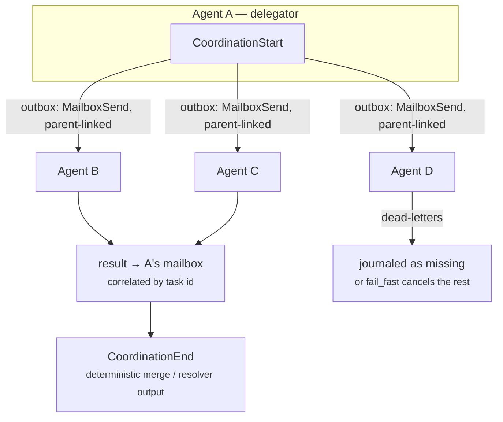

Part II · Concepts and internals · Chapter 11

# Sub-agents & delegation

One agent is a runtimes-and-state problem. Several agents working together is a *coordination* problem, and it's where multi-agent frameworks earn their reputation for fragility: the orchestrator calls a sub-agent, the sub-agent crashes mid-task, the result comes back twice or never, and the evidence trail is three disconnected log streams. This chapter is about Rusty's alternative — coordination as typed contracts over the primitives you already know, with a single causal evidence tree underneath.

## The concept: what coordination needs

The field's multi-agent patterns are well-worn: an orchestrator delegates to workers; a task fans out over items and merges results; redundant candidates race and the first good answer wins; a quorum votes. Frameworks implement these as prompt-level conventions — the orchestrator's instructions say "you may ask the researcher," and the wiring is application code.

What's missing at that level is everything Chapter 08 built: identity (which exact agent, at which manifest version), confinement (what is the delegate allowed to see), correlation (which result answers which ask), crash semantics (what happens when a member dies mid-pattern), and evidence (one account of the whole coordination, not N partial ones). The Agent Fabric's answer is that these are runtime guarantees or they are nothing — so four patterns ship as typed contracts in `rusty-core/src/agents.rs`, each a thin composition over mailbox submission through the transactional outbox.

## One connected tree

Before the patterns, two shared rules, because they're what make the evidence coherent.

**Event ids stitch the forest.** Event ids are globally unique (`{run_id}:{seq}`) and every task envelope carries a `parent` — the event that created it. When agent A delegates to agent B, B's spawn and first `MailboxReceive` record their parent as the event in A's journal that sent the message. Journals stay per-run and unchanged; the team's evidence is a forest stitched by parent ids, assembled at read time into a `TeamTrace`. The invariant the release proof checks: from any event in any member's journal, walking `parent` reaches the team's root spawn.

**Patterns submit through the outbox.** A pattern submitting N tasks must not crash between checkpoint and submission — that's the split-brain the outbox kills (Chapter 10). A pattern's task set and the run state that spawned it are one durable unit.

## The four patterns

**Delegate / handoff.** A typed ask: target agent (identity plus *pinned manifest version* — the delegate you asked is the delegate that answers, even across a redeploy), an input payload, an `ArtifactContract` for the result, and a **scoped context transfer** declaring which scopes and channels the delegate may see. Confinement is structural: the transfer is the agent manifest's declared scopes *intersected* with the grant — the grant can only narrow, the same rule Cedar overlays follow in Chapter 07. The result returns to the delegator's mailbox as a typed message correlated by the delegation's task id; the application never correlates callbacks by hand. *Handoff* is delegation plus a terminal mark — the delegator ends its turn-set and the delegate becomes the causal continuation, journaled as such. If the delegate crashes mid-pattern, its turn returns to visibility at lease expiry and is re-delivered to the re-activated delegate, idempotency key intact; the whole-task deadline bounds the wait, and expiry surfaces as a cancellation, not a hang.

**Fan-out / map.** N delegations over a list of items with a declared parallelism bound — the cross-agent form of what `Route::Send` is inside a graph. The runtime enforces at most `k` delegations in flight, and the merge is deterministic: results keyed by delegation task id, merged in sorted-id order — the same canonicalization the barrier applies to concurrent writes, applied to mailbox results. Equal inputs and equal member behavior produce byte-equal merged outputs. If a member dead-letters, the declared `on_member_failure` policy decides: `fail_fast` cancels the rest through the cancellation tree; `partial` merges what completed with the missing member *journaled as missing* — never silently absent. There is no third, implicit option.

**Race.** N candidates over equivalent agents; the first *successful* completion wins, and the runtime cancels the rest. The contract refuses, at submission, any candidate whose declared effect is not freely repeatable — cancelling losers is only sound if losing is undoable. An unsound race *cannot be declared*; the effect gate is a submission rule. And the losers' settlements are journaled with their spent cost, because wasted cost is a decision input. Honesty about waste is the price of offering races at all.

**Quorum.** N delegations, a declared threshold `k` over an explicit, named membership — the list is part of the contract, so "who voted" is never ambiguous — and a deterministic resolver (majority-equal, first-k, or an application-supplied pure function) applied to the accepted outputs in sorted order. Deterministic is a hard requirement: the resolver is `Effect::Pure` code the runtime re-executes during replay, so a quorum's recorded decision reproduces exactly. If failures drop membership below `k`, the quorum fails *open* — journaled as unreachable, surfaced to the caller, never silently downgraded to a smaller `k`.

Every pattern journals the same skeleton: `CoordinationStart` in the delegator, the `MailboxSend`/`MailboxReceive` pairs, the members' turn sets under that parentage, and `CoordinationEnd` carrying the result. An auditor reconstructs the vote; a replay reproduces the merge; a post-mortem walks parent ids from any member back to the root.

::: tip Key takeaways
- Four coordination patterns — delegate/handoff, fan-out/map, race, quorum — ship as typed contracts, not prompt conventions.
- The causal tree needs no super-journal: parent ids stitch per-run journals into one team trace at read time.
- Confinement is structural: scoped context transfers can only narrow what a delegate sees.
- Determinism is enforced where it matters — sorted-id merges and pure resolvers — so coordination decisions replay exactly.
- Unsound patterns are refused at declaration: races require repeatable effects, quorums never silently shrink.
:::

**Further reading**

- [docs/agent-fabric-design.md](https://github.com/dev-amjad-shaikh/rusty/blob/main/docs/agent-fabric-design.md) — the coordination contracts and their crash semantics
- [rusty-core/src/agents.rs](https://github.com/dev-amjad-shaikh/rusty/blob/main/rusty-core/src/agents.rs) — the typed pattern contracts
- [Chapter 08 · Blueprints & agents](./08-blueprints-agents.md) — identity, manifests, and mailboxes underneath
- [Chapter 10 · Durability](./10-durability.md) — the queue and outbox the patterns compose
