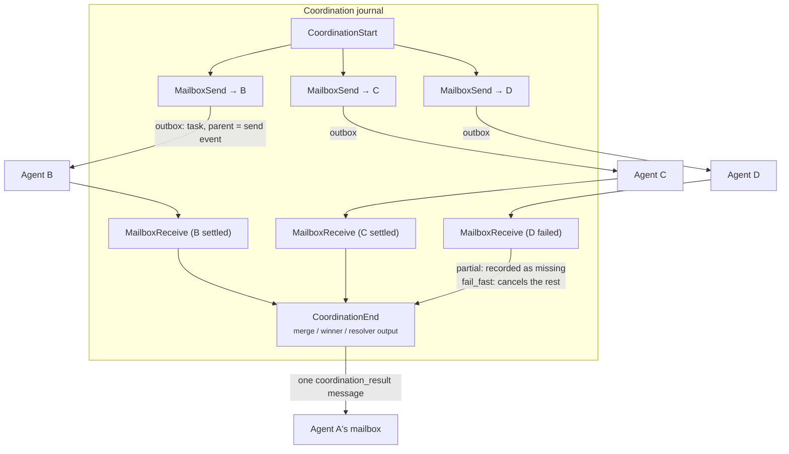

Part II · Concepts and internals · Chapter 11

# Sub-agents & delegation

One agent is a state and runtime problem. Several agents working together is a coordination problem, and it is where multi-agent systems usually break. The orchestrator calls a sub-agent, the sub-agent crashes mid-task, the result arrives twice or never, and the evidence is spread across several unrelated logs. This chapter shows how Rusty handles coordination: typed contracts built on the durable task queue, with one causal evidence tree for the whole team.

## The concept: what coordination needs

The common multi-agent patterns are well known. An orchestrator delegates to a worker. A task fans out over items and merges the results. Several candidates race and the first good answer wins. A group votes. Most frameworks implement these as prompt conventions ("you may ask the researcher") plus application code for the wiring.

That leaves out what Chapter 08 built for single agents: identity (which agent, at which manifest version), confinement (what the delegate may see), correlation (which result answers which request), crash behavior (what happens when a member dies mid-pattern), and evidence (one account of the coordination). R0.7's Agent Fabric makes these runtime guarantees. Four patterns ship as typed contracts in `rusty-core/src/agents.rs` (`CoordinationContract`, tagged `pattern`: `delegate`, `fan_out`, `race`, `quorum`), and the server drives them in `rusty-server/src/coordination.rs`. You submit one with `POST /coordination/{delegate|fan_out|race|quorum}` and read it with `GET /coordination/{id}`.

## One connected tree

Two rules make the evidence coherent before any pattern runs.

**Each coordination has its own journal.** The server opens a journal for the coordination and records the whole skeleton there: `CoordinationStart`, one `MailboxSend` per member, a `MailboxReceive` when each member's task settles, and `CoordinationEnd` with the result. Event ids are globally unique (`{run_id}:{seq}`), and every member task carries a `parent` pointing at the `MailboxSend` event that created it. Journals stay per-run. At read time `TeamTrace::assemble` (`rusty-core/src/team_trace.rs`) stitches the coordination journal and the members' journals into one tree with exactly one root, the `CoordinationStart` event. `GET /coordination/{id}/trace` serves it.

**Patterns submit through the outbox.** Each driver pass ends in `ServerStore::journal_and_enqueue`, which commits the new journal events and the member tasks' outbox rows as one unit. Member task ids (`{tenant}--{cid}--{member}`) and idempotency keys (`coordination:{cid}:{member}`) are derived from the coordination id, not minted. A retried submission converges on the same tasks instead of creating duplicates, and a crash between passes is repaired by the next pass rescanning the journal.

## The four patterns

**Delegate.** A typed request to one agent. You name the target agent and its `manifest_version`; the server refuses the submission if the registered manifest does not match, so the delegate you asked for is the one that answers, even across a redeploy. You pass an input payload, an optional `result_contract` (an `ArtifactContract`, carried on the wire but not yet enforced), and an optional `ContextGrant` of scopes and channels. The grant must narrow what the delegate's manifest already declares; a grant that widens it is rejected with `400`. The contract also has a `handoff` flag, but the server does not act on it yet.

If the delegate crashes, its lease lapses and the task is re-delivered on the next claim with the same idempotency key. The task deadline bounds the wait, and expiry settles the coordination as `cancelled` instead of hanging.

**Fan-out.** N delegations over a list of items, with at most `max_in_flight` running at once. This is the cross-agent form of `Route::Send` inside a graph. The merge is deterministic: results are keyed by member task id and merged in sorted-id order (`merge_fan_out`), so the same inputs and member outputs produce the same merged output. `on_member_failure` decides what a failure does:

- `fail_fast`: a `failed` or dead-lettered member cancels the rest.
- `partial`: completed results are merged and the missing member is recorded as missing.

**Race.** N candidates over equivalent agents. The first member to complete wins, and the rest are cancelled. Cancelling losers is only safe if their work can be repeated or discarded, so submission refuses any candidate whose declared effect is not freely repeatable (`RaceEffectNotFreelyRepeatable`, `400`). The losers' spend is recorded as `wasted_tokens` and `wasted_cost_usd`, so you can see what the race cost. If every candidate fails, the outcome is dead-lettered.

**Quorum.** N delegations over an explicit, named membership with a `threshold`. The first `threshold` completions are accepted, and a resolver runs over their outputs in task-id order. Two resolvers work today: `majority_equal` and `first_k`. A `custom` resolver has a wire shape but is refused at submission (`CustomResolverUnsupported`). The resolver is a pure function (`resolve_quorum`), and its decision is recorded in the journal. If failures push the reachable membership below the threshold, the quorum settles `unreachable`; it never lowers the threshold. A quorum with no majority still completes, with `decided: false`.

When the coordination ends, the server sends one `coordination_result` message to the delegator's mailbox, carrying the `CoordinationOutcome` keyed by coordination id. The delegator's manifest must declare that message kind, or the submission is rejected. With the whole skeleton in one journal, an auditor can reconstruct a vote, a replay reproduces the merge, and a post-mortem can walk parent ids from any member back to the root.

::: tip Key takeaways
- Four patterns ship as typed contracts: delegate, fan-out, race, quorum. You submit them over `POST /coordination/...`.
- Each coordination journals its own skeleton; `TeamTrace` stitches it and the members' journals into one tree at read time.
- Member task ids and idempotency keys are derived, and each pass commits journal and outbox together, so crashes converge instead of duplicating.
- Context grants can only narrow a delegate's declared scopes; widening is rejected.
- Merges and resolvers are deterministic. Races require repeatable effects, and quorums never lower their threshold.
- Not yet enforced: `handoff`, `result_contract` validation, custom quorum resolvers.
:::

**Further reading**

- [docs/agent-fabric-design.md](https://github.com/dev-amjad-shaikh/rusty/blob/main/docs/agent-fabric-design.md) — the coordination contracts and their crash semantics
- [rusty-core/src/agents.rs](https://github.com/dev-amjad-shaikh/rusty/blob/main/rusty-core/src/agents.rs) — the typed pattern contracts
- [rusty-server/src/coordination.rs](https://github.com/dev-amjad-shaikh/rusty/blob/main/rusty-server/src/coordination.rs) — the driver
- [Chapter 08 · Blueprints & agents](./08-blueprints-agents.md) — identity, manifests, and mailboxes underneath
- [Chapter 10 · Durability](./10-durability.md) — the queue and outbox the patterns compose
