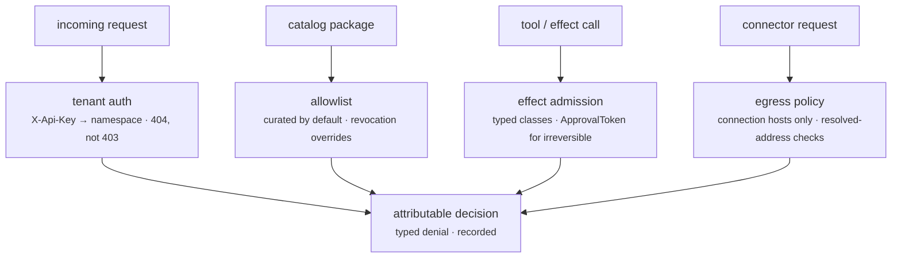

Part II · Concepts and internals · Chapter 12

# Policy & security

Each earlier Part II chapter contained a security mechanism: manifests, gates, denials, sealed secrets. This chapter puts them in order as layers. Each layer answers one question: who is calling, what may be installed, which effects may run, what may leave the network, and where a person must approve. The rule that runs through all of them is that a denial must be structural, attributable to a specific rule, and recorded.

## The concept: defense in depth for systems that act

Classic application security guards requests: authenticate the caller, then authorize the action. An agent platform has a harder problem. The agent is itself an actor, driven by model output that an attacker can influence through prompt injection. So you need more layers than a CRUD app: caller identity, plus capability declarations for code, effect classes for actions, egress control for the network, and approval boundaries for irreversible steps. Every layer also has to answer the audit question afterward with evidence: the grant, the policy version, the denial.

## Layer one: who is calling — tenant auth

`X-Api-Key` values map to tenants (`ServerConfig::with_tenant_key(tenant, key)`; `with_api_key` maps to the `default` tenant). Multi-tenancy is namespacing, not filtering. Resources of a named tenant live under a `{tenant}/` id prefix, so another tenant's thread does not exist in your namespace. The `default` tenant is unprefixed. A cross-tenant probe answers `404`, never `403`, so the existence of another tenant's resource is not leaked (`rusty-server/tests/multi_tenant.rs`).

With no authentication configured the server runs in dev mode: every request is allowed and CORS mirrors any origin. If you bind a dev server to a non-loopback address, it logs a warning that it is serving without authentication. Setting `RUSTY_ENV=production` changes the defaults:

- The server refuses to start unless authentication is configured (API keys, principals, or a bootstrap administrator).
- It serves same-origin only. A cross-origin browser client must be named with `with_cors_allowed_origin`.

Forgetting to configure auth in production produces a boot failure, not an open server.

## Layer two: what may be installed — the catalog allowlist

The org-level allowlist (`rusty-core/src/allowlist.rs`) decides which catalog packages may install. It has two modes. In `curated` mode, the default, only listed packages install. In `open` mode, any signed, non-revoked item from a trusted registry may install. Two details matter:

- **Revocation overrides every mode.** A revoked package is refused whatever the allowlist says.
- **Entries can carry capability constraints.** `CapabilityConstraint` can limit an entry to one package kind, forbid egress destinations, or forbid secret references. "Allowed" can mean "allowed only in its harmless shape".

## Layer three: what effects may run — the effect kernel

R0.7 moved retry safety from convention into the type system (`rusty-core/src/effects.rs`). The marker traits `PureEffect`, `ReadOnlyEffect`, `IdempotentEffect`, `CompensatableEffect`, and `IrreversibleEffect` map one-to-one onto the wire `Effect` enum. Generic code can require a class at compile time instead of checking a convention at runtime. `IrreversibleEffect` maps to the wire variant `NonIdempotent`. The module docs explain the two names: `NonIdempotent` states what the runtime can verify (no declared idempotency story), while `Irreversible` is a claim about the world. The typed API uses the second because it makes the approval boundary visible at the call site.

Two mechanisms build on the classes:

- **Deterministic effect ids.** `derive_effect_id(scope, kind, input_hash, idempotency_key)` gives every effect a content-derived identity. On recovery the runtime asks the journal whether that exact effect already committed.
- **The approval boundary.** `admit_irreversible` lets an irreversible effect run only when it is given an `ApprovalToken` scoped to that effect's derived id. The token is a value you have to construct, not a boolean that can default to true, and `approved_by` records who approved. The token is an in-process proof; attestation across processes is the signed receipt from Chapter 07. The server keeps durable approval records separately (`rusty-server/src/approvals.rs`), and a run waiting for approval parks as an interrupt, so it survives restarts.

Admission is opt-in per executor. Graphs written before R0.7 keep their behavior and still compile.

## Layer four: what may leave — egress policy

The egress plane (`rusty-core/src/egress.rs`) is a layer-7 policy over destination, method, path, and originating component, with the protocol (REST, WebSocket, MCP) part of the endpoint. Core owns the vocabulary and a pure evaluator. The server intercepts connector traffic and emits the audit record (`rusty-server/src/connectors.rs`). A request that matches no grant is refused with a typed reason naming the rule.

The server builds the policy for you (`docs/connector-standard.md`, rule 11). The allowed hosts are every configured connection's API host and token endpoint, plus whatever the operator adds (`ServerConfig::with_egress_policy`; the demo reads `RUSTY_EGRESS_ALLOW`). Every other host is denied. The policy is recomputed whenever a connection is created, granted, rotated, or revoked. Above it sits the deployment's egress ceiling (`rusty-server/src/egress_ceiling.rs`): the hosts connections may call at all, edited in Studio under Settings → Security → Sites agents may reach. A deployment booted without a ceiling allow-list is open at that level and says so; closing it to the hosts in use is one action. A connection whose host falls outside a closed ceiling is refused with `422 egress_outside_ceiling`.

Checks run on the resolved address, not only the hostname. A name that resolves to a private, loopback, or link-local address is refused unless the grant pins that IP explicitly (`allowed_ips`). This closes the standard SSRF path where a harmless-looking hostname points inside your network.

## Layer five: where a human must say yes

Approvals appear at several points, and they share one shape: an explicit, attributed, recorded decision at a declared boundary.

- An interrupt parks a run until a person answers (Chapter 02).
- An `ApprovalToken` admits an irreversible effect.
- A promotion outside its envelope requires a token scoped to the candidate's promotion effect (Chapter 05).

Because each decision is recorded with its author, "who approved this?" is a lookup.

::: tip Key takeaways
- Tenant auth namespaces resources; cross-tenant probes get `404`, never `403`.
- `RUSTY_ENV=production` refuses to boot without auth and serves same-origin only.
- The allowlist defaults to `curated`; revocation overrides every mode.
- Effect classes are types. An irreversible effect needs an `ApprovalToken` scoped to its derived effect id.
- Connector egress is limited to the hosts your connections and the operator name, checked on the resolved address, under a deployment-wide ceiling.
- Every layer refuses with a typed, attributable reason.
:::

**Further reading**

- [rusty-core/src/effects.rs](https://github.com/dev-amjad-shaikh/rusty/blob/main/rusty-core/src/effects.rs) — the effect kernel and the approval boundary
- [rusty-core/src/allowlist.rs](https://github.com/dev-amjad-shaikh/rusty/blob/main/rusty-core/src/allowlist.rs) — catalog policy modes and capability constraints
- [rusty-core/src/egress.rs](https://github.com/dev-amjad-shaikh/rusty/blob/main/rusty-core/src/egress.rs) — the egress evaluator and DNS preflight
- [SECURITY.md](https://github.com/dev-amjad-shaikh/rusty/blob/main/SECURITY.md) — the project's security posture and reporting
