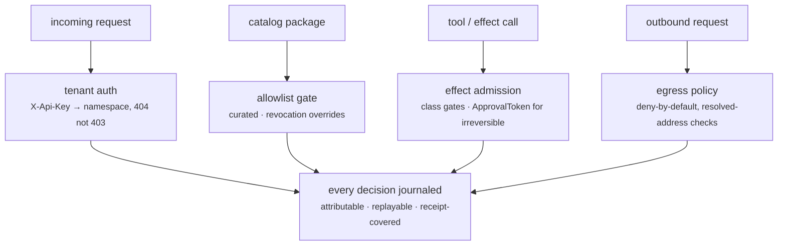

Part II · Concepts and internals · Chapter 12

# Policy & security

Every previous Part II chapter had a security mechanism inside it — manifests, gates, denials, sealed secrets. This chapter steps back and looks at the whole arrangement, because security in an agent platform is not a feature but a stack: who is calling, what the code may reach, what the agent may do, what leaves the network, and where a human must say yes. The design principle running through all of it: **denial must be structural, attributable, and evidenced** — a refusal you can show, never a refusal you assert.

## The concept: defense in depth for systems that act

Classic application security guards requests: authenticate the caller, authorize the action. Agent systems add a harder problem — the *agent itself* is an actor, driven by model output that is partially adversarial (prompt injection is not an edge case; it's Tuesday). So the stack needs more layers than a CRUD app: caller identity, yes, but also capability declarations for code, effect classifications for actions, egress control for the network, and approval boundaries for the irreversible. And every layer has to answer the audit question afterward: not "was it probably fine?" but "show me the grant, the policy version, and the denial log."

## Layer one: who is calling — tenant auth

The server's multi-tenancy is namespacing, not filtering. `X-Api-Key` values map to tenants; internally every resource lives under a `{tenant}/` id prefix, so another tenant's thread simply does not exist in your namespace. Cross-tenant probes answer **404, never 403** — existence itself is not leaked (`rusty-server/src/routes.rs`). With no keys configured, the dev server runs open with permissive CORS — loudly warning if bound past loopback. A `production` server (`RUSTY_ENV=production`) inverts the defaults: it refuses to boot without authentication and serves same-origin only unless you explicitly name a cross-origin browser client. Open in dev, hardened in production, and the transition is a refusal to start rather than a config you forgot.

## Layer two: what may be installed — the catalog allowlist

The org-level allowlist (`rusty-core/src/allowlist.rs`) sits before every install, update, and rollback of catalog packages. In `curated` mode — the enterprise default — only explicitly listed packages install; in `open` mode, any signed, non-revoked item from a trusted registry proceeds. Two details carry the weight: **revocation overrides every mode** (a revoked package is refused regardless of what the allowlist says), and allowlist entries can carry **capability constraints** — only this package kind, no egress destinations, no secret references — so "allowed" can mean "allowed, but only the harmless shape of it."

## Layer three: what effects may run — the effect kernel

R0.7 moved retry safety from convention into the type system (`rusty-core/src/effects.rs`). The marker traits — `PureEffect`, `ReadOnlyEffect`, `IdempotentEffect`, `CompensatableEffect`, `IrreversibleEffect` — map one-to-one onto the wire `Effect` enum, but they let generic infrastructure *require* a class at the type level instead of re-checking a convention at runtime. The module docs carry a naming honesty worth quoting in substance: the wire enum's `NonIdempotent` states what the runtime can verify — the absence of a declared idempotency story — while `Irreversible` is a claim about the world it cannot check; the typed API uses the second word because it makes the approval boundary legible at a call site.

Two mechanisms close the loop. **Deterministic effect ids** (`derive_effect_id`) give every effect a content-addressed identity from run scope, kind, input hash, and idempotency key — so on recovery the runtime asks "did this exact effect already commit?" and the journal answers. **The approval boundary** (`ApprovalToken`, `admit_irreversible`): an irreversible effect executes only when presented with a token scoped to its derived effect id. The token makes approval a value that must be constructed — not a boolean that can be silently defaulted — and `approved_by` gives attribution. Its honest edge is stated: the token is an in-process proof of explicit decision, so the approval must be journaled to survive a restart (it is), and cross-process attestation is the signed-receipt work of Chapter 07. Admission is opt-in per executor; existing graphs keep pre-R0.7 behavior and stay source-compatible.

## Layer four: what may leave — egress policy

The egress plane (`rusty-core/src/egress.rs`, wired into connector traffic in `rusty-server/src/connectors.rs`) is layer-7 and deny-by-default: destination × protocol × method × path × originating component, and every request that doesn't match an explicit grant is refused with a typed, attributable reason. Core owns the vocabulary and the pure evaluator; the server owns interception and audit emission. The DNS discipline matters as much as the list: checks apply to the resolved address, so a hostname that resolves into a link-local or loopback range doesn't sneak a manifest's good name past the boundary — the SSRF textbook's first lesson, implemented rather than referenced.

## Layer five: where a human must say yes

Approvals thread through the whole stack and they're all the same shape: an explicit, attributable, journaled decision at a declared boundary. An interrupt parks a run for a human (Chapter 02). An `ApprovalToken` admits an irreversible effect. A promotion outside its envelope requires a scoped token (Chapter 05). Studio's Home surfaces them in one place — the decision gate holding irreversible actions. And because approvals are journaled, the answer to "who let this happen?" is a query, not an investigation.

::: tip Key takeaways
- The stack: tenant auth (404, never 403), catalog allowlists (revocation overrides everything), typed effect classes, deny-by-default egress with DNS discipline, and approval tokens for the irreversible.
- Production inverts dev defaults by refusing to boot unauthenticated.
- Approvals are values that must be constructed, scoped to a derived effect id, and journaled — attribution is structural.
- Every layer emits evidence; "show me the denial" is always answerable.
:::

**Further reading**

- [rusty-core/src/effects.rs](https://github.com/dev-amjad-shaikh/rusty/blob/main/rusty-core/src/effects.rs) — the effect kernel and the approval boundary
- [rusty-core/src/allowlist.rs](https://github.com/dev-amjad-shaikh/rusty/blob/main/rusty-core/src/allowlist.rs) — catalog policy modes and capability constraints
- [rusty-core/src/egress.rs](https://github.com/dev-amjad-shaikh/rusty/blob/main/rusty-core/src/egress.rs) — the egress evaluator
- [SECURITY.md](https://github.com/dev-amjad-shaikh/rusty/blob/main/SECURITY.md) — the project's security posture and reporting
