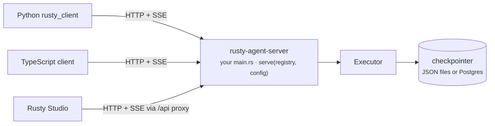

<p class="chapter-eyebrow">Part II · Concepts and internals · Chapter 13</p>

# The server & the SDKs

Rusty Core has no HTTP. Rusty Server is the platform's only network interface, and everything that is not Rust (your product backend, data tooling, front end) talks to it over HTTP and Server-Sent Events. The roadmap explicitly rejects native bindings: no PyO3, no napi-rs, no `cdylib`/C ABI. You get one protocol, tested once, usable from any language.

## The concept: one wire, many languages

A native library can reach other languages in three ways. Native bindings put every consumer language inside your process: fast, but each language adds its own packaging and build burden. A C ABI is the lowest common denominator and removes Rust's safety guarantees at the boundary. A network protocol costs you a serialization step and gives you one implementation, one conformance target, and clients in any language with an HTTP client, tested against the real server.

Agent platforms have converged on what to expose: threads, runs, and streaming. Rusty Server implements an Agent-Protocol-compatible subset of the LangGraph Platform API, so that model and its client calls carry over.

## Rusty Server: the resource model

`rusty-agent-server` is an axum library crate. Your own `main.rs` builds a `GraphRegistry`, a `ServerConfig`, and calls `rusty_agent_server::serve(registry, config)`. You deploy the result as one binary (Chapter 15 walks through it). The server adds no execution semantics of its own. A run request authenticates, is scheduled on its thread, and drives the same `Executor` over the same checkpointer, turning graph events into SSE frames.

| Resource | What it is |
|---|---|
| **Threads** | A session bound to one registered graph; it namespaces all checkpoints. `GET /threads/{id}/state`, `POST /threads/{id}/history`, and `POST /threads/{id}/fork` expose the checkpoint log. |
| **Runs** | One execution of the thread's graph, in three modes: background (`POST /threads/{id}/runs` → `202` + run id), blocking (`runs/wait`), and streaming (`runs/stream`). |
| **Assistants** | Named graph aliases with config; a run can reference `assistant_id` and inherit its recursion limit. |
| **Crons** | Recurring runs on an interval or a five-field cron expression. |
| **KV store** | Namespaced JSON documents (`PUT`/`GET`/`DELETE /store/{ns}/{key}`) for application state outside graph state. |

Later releases added more on the same server: run journals and fixtures (`GET /runs/{id}/events`, `/fixture`), server-side replay and branch diff (`POST /runs/replay`, `GET /runs/diff`), signed receipts (`GET /runs/{id}/receipt`, `POST /receipts/verify`), the durable task queue, coordination, connectors, skills, knowledge, memory, and evaluation. `GET /info` reports the service version, the persistence backend (`checkpointer` and `server_store`: `json_file` or `postgres`), and the registered graphs with their channels and tools.

[docs/api/openapi.yaml](https://github.com/dev-amjad-shaikh/rusty/blob/main/docs/api/openapi.yaml) is an OpenAPI 3.1 description of the core builder surface: health, auth, threads, runs, assistants, connectors, skills, knowledge, memory, and evaluation. It covers 56 of the server's 295 routes today ([docs/api/README.md](https://github.com/dev-amjad-shaikh/rusty/blob/main/docs/api/README.md) lists the gaps). For anything else, the route table in `rusty-server/src/lib.rs` is the reference.

## The two rules worth remembering

**One active run per thread.** The `RunManager` (`rusty-server/src/runs.rs`) enforces it. A second submission on a busy thread follows its `multitask_strategy`. `reject` answers `409`. `enqueue`, the default, appends it to a per-thread FIFO whose depth is capped by `max_concurrent_runs_per_thread`. Queued runs are persisted and survive a restart. Two writers on one conversation cannot happen.

**SSE frames are resumable.** Frame ids have the form `{checkpoint_id}:{step}:{seq}`, with `-` as the checkpoint before the first checkpoint exists. `GET /runs/{id}/stream` honors `Last-Event-ID`: it replays the run's bounded in-memory event log after that sequence (`ServerConfig::event_log_capacity`, default 1000 frames), then follows the live stream. A dropped connection resumes where it stopped. The run-creation endpoints ignore the header, because a new run starts a new sequence.

Persistence defaults to JSON files under `store_path`. With the `postgres` feature, `ServerConfig::with_postgres(url)` moves checkpoints and the server store (threads, assistants, crons, KV, journals, tasks, memory, and more) into auto-migrated tables. Some planes, such as knowledge, connectors, and skills, still load from `store_path` (Chapter 22). [docs/server-quickstart.md](https://github.com/dev-amjad-shaikh/rusty/blob/main/docs/server-quickstart.md) walks the core surface in about ten minutes: create, interrupt, resume over SSE, fork, replay, and journal inspection, with real request and response bodies.

## The SDKs: thin and verified

Two clients, both with no runtime dependencies:

- **Python:** `pip install rusty-agent-runtime`, imported as `rusty_client` (`sdks/python/`). Standard library only (`urllib.request` and `json`), Python 3.8+.
- **TypeScript:** `npm install @rusty-runtime/client` (`sdks/typescript/`). ESM for Node.js 18+ and modern browsers, using the global `fetch`.

They are thin on purpose: no codegen, no native modules. Each SDK has an end-to-end suite that launches the real demo server and drives it, so the clients are tested against the server they ship with. When the demo server began seeding an administrator by default, both suites had to set `RUSTY_OPEN=1` to keep testing the auth-free dev mode.

```python
from rusty_client import RustyClient

client = RustyClient("http://127.0.0.1:8100")   # api_key="..." when auth is on
thread = client.create_thread("react_agent")
tid = thread["thread_id"]

for frame in client.run_stream(
    tid,
    input={"messages": [{"role": "user", "content": "What is 17 + 25?"}]},
    stream_mode=["updates", "values"],
):
    print(frame.event, frame.id, frame.data)
```

```ts
import { RustyClient } from "@rusty-runtime/client";

const client = new RustyClient("http://localhost:8100", { /* apiKey: "…" */ });
const { thread_id } = await client.createThread("react_agent");
for await (const frame of client.runStream(thread_id, {
  input: { messages: [{ role: "user", content: "What is 17 + 25?" }] },
})) {
  if (frame.event === "end") console.log("done:", frame.data.status);
}
```

The demo server registers `pipeline` and `react_agent`. It seeds an administrator on first boot, so run it with `RUSTY_OPEN=1` to try these snippets without credentials, or pass a key. Both SDKs also wrap the evidence endpoints (`replay_run` and `diff_runs` in Python, `replayRun` and `diffRuns` in TypeScript) and the task queue.



## What this layer is for

If you embed agents inside a Rust service, you can skip the server and use the core crate directly. The server is for everything else: APIs for web and mobile clients, the Studio workspace, product code in other languages, and the operational surface (crons, KV, receipts, the task queue) that a product built around agents needs. Part III's quickstart starts with the server because it shows the platform's shape fastest.

::: tip Key takeaways
- The server is a library crate. Your `main.rs` calls `serve(registry, config)` and ships as one binary.
- The core resources are threads, runs, assistants, crons, and KV; journals, replay, receipts, tasks, and the product planes share the same server.
- One active run per thread; SSE streams resume with `Last-Event-ID`.
- The SDKs have no runtime dependencies and are tested end to end against the real demo server.
- `docs/api/openapi.yaml` is OpenAPI 3.1 for the core surface (56 of 295 routes); the route table in `lib.rs` covers the rest.
:::

**Further reading**

- [docs/server-quickstart.md](https://github.com/dev-amjad-shaikh/rusty/blob/main/docs/server-quickstart.md) — zero to interrupt/resume over HTTP in ten minutes
- [docs/rusty-server-design.md](https://github.com/dev-amjad-shaikh/rusty/blob/main/docs/rusty-server-design.md) — endpoint mapping and SSE semantics
- [docs/api/](https://github.com/dev-amjad-shaikh/rusty/tree/main/docs/api) — the OpenAPI 3.1 spec and its coverage plan
- [sdks/python/](https://github.com/dev-amjad-shaikh/rusty/tree/main/sdks/python) and [sdks/typescript/](https://github.com/dev-amjad-shaikh/rusty/tree/main/sdks/typescript) — the clients
