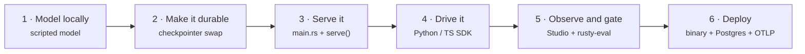

<p class="chapter-eyebrow">Part III · Building with Rusty · Chapter 16</p>

# Build an agent end to end

"Build an agent" means two things in Rusty, and a real product usually needs both. **The graph** is the compiled program, written in Rust. **The agent** is the configured, governed identity around a graph, assembled in Studio. This chapter follows the six stages in [docs/building-agentic-products.md](https://github.com/dev-amjad-shaikh/rusty/blob/main/docs/building-agentic-products.md): model the graph locally, make it durable, serve it, drive it from your product, observe and gate it, and deploy.



## Stage 1: model the graph locally

Start from the prebuilt ReAct agent (`create_react_agent`) and the five documented examples in [rusty-core/examples/](https://github.com/dev-amjad-shaikh/rusty/tree/main/rusty-core/examples), not from a blank file:

| Example | What it shows |
|---|---|
| `react_agent` | The prebuilt ReAct loop over a scripted model, zero network |
| `parallel_fanout` | Dynamic fan-out and fan-in with `Send` and `Reducer::Append` |
| `human_in_loop` | Interrupt and resume with a `JsonFileCheckpointer` |
| `react_record_replay` | Journal every model and tool call, then replay with zero outbound calls |
| `live_agent` | A real OpenAI-compatible endpoint (`RUSTY_BASE_URL`, `RUSTY_API_KEY`, `RUSTY_MODEL`) |

```bash
cd rusty-core
cargo run --example human_in_loop
```

The directory also holds `context_pipeline_react`, `durability_bench`, and `genai_live` (which needs `--features genai`).

When you outgrow the prebuilt loop, write the graph yourself using Chapter 02's rules: channels with reducers, nodes as async closures over immutable snapshots, and `compile()` validating the topology before anything runs. Test against a scripted model first. `ChatModel` is a trait, so a scripted model is a few lines. It is deterministic, offline, and free, and it lets you test routing, reducers, and interrupts before you spend a token. This is the README's version:

```rust
struct Echo; // scripted ChatModel: one canned reply
#[async_trait::async_trait]
impl ChatModel for Echo {
    async fn chat(&self, _: &[ChatMessage], _: &[serde_json::Value]) -> Result<ChatResponse> {
        Ok(ChatResponse { message: ChatMessage::assistant("42"), model: None, usage: None })
    }
}
```

Swap in `OpenAiCompatibleClient` when the shape is right.

## Stage 2: make it durable

Durability is a constructor swap. Replace `InMemoryCheckpointer` (for development and tests; state is lost on restart) with `JsonFileCheckpointer`, or with `PostgresCheckpointer` behind the `postgres` feature. The graph code does not change.

This is also where you place interrupts: approvals, budget limits, missing input, anywhere a run should park and wait. The pattern is always the same. Check `ctx.resume_value()` first, and call `ctx.interrupt(...)` only when the answer is not there yet. Keep everything before the interrupt safe to repeat, because resume re-executes the node from its start. Done this way, a run that waits a week for a person is an ordinary run.

## Stage 3: serve it

Move the graph into a `main.rs` that calls `rusty_agent_server::serve`. Chapter 15's library path is the template. You get threads, background, blocking, and streaming runs, checkpoint history, fork and replay, crons, KV, and auth in one binary.

## Stage 4: drive it from your product

Use the Python or TypeScript SDK (Chapter 13) to create threads, stream runs, and resume interrupts from your application. The SDKs are thin clients over HTTP and SSE, so anything you can do from Rust you can do from any language with an HTTP client.

## Stage 5: the agent around the graph

Studio is where a team builds and runs the governed agent (`docs/how-to.md`). Open **Agents** and create one. The wizard has six steps (Template, Identity, Goal, Instructions, Model & tools, Review), and you can click back to any earlier step:

1. **Template.** *Blank agent* starts empty. The templates (Support agent, Data analyst, Outbound SDR, Coding agent, Gap hunter, Research assistant) pre-fill instructions, starter tools, and a goal. Some also set a larger reasoning-steps budget or a schedule.
2. **Identity.** Name, `@handle` (how runs and evaluations refer to the agent), description, color, and icon.
3. **Goal.** One sentence a teammate could verify, plus a primary metric ("Outcome verified", "Resolved without a pause", or "Runs that finished") and a target. The goal is measured live on the agent's runs over a rolling seven days, and on publish, where the agent's test suites gate activation.
4. **Instructions.** The system prompt: who the agent is, how it works, and what it must never do.
5. **Model & tools.** Pick the model and the starter tools. Each tool carries an effect class, so the runtime knows what it may do without asking a person.
6. **Review.** Check the summary and choose **Create agent**. The agent starts as a draft.

The builder then shows everything on one canvas (goal, readiness, model and behavior, instructions, tools, skills, memory, triggers, evaluation) with a test rail that runs the agent against real tool calls. The **readiness** card lists what is still missing, from nine checks: identity, goal, instructions, at least one enabled tool, a skill, healthy connectors, a trigger, an evaluation goal (a dataset), and publication.

Pair the Studio work with `rusty-eval` in CI: versioned datasets, assertions over recorded runs, and release gates (Chapter 20). Watch runs live with `rusty-otel` (Chapter 21).

## Stage 6: deploy

Deploy one binary with the checkpointer on Postgres and OTLP spans going to your observability stack. Chapter 22 covers the production checklist and the deployment control plane.

## The loop you'll actually live in

Day to day, building an agent is a cycle: adjust the instructions, run it in the test rail, read the run's events when it misbehaves, add the failing case to a dataset, and publish behind the gate. Chapters 17 to 21 cover each part: skills, tools and connectors, memory, evaluation, and observability. Every run is checkpointed and journaled, so each iteration starts from a recorded run.

::: tip Key takeaways
- Build the graph first, locally, against a scripted model. Then add durability with a checkpointer swap, serve it, and drive it from an SDK.
- Place interrupts deliberately: check `resume_value()` first, and keep the code before the interrupt safe to repeat.
- In Studio the six-step wizard creates a draft; the readiness card and the test rail stand between the draft and publishing.
- The working loop is instructions → test → journal → dataset → gated publish.
:::

**Further reading**

- [docs/building-agentic-products.md](https://github.com/dev-amjad-shaikh/rusty/blob/main/docs/building-agentic-products.md) — the six-stage product path
- [docs/how-to.md](https://github.com/dev-amjad-shaikh/rusty/blob/main/docs/how-to.md) — the Studio flows, with screenshots
- [rusty-core/examples/README.md](https://github.com/dev-amjad-shaikh/rusty/blob/main/rusty-core/examples/README.md) — the examples and how to run them
- [docs/server-quickstart.md](https://github.com/dev-amjad-shaikh/rusty/blob/main/docs/server-quickstart.md) — the serving stage in detail
