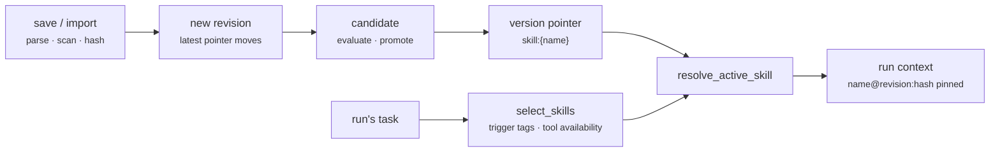

<p class="chapter-eyebrow">Part III · Building with Rusty · Chapter 17</p>

# Build a skill

Chapter 06 explained what a skill is: versioned procedural knowledge that shapes context and carries no authority of its own. This chapter shows you how to write one, get it registered, and attach it to an agent. You work in Studio against your local server; underneath, `rusty-core/src/skill.rs` defines the package and `rusty-core/src/skills.rs` decides when it activates.

## The anatomy

A skill is a `SKILL.md` package: flat YAML frontmatter, a markdown body, and optional `references/` and `assets/` members beside it. `name` and `description` are required. The parser accepts a small set of other keys, including `license`, `compatibility`, `allowed-tools` (a comma-separated list), `dependencies`, and `eval-gate`, and refuses anything malformed.

```markdown
---
name: weekly-notice
description: Drafts the weekly team notice. Use when the user asks for a weekly notice, or when a draft needs the notice format.
allowed-tools: search_knowledge, read_document
---

# Weekly notice

1. Collect this week's items with `search_knowledge`.
2. Open each source with `read_document` and keep one line per item.
3. Group items under Shipped, In progress, and Blocked.
```

Write the description as a trigger, not a summary. The agent reads it to decide whether the skill applies, so a vague description produces a skill that never activates or activates everywhere. At run time the platform also matches trigger tags from the skill's binding against the task. Matching is structural, with no embeddings.

## Building one in Studio

1. **Open the editor.** Go to Skills → **New skill**. From an agent's builder, **Compose a skill** in the skills section opens the same editor and attaches the result when you save.
2. **Name it.** Type a plain name such as "Weekly notice". Studio turns it into the kebab-case name the registry requires (`weekly-notice`, at most 64 bytes).
3. **Write "When to use it."** This is the trigger text described above.
4. **Write the procedure.** Use markdown headings, lists, and code. Reference tools inline as `` `tool_name` ``. The editor detects them and records them as the skill's allowed tools.
5. **Save.** The skill joins the library. Attach it to any agent from that agent's **Skills** section.

You can also import. **Browse library** lists the sources the deployment suggests (`GET /skills/library`). Inside that drawer, **From a repository** takes a GitHub repository URL, which the server resolves to its tarball, or any `https` URL ending in `.tar.gz` or `.tgz` (`POST /skills/import`). The server finds every `SKILL.md` in the archive and registers each one through the same path as a skill you wrote. The report lists what was found, imported, and skipped, with a reason for each skip. Members outside `SKILL.md`, `references/`, and `assets/` (a `scripts/` directory is the usual case) are not imported and are named in the report.

## What governance does to your skill

Registration runs the pipeline from Chapter 06. You should know what it does to your markdown:

- **Validation at construction.** Frontmatter must be in the supported subset, the name kebab-case, the body at most 256 KiB, and member paths relative with no `..` or symlinks. An invalid package cannot exist as a value.
- **Provenance.** Every version records its source, an author, and its content hash.
- **Security scan.** Embedded `<script>` tags and URLs with credentials in them are denials, and registration fails. Large base64 blobs are warnings stored with the version's `ScanReport`. When an import skips your skill, the scan is the first place to look.
- **Immutable versions.** A version's identity is the SHA-256 of the package's canonical serialization. Saving identical content is a no-op. Changed content appends a new revision and moves the registry's latest pointer forward, never back.

## Activation and iteration

Attaching a skill does not load it into every run. At run time `select_skills` shortlists skills by trigger-tag overlap with the task and drops any whose declared tools the run cannot reach. `resolve_active_skill` then binds the revision named by the learn plane's version pointer for `skill:{name}`. The registry's latest pointer is authorship history and is never used for activation. A skill with no promoted revision does not bind through this path, and there is no fallback to the newest revision.



A revision is a behavior change, so it travels as a candidate through the same evaluation and promotion path as any other change (Chapter 05). While a skill is active, `SkillGateTool` refuses any tool call outside the active skills' declared tool set. A skill can narrow what a run may call, never widen it. The run's context manifest pins each assembled skill as `name@revision:hash`, and the skill body travels inside the journaled model-call input, so you can always tell which procedure shaped which answer.

::: tip Key takeaways
- A skill is `SKILL.md` with `name` and `description` required. Write the description as the trigger.
- Reference tools inline; they become the skill's allowed tools, which can only narrow a run's tool surface.
- Registration validates, records provenance, scans, and versions immutably. Import reports give a reason for every skip.
- Activation binds the promoted revision through the learn plane's version pointer, never the latest by default.
:::

**Further reading**

- [Chapter 06 · Skills](./06-skills.md) — the internals this chapter relies on
- [docs/how-to.md](https://github.com/dev-amjad-shaikh/rusty/blob/main/docs/how-to.md) — the Studio flow with screenshots
- [rusty-core/src/skill.rs](https://github.com/dev-amjad-shaikh/rusty/blob/main/rusty-core/src/skill.rs) — the package format's exact rules
- [rusty-core/src/skills.rs](https://github.com/dev-amjad-shaikh/rusty/blob/main/rusty-core/src/skills.rs) — selection, activation, and the tool gate
