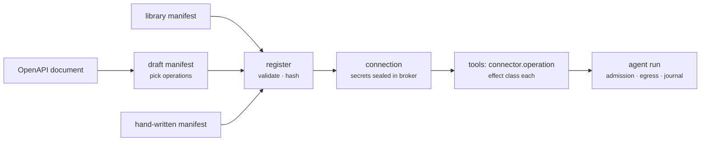

Part III · Building with Rusty · Chapter 18

# Build a tool / connector

In Studio you do not write tools by hand. Tools come from what the server can reach, and that reach is declared in connector manifests. This is Chapter 09's connector standard as a workflow: connect a system once, and each operation its manifest names becomes a governed tool that allowed agents can call. The tool is named `{connector}.{operation}` everywhere: in the catalog, in the agent's registry, and in the model's tool list. This chapter walks the hands-on path, including a system that has no built-in manifest.

## Three paths to a tool

**Tools → New tool** offers three choices:

1. **From a connection.** Connect a service (next section). Its operations appear in the catalog as tools, each with an effect class: `read_only`, `idempotent`, `compensatable`, or `irreversible`. The executor's admission gate reads that class before a call runs.
2. **From an OpenAPI document.** This sends you to Connectors → **Browse all** → **Custom protocol** → REST / OpenAPI, described below.
3. **As a skill.** A procedure over existing tools is procedural knowledge, so this sends you to Skills (Chapter 17). If you are describing how to do something, write a skill. If you are declaring what can be called, you need a tool.

You grant tools to an agent in its builder under **Tools**, and each grant can carry a "when" note that tells the agent when to use it. Grant narrowly. The set of tools an agent may call is a security boundary (Chapter 12).

## Adding a connector

1. **Browse the library.** Open Connectors → **Browse all**. The library holds every manifest in the repo's `catalog/` directory, registered at boot: Confluence, GitHub, HubSpot, Jira, Linear, Notion, PagerDuty, Salesforce, Slack, Stripe, Zendesk, and a Ledger demo. Search by name or description.
2. **Choose the system**, or use **Custom protocol** for one that is not listed.
3. **Authenticate.** The dialog shows the auth method the manifest declares: OAuth 2.0, API key, connection string, or no auth. Credentials go to the broker. Fields marked `rusty_secret: true` are sealed before anything is stored, and tools receive short-lived opaque handles. Raw values never reach an agent, a prompt, a journal, or a log.
4. **Test it.** On the connection, choose **Test connection**. This runs the manifest's `check` operation, a parameterless read-only GET, against the real system (`POST /connectors/check`). Saving a connection does not run the check for you (`POST /connectors/instances` validates the configuration and seals secrets only), so test before you rely on it.
5. **Test against a stand-in (optional).** Connectors → **New stand-in** creates a *world*: the server's own copy of a connected system that answers the connector's calls from seeded records and resets to that seed (`rusty-server/src/worlds.rs`). Agents can then run end to end, with their real tools, skills, and effects, without touching the live system. A connection can also run its check against a stand-in with **Test against {name}**. Evaluation cases tagged `world:<name>` run inside one (Chapter 20).

## A system with an OpenAPI description

For a REST API the library does not carry, choose **Custom protocol** → REST / OpenAPI and give the address of its OpenAPI 3.x document. The server reads it into a *draft* manifest (`POST /connectors/openapi`):

- Operations with an `operationId` become candidate tools. The rest come back listed as unmapped.
- You pick one of four auth styles (bearer, basic, header, query), which becomes the connection specification and every operation's auth.
- Default effects come from the HTTP method: `GET` is `read_only`, `DELETE` is `irreversible`, anything else is `idempotent`. Correct them where the API behaves differently.
- The `check` operation is derived from a listing read, called with no parameters.

You then choose which operations to keep. Only those become tools. Registering the manifest opens the credential dialog.

## Authoring a manifest by hand

For a system with no OpenAPI description, the manifest is one JSON document, and the standard's rules (`docs/connector-standard.md`) are your checklist:

- Constrain every object level with `additionalProperties: false`.
- Declare auth alternatives as a closed `oneOf` with `const` discriminators.
- Mark secrets with `rusty_secret: true`.
- Give every operation an honest effect.
- Use wire names a person would write (`oauth2_client_credentials`, not an internal code).
- Set `rusty_order` where form field order matters.
- Leave `hash` out. The server validates the manifest, canonicalizes it, and computes the hash on registration.

If registration refuses the manifest, the error names the rule, and the lint returns `422` with the fix. Start from a small catalog manifest such as `catalog/linear-connector/manifest.json`.

## The discipline underneath

Everything above feeds into the runtime behavior from Part II without extra wiring:

- A connector call is journaled with its declared effect.
- Its egress is limited to the connection's hosts and checked on the resolved address (Chapter 12).
- An `irreversible` operation is refused until an `ApprovalToken` names that exact call; a `compensatable` one runs with its compensation registered.
- Under exact replay the call is served from the journal instead of re-executed.

Declaring the manifest honestly is the wiring.

::: tip Key takeaways
- Tools come from connections or OpenAPI drafts. A procedure over tools is a skill.
- Credentials are sealed into the broker and reach tools only as opaque handles.
- **Test connection** runs the manifest's `check`; saving does not run it for you.
- Stand-ins (worlds) let an agent run end to end against seeded data.
- Hand-written manifests follow the standard's rules; leave the hash to the server.
- Effect admission, egress limits, approval tokens, and replay apply automatically to every connector call.
:::

**Further reading**

- [Chapter 09 · Tools & connectors](./09-tools-connectors.md) — the standard and its rules
- [docs/connector-standard.md](https://github.com/dev-amjad-shaikh/rusty/blob/main/docs/connector-standard.md) — the manifest, field by field
- [docs/how-to.md](https://github.com/dev-amjad-shaikh/rusty/blob/main/docs/how-to.md) — the Studio flows with screenshots
- [catalog/](https://github.com/dev-amjad-shaikh/rusty/tree/main/catalog) — the shipped connector manifests
