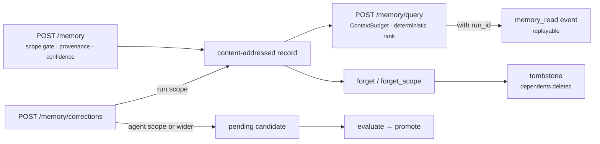

<p class="chapter-eyebrow">Part III · Building with Rusty · Chapter 19</p>

# Wire memory

Chapter 04 described the governed memory model. This chapter is the practical side: how you give an agent memory that stays scoped, attributable, and erasable, and which mistakes the write path is built to stop. The surface is the server's `/memory` routes over `rusty-core/src/memory.rs`.

## What you actually configure

You make three decisions: where a record lives, what kind it is, and how much of it a prompt may carry.

**Scope.** Every record has a `ScopeAddress`: a `MemoryScope` plus a concrete id. The scopes are `run`, `agent`, `team`, `user`, and `tenant`. Pick the narrowest one that works, because a wider scope spreads a wrong record further.

- `run` is runtime-only. `POST /memory` refuses it with `400`; the executor writes it.
- `agent` scope requires the agent to be registered with `StateScope::Private` in its capability manifest (`404` or `403` otherwise).
- `user` scope checks that the caller may act for that user. Most product memory belongs here.
- `tenant` scope must name the caller's own tenant (`403` otherwise). Treat it as configuration-grade memory that operators write.
- `team` scope carries no extra server check today, so enforce team membership in your application.

**Kind.** A record is a `fact`, `preference`, `example`, or `summary`. The kind drives behavior. Summaries name their source records. Examples are what the correction loop produces from a corrected run. Retrieval can filter by kind. Write `preference` for "Alex wants concise answers" and `fact` for "the invoice cutoff is the 25th". Let corrections produce `example` records instead of writing them by hand.

**Budget.** Retrieval into a prompt is bounded by a `ContextBudget`: `max_tokens`, a `margin_percent` safety margin on the token estimate, and an `overflow` policy (`truncate` by default, or `fail`). Records are packed in a deterministic rank order: priority, then confidence, then recency, then `memory_id` as the tie-break. Set `max_tokens` from your model's context window minus the other prompt sections. Memory competes with instructions and conversation for the same tokens, and the budget makes that trade explicit.

The calls below assume an open dev server on :8100 (the demo started with `RUSTY_OPEN=1`). Against an authenticated server, add your `X-Api-Key` header.

```bash
# Write a user-scoped preference (201, or 200 with created:false if the same content is already stored)
curl -s -X POST localhost:8100/memory -H 'Content-Type: application/json' -d '{
  "kind": "preference",
  "scope": {"scope": "user", "id": "alex"},
  "content": {"text": "Prefers concise answers."},
  "author": {"type": "human", "human_id": "alex"}
}'

# Retrieve under a token budget
curl -s -X POST localhost:8100/memory/query -H 'Content-Type: application/json' -d '{
  "scope": {"scope": "user", "id": "alex"},
  "budget": {"max_tokens": 800}
}'
```

The body is `WriteMemoryPayload` in `rusty-server/src/routes.rs`: `author` is a tagged `ProvenanceAuthor` (`human`, `agent`, `distiller`, ...), and `content` is free JSON. The server refuses content whose `text` looks like a credential with `422`; credentials belong in connections. The query body is a flattened `MemoryQuery` (`scope`, `kinds`, `key`, `tags`, `min_confidence`, `include_expired`, ...) plus an optional `budget` and `run_id`.

## The rules that keep it trustworthy

The write path enforces three rules before any I/O. Build your product around them.

1. **Provenance is mandatory.** Every record names who wrote it and from what evidence. When an agent acts on a memory, you can walk the record back to the run, correction, or distiller that produced it.
2. **Confidence is declared.** A human author's write defaults to `1.0`; any other author must supply a confidence or the write fails with `400`. The runtime computes confidence in one place only: a consolidated summary takes the minimum confidence of its sources. Retrieval can filter with `min_confidence`, so treat low-confidence records as items to review.
3. **Writes never change behavior directly.** A memory write changes what future retrievals return. If you want to change a prompt, policy, or permission, send it through the candidate pipeline (Chapter 05). A memory store that doubles as a config back channel is the fastest way to lose track of why an agent behaves as it does.

Writes are idempotent by construction. A record is content-addressed, so writing the same content twice returns the existing record.

## Corrections: the highest-trust input

The correction loop (Chapter 05) gives the best return for the effort. A user says "the report goes to finance@, not accounting@", and your UI posts it to `POST /memory/corrections`. The record carries `human:{author} via correction:{id}` attribution and confidence `1.0`.

- At `run` scope the correction is adopted directly.
- At `agent` scope or wider it becomes a candidate with `candidacy: pending`, and it is evaluated before promotion.
- When the correction targets a run event, it also yields an `example` record: the journaled input plus the corrected behavior. The distiller folds these into a new dataset version, so the corrected case becomes a regression test.

Give your users an explicit "that's wrong" control. One explicit correction is worth more than many inferred signals, and it carries its own test into the pipeline.

## Erasure and expiry

Rusty deletes memory for real and journals the fact that it did.

- `POST /memory/forget` erases one record. `POST /memory/forget_scope` erases every record at a scope address, for example everything at `{"scope": "user", "id": "alex"}`. Both take a `reason` (`expired`, `retracted`, or `erasure_request`).
- Summaries that depend on a forgotten record are deleted transitively. They are not re-derived.
- Each forgotten record leaves a metadata-only `memory_forget` tombstone. It is journaled into a run when you pass `run_id`.
- `forget_scope` is idempotent (an empty scope returns empty lists). `tenant` scope can only forget itself.

For ordinary hygiene, set `expires_at` on a record. Retrieval excludes expired records unless the query sets `include_expired`, so staleness is a filter and needs no cleanup job.

Run journals are not memory. Forgetting a memory scope leaves journals intact, so keep anything you may need to erase out of journal-bound payloads. The one exception is forgetting a person (`rusty-server/src/forget.rs`): their memory is tombstoned, their connections revoked, the runs sealed under their key removed, and the key destroyed, so any remaining copy is ciphertext.

## Testing memory behavior

A budgeted query made with a `run_id` journals a `memory_read` event carrying the assembly. Exact replay serves that assembly from the journal, so memory behavior is replay-testable: record a run, replay it, and retrieval returns the same records. For a regression test, add a dataset case with a `state` assertion over what the agent did with what it remembered (Chapter 20).



::: tip Key takeaways
- Scopes are `run`, `agent`, `team`, `user`, `tenant`. `run` is runtime-only; start narrow and widen on purpose.
- Retrieval is token-budgeted with `ContextBudget` and ranked deterministically.
- Non-human writes must declare confidence; human writes default to `1.0`.
- Corrections are the highest-trust input: adopted at run scope, evaluated as candidates wider than that.
- Forgetting deletes records and their dependent summaries and journals a tombstone. Journals stay, except when a whole person is forgotten.
- A budgeted read with a `run_id` journals `memory_read`, so memory behavior replays exactly.
:::

**Further reading**

- [Chapter 04 · Memory](./04-memory.md) — the record model and write path
- [docs/learn-design.md](https://github.com/dev-amjad-shaikh/rusty/blob/main/docs/learn-design.md) — retrieval, budgets, consolidation, forgetting
- [rusty-core/src/memory.rs](https://github.com/dev-amjad-shaikh/rusty/blob/main/rusty-core/src/memory.rs) — `MemoryRecord`, `MemoryQuery`, `ContextBudget`, `plan_forget`
