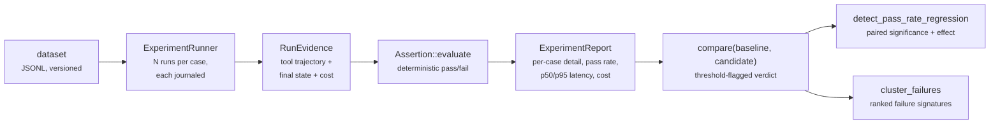

<p class="chapter-eyebrow">Part III · Building with Rusty · Chapter 20</p>

# Evaluate with rusty-eval

An agent that cannot be regression-tested is not a product feature; it is a demo. This chapter is the testing discipline: versioned datasets, deterministic assertions over recorded runs, experiment reports, and the release gates that stand between a candidate and production. The design stance that makes it all cheap: `rusty-eval` is built directly on the executor and the Flight Recorder journal — **no simulation harness, no live model required**.

## The pipeline



Every stage composes machinery you already know. Experiment runs go through `Executor::run`, each journaling into its own Flight Recorder journal — so a failing eval case is *evidence*, replayable and inspectable, not a red line in CI output.

## Datasets you can diff

A dataset is canonical JSONL: line one is a header (`format_version`, name, version), every following line a case. Serialization is canonical — field order fixed, map keys sorted — so datasets are diffable in version control and `load → save` is byte-stable:

```jsonl
{"kind":"header","format_version":1,"name":"math-tools","version":"1.0.0"}
{"kind":"case","id":"add-two","input":{"messages":[{"role":"user","content":"2+3?"}]},"expect":{"tool_trajectory":[{"name":"calculator","args":{"/op":"add"}}],"state":[{"pointer":"/messages/3/content","expected":"the answer is 5"}]},"tags":["smoke"]}
```

Each case declares its `input`, its `expect` — tool trajectory as an ordered subsequence with JSON-pointer argument matchers, state predicates, forbidden tools, cost/latency bounds — and `tags` for slicing. Loading validates the format version and refuses unknown ones. Version bumps are new files, not edits: the correction loop (Chapter 05) exploits this, folding each correction into a new dataset version so the failing case becomes a permanent regression test.

## Assertions: deterministic or nothing

No model in the loop. Six assertion kinds cover the checks that matter: `tool_call_order` (expected calls as an ordered subsequence), `tool_call_count`, `state[...]` (final-state value at a JSON pointer), `no_tool_call` (blacklisted tools never called), `max_cost` and `max_latency`. Every verdict returns `{ assertion, passed, expected, observed, detail }` — the report shows *why* a run failed, not just that it did. A model judge exists for the judgments determinism can't make, but the gate your release depends on should be the deterministic kind.

Experiments run sequentially by default so latency measurements stay uncontended; `with_max_concurrency(n)` opts into bounded parallelism for bigger suites. Baseline gates require matching concurrency settings — latency, cost, and rate-limit evidence stays comparable instead of silently mixing sequential and parallel runs.

## From report to release decision

`compare(baseline, candidate)` produces per-assertion deltas, per-case regressions, and a threshold-flagged verdict — the exact shape Chapter 05's promotion envelope consumes. `detect_pass_rate_regression` adds paired exact significance plus practical effect size, so "dropped 2%" and "dropped 2% on n=8" don't read the same. `cluster_failures` groups failures by stable signature and ranks them with evidence links — the triage view for the morning after a big experiment.

In Studio, this machinery is the Tests destination — versioned datasets, experiments, and the release gates an agent's publish is measured against — and the gates wire into the deployment control plane, so a revision can require a passing comparison before it reaches an environment. In CI, a `ReplayFixture` (Chapter 03) replays a recorded run end to end with zero outbound calls; fixtures plus datasets cover the two halves of agent regression testing — *the plumbing didn't change* and *the behavior didn't regress*.

## The discipline to adopt

Start every agent with a smoke dataset of five cases you care about, and grow it from corrections and production failures. Gate publishes on `compare()` against the current production baseline. When a gate fails, read the failure clusters before touching the prompt — the clusters tell you whether you have one bug or five. This is the loop that turns "the agent seems worse lately" into a diffable, attributable, fixable fact.

::: tip Key takeaways
- rusty-eval runs the real executor over versioned JSONL datasets; every run journals its own evidence.
- Assertions are deterministic and explain themselves: expected versus observed, with detail.
- Datasets are canonical and diffable; corrections become new dataset versions, never edits.
- `compare()` is the release-gate shape; significance testing and failure clustering turn red builds into triage.
- Replay fixtures cover plumbing regressions; datasets cover behavior regressions.
:::

**Further reading**

- [rusty-eval/README.md](https://github.com/dev-amjad-shaikh/rusty/blob/main/rusty-eval/README.md) — the pipeline, dataset format, and assertion reference
- [rusty-eval/src/](https://github.com/dev-amjad-shaikh/rusty/tree/main/rusty-eval/src) — the runner, compare, regression detection, failure clustering, feedback
- [docs/studio.md](https://github.com/dev-amjad-shaikh/rusty/blob/main/docs/studio.md) — the Tests destination
