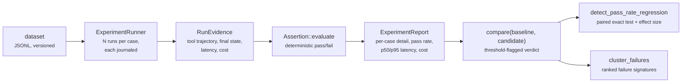

<p class="chapter-eyebrow">Part III · Building with Rusty · Chapter 20</p>

# Evaluate with rusty-eval

You cannot ship changes to an agent safely until you can regression-test it. `rusty-eval` gives you versioned datasets, deterministic assertions over recorded runs, experiment reports, and release gates. It runs your graph through the real `Executor` and reads the Flight Recorder journal each run produces. You need no simulation harness, and the deterministic path needs no live model.

## The pipeline



`ExperimentRunner` runs the agent N times per case through `Executor::run`. Each run records into its own journal, and `RunEvidence` is distilled from that journal. A failing case is therefore a recorded run you can replay and inspect in Studio, with more detail than a red line in CI.

## Datasets you can diff

A dataset is JSONL. The first line is a header (`format_version`, `name`, `version`); every following line is a case. Serialization is canonical, with fixed field order and sorted keys, so datasets diff cleanly in version control and a load followed by a save is byte-stable:

```jsonl
{"kind":"header","format_version":1,"name":"math-tools","version":"1.0.0"}
{"kind":"case","id":"add-two","input":{"messages":[{"role":"user","content":"2+3?"}]},"expect":{"tool_trajectory":[{"name":"calculator","args":{"/op":"add"}}],"state":[{"pointer":"/messages/3/content","expected":"the answer is 5"}]},"tags":["smoke"]}
```

Each case declares an `input`, an `expect` block, and `tags` for slicing. The `expect` fields are:

- `tool_trajectory`: expected calls as an ordered subsequence, with JSON-pointer argument matchers (`"/op": "add"`)
- `state`: `{pointer, expected}` predicates over the final state
- `forbid_tools`, `max_cost_usd`, `max_latency_ms`
- `rubric`: input for a judge
- `world_writes`, `no_world_writes`: checks against a *world*, the server's resettable stand-in for a connected system (`rusty-server/src/worlds.rs`)

Loading checks `format_version` and refuses versions it does not know. A new dataset version is a new file. The correction loop (Chapter 05) relies on this: each correction lands in a new dataset version, so the corrected case becomes a permanent regression test.

## Assertions: deterministic first

Each `expect` section compiles to assertions (`Expectation::assertions`). There are eight kinds, named in reports as:

| Report name | Checks |
|---|---|
| `tool_call_order` | Expected calls appear as an ordered subsequence with matching arguments |
| `tool_call_count[{name}]` | Exact call count for one tool |
| `state[{pointer}]` | Final-state value at a JSON pointer equals the expected value |
| `no_tool_call` | Forbidden tools were never called |
| `max_cost` / `max_latency` | Run totals stay within bounds |
| `world_write[{table}]` | The run wrote a matching row into a world table |
| `no_world_write` | The run left the named world tables untouched |

Every verdict is an `AssertionResult` with `assertion`, `passed`, `expected`, `observed`, and `detail` (present on failures). The report tells you why a run failed. For judgments a deterministic check cannot make, `rusty-eval` has judges behind the `JudgeModel` trait: `RuleBasedJudge` needs no model, and `ModelJudge` adapts any runtime `ChatModel`. Base your release gate on the deterministic assertions and use judges for the rest.

Experiments run sequentially by default so latency measurements are not contended. `ExperimentConfig::with_max_concurrency(n)` enables bounded parallelism for bigger suites. A baseline gate refuses to compare runs made with different concurrency settings, so latency, cost, and rate-limit evidence stay comparable.

## From report to release decision

`compare(baseline, candidate)` returns per-assertion deltas, per-case regressions, and a threshold-flagged verdict. `detect_pass_rate_regression` pairs baseline and candidate outcomes by case id and repetition and applies a one-sided exact McNemar test. It reports a regression only when the sample size, the minimum pass-rate drop, and the significance level are all met. An underpowered comparison returns `insufficient_evidence` and is never treated as safe. That keeps a 2% drop on eight cases from reading the same as a 2% drop on eight hundred.

`cluster_failures` groups failures by termination mode, failed assertions, and judge outcome, and ranks the groups by frequency with stable ids across experiments. Read the clusters before you touch the prompt: they tell you whether you have one bug or five.

`GatePolicy` (`rusty-eval/src/gate.rs`) turns these into a release decision. It combines absolute requirements (minimum runs, pass rates per assertion or tag, cost) with optional baseline requirements (regression count, cost growth, removed cases). Gate evaluation does no I/O and reads no clock, so the same reports and policy always give the same decision.

Gates plug into the rest of the platform in two places. In Studio, the Tests destination holds datasets, experiments, and the gates an agent's publish is measured against. In R0.12's deployment control plane, promotion into a gated environment requires a `GateDecision` computed over a named dataset version, and an unavailable gate refuses the promotion (Chapter 22). In CI, a `ReplayFixture` (Chapter 03) re-drives a recorded run with zero outbound calls. Fixtures show the plumbing did not change; datasets show the behavior did not regress.

## The discipline to adopt

Start each agent with a smoke dataset of about five cases you care about. Grow it from corrections and production failures. Gate each publish on `compare()` against the current production baseline. When a gate fails, read the failure clusters first. This turns "the agent seems worse lately" into a diff you can attribute and fix.

::: tip Key takeaways
- `rusty-eval` runs the real executor over versioned JSONL datasets, and every run journals its own evidence.
- Eight deterministic assertion kinds, each reporting expected versus observed. Judges exist for what determinism cannot check.
- Datasets are canonical and diffable. Corrections become new dataset versions, never edits.
- `detect_pass_rate_regression` fails closed on thin evidence; `GatePolicy` makes the release decision reproducible.
- Replay fixtures cover plumbing regressions; datasets cover behavior regressions.
:::

**Further reading**

- [rusty-eval/README.md](https://github.com/dev-amjad-shaikh/rusty/blob/main/rusty-eval/README.md) — the pipeline, dataset format, statistics, clustering, judges
- [rusty-eval/src/](https://github.com/dev-amjad-shaikh/rusty/tree/main/rusty-eval/src) — `assertion.rs`, `dataset.rs`, `experiment.rs`, `compare.rs`, `statistics.rs`, `clustering.rs`, `gate.rs`
- [docs/studio.md](https://github.com/dev-amjad-shaikh/rusty/blob/main/docs/studio.md) — the Tests destination
