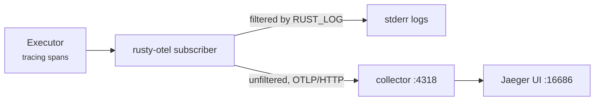

<p class="chapter-eyebrow">Part III · Building with Rusty · Chapter 21</p>

# Observe with rusty-otel

Chapter 03 separated two records of a run. The journal is evidence: complete, hash-chained, and replayable. Telemetry is for people watching the system live: sampled and approximate. This chapter covers telemetry. The executor is already instrumented with `tracing`. `rusty-otel` is a one-call setup that sends those spans to stderr and, optionally, to an OTLP collector. You write no instrumentation code.

## What you get for free

The executor's spans follow the super-step loop, so a trace reads like the execution:

| Span / event | Level | Fields | Meaning |
|---|---|---|---|
| `rusty.run` | INFO | `thread_id`, `max_steps`, `resume`, `replay` | One per `Executor::run`; the root of the trace |
| `rusty.super_step` | DEBUG | `step`, `active_nodes` | One per super-step |
| `rusty.node` | INFO | `node`, `step` | One per spawned node task |
| barrier-merge event | DEBUG | channels written | Reducer merge at each barrier |
| run-complete event | INFO | `steps`, `duration_ms` | The run finished |
| interrupt event | INFO | `node`, `step` | The run parked for a human |
| error events | WARN | `node`, `step`, `error`, `retryable` | Node and routing failures |

Spans nest `run` → `super_step` → `node`. One `rusty.run` trace in Jaeger or Tempo expands into the full execution tree, with `thread_id`, `step`, and `node` available on the spans. Error events carry a `retryable` flag, so you can filter a dashboard by whether a failure is worth retrying.

## Setup

For local development with no collector:

```rust
let _guard = rusty_otel::init_local("my-agent")?;
```

Span logs print to stderr, filtered by `RUST_LOG` or, when it is unset, the default `info,rusty_agent_runtime=debug`. The default shows the DEBUG super-step spans without flooding logs from other crates.

With a collector, pass one config value:

```rust
let mut guard = rusty_otel::init(rusty_otel::OTelConfig {
    service_name: "my-agent".into(),
    otlp_endpoint: Some("http://localhost:4318/v1/traces".into()),
    log_filter: None, // explicit filter, else RUST_LOG, else the default above
})?;

// ... run graphs ...

guard.shutdown(); // flush buffered spans before exit; idempotent, and also runs on drop
```

Export is OTLP over HTTP. Two behaviors matter when you run it:

- **The filter applies per layer.** The log filter gates the stderr layer only. It never throttles OTLP export, so `RUST_LOG=warn` still ships the full trace tree to the collector.
- **Initialize once per process.** The subscriber is global. A second `init` returns `OTelError::SubscriberAlreadyInstalled` instead of registering twice.

For a local trace viewer, the crate ships `rusty-otel/docker-compose.yml` and `rusty-otel/otel-collector-config.yaml`. The collector listens for OTLP on 4317 and 4318 and forwards to Jaeger all-in-one, whose UI is on port 16686.



## Telemetry and evidence, divided properly

Use traces for live questions: is the fleet healthy, where does latency go, which node is failing, and is the failure retryable. Use the journal for accountability questions: what exactly this run did, what the model saw, and what it would do if re-driven. The trace tells you a run took 40 seconds. The journal tells you what happened in those 40 seconds, in order, with causes. Studio's run timeline reads the journal; your trace backend reads the spans. Operate both.

::: tip Key takeaways
- `rusty-otel` is setup, not instrumentation: one call routes the executor's existing spans to stderr or OTLP.
- Spans nest run → super-step → node, with `thread_id`, `step`, and `node` as fields.
- `RUST_LOG` gates stderr only; OTLP export is never throttled by it.
- `init` works once per process; `shutdown()` flushes and also runs on drop.
- Traces answer live questions; the journal answers accountability questions.
:::

**Further reading**

- [rusty-otel/README.md](https://github.com/dev-amjad-shaikh/rusty/blob/main/rusty-otel/README.md) — setup, the span table, the local collector stack
- [docs/architecture.md](https://github.com/dev-amjad-shaikh/rusty/blob/main/docs/architecture.md) — the span taxonomy in context
- [Chapter 03 · Journals & evidence](./03-journals.md) — the evidence half of observation
