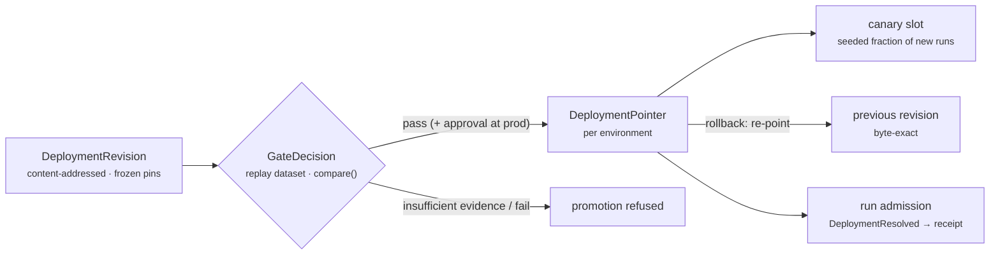

Part III · Building with Rusty · Chapter 22

# Deploy & operate

The deployment topology is one binary, a Postgres database behind the checkpointer, and OTLP spans sent to your observability stack. There is no Python runtime, no Redis, and no orchestration config file. `cargo build --release` produces the binary; the rusty-server README has a `FROM scratch` Dockerfile and the `ServerConfig` reference. This chapter covers the production checklist, day-2 operations, and the deployment control plane for shipping changes.

## The production checklist

**Harden the edge.** Set `RUSTY_ENV=production` (or `ServerConfig::in_production(true)`). The server then refuses to start without authentication and serves same-origin only; name any cross-origin browser client with `with_cors_allowed_origin`. Map keys to tenants with `ServerConfig::with_tenant_key(tenant, key)`. Tenant ids are 1 to 64 characters of `[A-Za-z0-9._-]`, and a bad id panics at startup. Each tenant's resources live in its own namespace, and cross-tenant probes get `404`, never `403` (Chapter 12).

**Move persistence to Postgres.** Build with the `postgres` feature and call `ServerConfig::with_postgres(url)`. Checkpoints go to core's `rusty_checkpoints` table, and the server store (threads, assistants, crons, KV, journals, tasks, memory, and more) to auto-migrated `server_*` tables. Some planes still live on disk under `store_path` even with Postgres: knowledge, connectors, and skills load from files, and run-artifact bytes sit in a file-backed artifact store. Back up `store_path` too. The JSON-file backend assumes one writer process and has no replication. Check what you are running on with `GET /info`: `checkpointer` and `server_store` report `json_file` or `postgres`.

**Wire observability.** Initialize `rusty-otel` with your OTLP endpoint (Chapter 21). Traces cover runs, super-steps, nodes, and classified errors.

**Know your shutdown.** `serve` drains on SIGINT or SIGTERM:

1. New run submissions answer `503`, and the cron scheduler stops.
2. In-flight requests finish. In-flight runs are cancelled at their next super-step boundary, end terminal-`cancelled`, and stay resumable from their last checkpoint. The outbox relay finishes its current pass.
3. The drain is bounded by `ServerConfig::shutdown_grace` (default 25 seconds; set it with `with_shutdown_grace`). After that the server exits anyway. Anything still running resumes from its last checkpoint, and leased tasks return to the queue within one lease period.

A run parked for human approval holds no process, so it survives any number of deploys while the person decides.

**Back up the store, and verify the backup.** [docs/backup.md](https://github.com/dev-amjad-shaikh/rusty/blob/main/docs/backup.md) describes the reference topology: Postgres base backups with continuous WAL archiving, a versioned object-store bucket for blobs, and an archive-lag alert. [docs/recovery.md](https://github.com/dev-amjad-shaikh/rusty/blob/main/docs/recovery.md) is the restore runbook. Verification is a real check, not a file copy: after a restore, `rustyness verify-log` checks each journal snapshot's hash chain and sequence, and that every artifact reference resolves. The server can also write estate backups itself (`with_backup_dir`, `with_restore_from`).

## Shipping changes: the deployment control plane

R0.12's operations plane (`docs/operations-plane-design.md`, `rusty-core/src/deploy.rs`) replaces "rebuild and restart" with a governed path. It applies Chapter 05's version-pointer discipline to deployments:

- **Immutable revisions.** A `DeploymentRevision` is content-addressed and freezes its registry pin set (prompts, tool contracts, model settings) when it is created. The revision a gate evaluated is exactly the revision that ships.
- **Environments as records.** `dev`, `staging`, and `prod` are first-class `Environment` records by convention; a revision moves through them. They are not separate processes, stores, or trust boundaries.
- **Gates wired to evaluation.** Promotion into a gated environment requires a `GateDecision`: the frozen pin set is replayed against a named dataset version and compared with `compare()` against the revision currently serving (Chapter 20). Underpowered comparisons are `insufficient_evidence`, and an unavailable gate refuses the promotion. Strictness is per environment. `prod` can also require a human approval token scoped to the revision's promotion effect.
- **Canary by seeded draw.** A canary binds a revision to a declared fraction of new runs. Each run's assignment is drawn from a seed, so a recorded run reproduces it. There is no automatic traffic controller; each fraction change is a declared, journaled act.
- **Shadow without effects.** A shadow deployment runs the candidate against recorded traffic under an `EffectAdmissionContext` that admits only `Pure` and `ReadOnly` effects. Everything else, `Idempotent` included, is refused and reported, and where the candidate depends on a refused effect's result, the recorded outcome is served. Shadow runs never sign receipts as production evidence.
- **Rollback by pointer.** The per-environment `DeploymentPointer` moves promotion and rollback in one transaction, and rollback restores the previously serving revision byte-exact.

Deployment transitions (gate decisions, canary changes, promotions, rollbacks) journal onto their own `deployment-control` chain (`GET /deployments/journal`). Each run journals a `DeploymentResolved` event at admission, so the run's signed receipt leads to the exact revision and pins it ran under. `GET /deployments/health` reports the active revision per environment. Environment-scoped secrets (`/deployments/secrets`) are envelope-encrypted and bound to their environment.

Single-binary self-hosting remains the default. The control plane manages that binary; it does not replace it with a hosted service.

## Run artifacts

Runs produce binary outputs: files, images, audio, datasets. R0.12 stores them as `RunArtifact` records under `/artifacts` (separate from `/registry/artifacts`, which holds configuration). Each artifact is content-addressed by the SHA-256 of its bytes, and a read re-hashes the bytes before serving them. Lineage links it to the producing run, the effect id, and the journal event that referenced it. Named artifacts keep version sequences. Previews are derived on read and never stored. Access is checked at the tenant level; finer-grained permissions are post-R1.0 work.

Retention is declared per artifact: `pinned`, a number of days, or `receipt_bound` (the default). The retention sweeper runs as durable work and never prunes an address that a live signed receipt still names. If it cannot verify coverage, it keeps everything. Releasing a receipt pin is a journaled operator act, and a read of pruned bytes returns a typed `410`. A policy like "delete everything older than thirty days except what a receipt still pins" is exactly what this supports.

## The honest limitations, restated for operators

The README keeps the current list. For operators the main items are:

- **The executor is single-node.** Remote nodes distribute node work, but the super-step loop itself is not clustered and has no failover.
- **Persistence is single-node.** Postgres is one database, and Rusty does no replication.
- **Queue autoscaling is yours.** Queued runs are durable, and `GET /tasks/metrics` publishes scaling signals, but autoscaling is an open R1.0 item.
- **Nodes must be idempotent.** Checkpoints happen at step boundaries (Chapter 10).

R1.0's critical path is clustered execution: executor failover and a distributed durable queue with autoscaling (Appendix D). Until then, size your deployment as one well-run binary with a good database.

::: tip Key takeaways
- Topology: one binary, Postgres, OTLP. Back up `store_path` as well as the database.
- `RUSTY_ENV=production` refuses to boot without auth; `/info` tells you which store backend is live.
- Shutdown drains within `shutdown_grace` (25 s default); cancelled runs resume and parked runs survive deploys.
- Ship revisions through environments, gated by evaluation, canaried by seeded draw, shadowed without effects, and rolled back by pointer.
- Run artifacts are content-addressed with lineage; receipt-pinned bytes survive retention.
- The executor and persistence are single-node today.
:::

**Further reading**

- [docs/operations-plane-design.md](https://github.com/dev-amjad-shaikh/rusty/blob/main/docs/operations-plane-design.md) — revisions, environments, gates, canary, shadow, the artifact plane
- [docs/backup.md](https://github.com/dev-amjad-shaikh/rusty/blob/main/docs/backup.md) and [docs/recovery.md](https://github.com/dev-amjad-shaikh/rusty/blob/main/docs/recovery.md) — the operational runbooks
- [docs/stability.md](https://github.com/dev-amjad-shaikh/rusty/blob/main/docs/stability.md) and [docs/versioning.md](https://github.com/dev-amjad-shaikh/rusty/blob/main/docs/versioning.md) — what upgrades promise
- [README.md](https://github.com/dev-amjad-shaikh/rusty/blob/main/README.md) — the current known-limitations list
